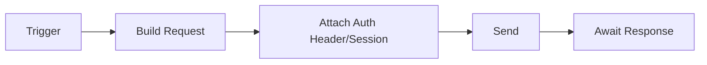
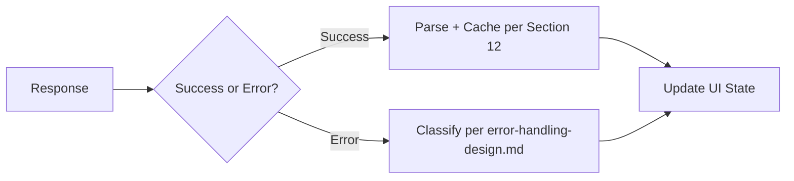

# Frontend API Integration

## 1. Purpose

This document defines frontend API integration, strictly aligned with [api-contracts.md](../06_API_and_Integration/api-contracts.md), [api-route-implementation.md](../09_Backend_Implementation/api-route-implementation.md), and [error-handling-design.md](../09_Backend_Implementation/error-handling-design.md). **No new API contract is invented here.**

## 2. API Client Boundary

A single API client layer, per feature module's service boundary, is the only path to backend data — restated unchanged from [frontend-architecture.md](../02_System_Architecture/frontend-architecture.md) Section 7. Every request carries the authentication token/session established in [frontend-authentication-ui.md](frontend-authentication-ui.md).

## 3. Request Lifecycle

## 4. Response Lifecycle

## 5. Authentication Headers / Session Behavior

Every request attaches the current session/token (mechanism per [authentication-implementation.md](../09_Backend_Implementation/authentication-implementation.md) Section 5, Under Evaluation) — the API client layer handles this uniformly, so individual feature modules never manage authentication headers themselves.

## 6. Authorization Failures

A 403 response (per [error-handling-design.md](../09_Backend_Implementation/error-handling-design.md)) is surfaced as an explicit "forbidden" state ([frontend-loading-error-empty-states.md](frontend-loading-error-empty-states.md)), never silently retried or hidden — the frontend does not attempt to "work around" an authorization failure.

## 7. Validation Failures

A 400/422 response is mapped back to the originating form/input field where possible, surfacing the backend's structured field-level detail ([request-response-validation.md](../09_Backend_Implementation/request-response-validation.md) Section 14) directly to the user, rather than a generic "something went wrong."

## 8. Retries

Idempotent read requests may be retried with backoff on a transient failure (network error, 502/503); non-idempotent command requests (Scenario run, Recommendation review) are **not** automatically retried without an explicit idempotency token, per [api-design-principles.md](../06_API_and_Integration/api-design-principles.md) Section 16 and [background-job-architecture.md](../09_Backend_Implementation/background-job-architecture.md) Section 8.

## 9. Timeout Handling

Every request has a client-side timeout distinct from (and typically shorter than) the server's own timeout budget; a client-side timeout surfaces as an explicit "taking longer than expected" state, with the option to continue waiting (for a known-async operation, Section 16) or cancel (Section 10).

## 10. Cancellation

A request tied to a component that unmounts (e.g., the user navigates away mid-fetch) is cancelled at the client, preventing a late response from updating state for a view the user is no longer looking at — this is a standard SPA data-fetching discipline, not a new architectural decision.

## 11. Stale Responses

If two requests for the same resource are in flight and resolve out of order, only the response matching the most recent request is applied to state — preventing a slower, earlier request's stale result from overwriting a newer one.

## 12. Concurrent Requests / Request Deduplication

Identical, simultaneous requests for the same resource (e.g., two components both needing the same district's data) are deduplicated into a single network call, per the Server/API state category's "de-duplicated per identical in-flight request" rule ([frontend-state-management.md](frontend-state-management.md) Section 2, row 2).

## 13. Caching Boundary

The frontend's own Server/API state cache is a **client-side, per-viewer convenience layer**, distinct from the backend's caching (Section 2 of [caching-and-performance.md](../09_Backend_Implementation/caching-and-performance.md)) — restated so the two are never confused: the frontend cache reduces redundant network calls within a session; the backend cache reduces redundant computation across all clients.

## 14. Optimistic Updates — Where Appropriate

Applied only to low-risk, easily-reversible UI feedback (e.g., marking a notification as read) — **never** applied to a Recommendation review action or a Scenario submission, since both are audit-significant, backend-authoritative state transitions ([domain-layer-design.md](../09_Backend_Implementation/domain-layer-design.md) Section 4) that must reflect the backend's actual, confirmed outcome before the UI presents them as final.

## 15. Read vs. Command Operations

Restated unchanged from [api-resource-model.md](../06_API_and_Integration/api-resource-model.md) Section 4: READ operations are cached and safely retriable (Sections 8, 13); COMMAND operations (`create_scenario`, `run_scenario`, `review_recommendation`) are never optimistically applied (Section 14) and are idempotency-token-guarded where retried (Section 8).

## 16. Polling / Asynchronous Job Status Handling

For any operation classified asynchronous per [background-job-architecture.md](../09_Backend_Implementation/background-job-architecture.md) Section 3, the frontend polls the job-status endpoint (mechanism: polling vs. WebSocket/streaming remains Under Evaluation, per [api-architecture.md](../06_API_and_Integration/api-architecture.md) Section 25) at an interval that balances responsiveness against unnecessary request volume — exact interval not specified, an implementation-time tuning decision.

## 17. Notification Updates

Notification state ([frontend-state-management.md](../10_Frontend_Implementation/frontend-state-management.md) Section 2, row 8) is updated either via polling (same mechanism as Section 16) or a push mechanism, if one is confirmed — Under Evaluation, not committed.

## 18. Mapping Frontend Consumers to Existing API Contracts

| Frontend Feature | API Operation(s) Consumed | Contract Source |
|---|---|---|
| District, GIS | Operations 1–2 | [api-contracts.md](../06_API_and_Integration/api-contracts.md) |
| Dashboard (Healthcare, Transportation, Agriculture, Weather, Disaster, Infrastructure, Analytics) | Operations 3–10 | Same |
| AI Assistant | Operations 16–17 | Same |
| Admin (audit view) | Operation 18 | Same |
| Prediction | Operation 11 | Same |
| Simulation | Operations 12–14 | Same |
| Recommendations | Operation 15 + review command | Same + [api-resource-model.md](../06_API_and_Integration/api-resource-model.md) Section 5 |

No frontend feature module consumes an operation not already documented in [api-contracts.md](../06_API_and_Integration/api-contracts.md).

## 19. Milestone Traceability

| API Integration Capability | First Needed |
|---|---|
| Basic request/response lifecycle, auth headers, retries, cancellation, deduplication | M1 |
| Full domain-resource consumption | M2 |
| AI-specific request handling | M3 |
| Prediction job polling | M4 |
| Simulation job polling | M5 |
| Recommendation command handling | M6 |

## 20. Open Decisions

- Polling interval, or whether streaming/WebSocket is adopted instead (Section 16) — Under Evaluation.
- Client-side timeout duration (Section 9) — implementation-time tuning, no numeric value invented.
