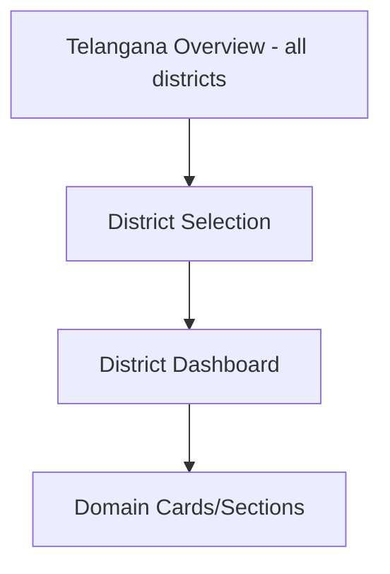
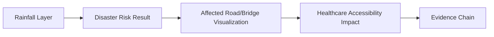

# Frontend Dashboard Design

## 1. Purpose

This document defines the dashboard implementation structure, elaborating [frontend-architecture.md](../02_System_Architecture/frontend-architecture.md) and [decision-intelligence-workflows.md](../07_AI_GIS_and_Intelligence/decision-intelligence-workflows.md) Workflow 1 with implementation-blueprint detail. **No KPI value is fabricated anywhere in this document** — every example is illustrative and structural only.

## 2. The Phase-1 Hierarchy

## 3. District Dashboard Domain Sections

| Domain | Backing Resource | Milestone |
|---|---|---|
| Population/Demographics | [api-contracts.md](../06_API_and_Integration/api-contracts.md) Operation 3 | M2 |
| Healthcare | Operation 4 | M2 |
| Transportation | Operation 6 | M2 |
| Agriculture | (Agriculture resource, [api-route-implementation.md](../09_Backend_Implementation/api-route-implementation.md)) | M2 |
| Weather/Environment | Operation 7 | M2 |
| Disaster | Operation 8 | M2 (data), M4 (risk) |
| Infrastructure | Operation 5 | M2 |
| Analytical insights | Operation 10 | M2 |
| Predictions | Operation 11 | M4 |
| Simulations | Operations 12–14 | M5 |
| Recommendations | Operation 15 | M6 |
| AI assistance | Operations 16–17 | M3 |

## 4. Dashboard Shell

A persistent layout region hosting: a header (district name, breadcrumb back to Overview), a domain-section navigation (tabs or a scrollable card layout — not fixed here), the map (Section 6), and the AI assistant entry point (Section 10) — composed from the layout components in [frontend-component-design.md](frontend-component-design.md) Section 2.

## 5. KPI Presentation

KPI Cards (per [frontend-component-design.md](frontend-component-design.md)) each display a single Analytical Result value with its provenance ([evidence-provenance-flow.md](../06_API_and_Integration/evidence-provenance-flow.md)), never a raw, uncontextualized number — every KPI card shows, at minimum, the value, its unit, and a freshness indicator.

## 6. Maps

The District Dashboard embeds a district-scoped map (per [frontend-gis-implementation.md](frontend-gis-implementation.md) Section 6), with layer controls (Section 9) allowing the user to toggle the layers named in [frontend-gis-implementation.md](frontend-gis-implementation.md) Section 7.

## 7. Charts

Trend and comparison charts (FR-025, FR-026) render Analytical Result time series and, from M4 onward, Prediction data with its confidence band — restated from [frontend-architecture.md](../02_System_Architecture/frontend-architecture.md) Section 12.

## 8. Domain Cards

Each domain section (Section 3) is composed of one or more domain-specific cards (e.g., a Healthcare section might show a coverage KPI card, a facility-count card, and a facility-list table) — the exact composition per domain is an implementation-time layout decision, not fixed by this document beyond the domain inventory itself.

## 9. Tables, Filters, Time Selectors, Layer Controls

| Control | Purpose |
|---|---|
| Tables | Paginated, sortable facility/observation lists (per [frontend-component-design.md](frontend-component-design.md)) |
| Filters | Domain-specific filtering (facility type, observation type) per [api-design-principles.md](../06_API_and_Integration/api-design-principles.md) Section 7's allow-listed filter fields |
| Time selectors | Date-range controls for trend charts, respecting the Observed/Predicted temporal boundary ([temporal-database-design.md](../05_Database_Design/temporal-database-design.md)) — a time selector never lets a user request a future date for Observed-state data |
| Layer controls | Toggle visibility of map layers, per [frontend-gis-implementation.md](frontend-gis-implementation.md) Section 7 |

## 10. Notification Area

A persistent, cross-cutting notification surface (Section 8 of [frontend-implementation-architecture.md](frontend-implementation-architecture.md)) — background job completions (Prediction/Simulation/Recommendation) surface here, distinct from the AI conversation thread.

## 11. AI Assistant Entry Point and Evidence/Provenance Presentation

The dashboard embeds an entry point to the AI Assistant ([frontend-ai-assistant-ui.md](frontend-ai-assistant-ui.md)), and every dashboard element carrying a factual claim visually communicates its state category:

| State Category | Visual Treatment (Conceptual, Not a Fixed Design Spec) |
|---|---|
| Observed (Source of Truth) | Presented as plain fact, with a source/date footnote |
| Derived | Presented as a computed fact, with a "computed from..." disclosure |
| Predicted | Visually distinguished (e.g., a dashed trend line, an explicit "Forecast" label) — never rendered identically to an Observed data point |
| Scenario | Visually distinguished as hypothetical (e.g., a distinct color/pattern, an explicit "Scenario" label) |
| Recommendation | Presented with advisory framing and a visible evidence-chain link, never as a directive |
| AI Response | Presented within the conversation surface, with inline citations resolvable to the above categories |

**Never:** Prediction = Source, Simulation = Prediction, Recommendation = Fact, AI Response = Source — restated as an absolute UI rule, directly implementing [digital-twin-state-model.md](../05_Database_Design/digital-twin-state-model.md) and Section 23 of this milestone's brief at the presentation layer. No specific color, icon, or exact visual token is fabricated here (per this milestone's explicit "do not fabricate exact colors... unless existing documentation specifies them") — this table defines the *distinguishing requirement*, not its final visual implementation.

## 12. Cross-Domain Intelligence UI

Consolidating this milestone's Section 22 requirements — visualizing the established Weather → Disaster → Transportation → Healthcare chain ([data-domain-model.md](../04_Data_Engineering/data-domain-model.md) Section 13; [backend-implementation-architecture.md](../09_Backend_Implementation/backend-implementation-architecture.md) Section 14), since no dedicated file exists for this.

| Element | Frontend Presentation |
|---|---|
| Rainfall layer | Weather station points, optionally a spatially-aggregated overlay ([frontend-gis-implementation.md](frontend-gis-implementation.md) Section 7) |
| Disaster risk result | The affected-area geometry, rendered with its state category visibly distinguished (Section 11 above) |
| Affected road/bridge visualization | Roads intersecting the affected area highlighted distinctly from unaffected roads |
| Healthcare accessibility impact | Facilities/villages whose computed accessibility changed, per [frontend-gis-implementation.md](frontend-gis-implementation.md) Worked Example C |
| Evidence chain | A composed panel citing every domain's contributing data, per [evidence-provenance-flow.md](../06_API_and_Integration/evidence-provenance-flow.md) |

**The frontend visualizes backend-derived relationships; it never independently infers an authoritative relationship between domains itself** — every arrow in the diagram above corresponds to a backend computation already performed ([backend-implementation-architecture.md](../09_Backend_Implementation/backend-implementation-architecture.md) Section 14), restated from AD-FE-004's render-only principle, applied here to cross-domain composition specifically rather than single-domain GIS operations.

## 13. Milestone Traceability

| Dashboard Capability | First Needed |
|---|---|
| Telangana Overview, District Dashboard shell, map | M1 |
| Domain sections (Demographics through Analytics), KPI cards, charts, tables, filters | M2 |
| Cross-domain intelligence UI (data-only chain) | M2 |
| AI assistant entry point | M3 |
| Prediction visualization | M4 |
| Simulation controls | M5 |
| Recommendation panels | M6 |

## 14. Open Decisions

- Exact per-domain card layout/composition (Section 8) — implementation-time design decision.
- Exact visual tokens for state-category distinction (Section 11) — a future visual-design task, not fabricated here.
