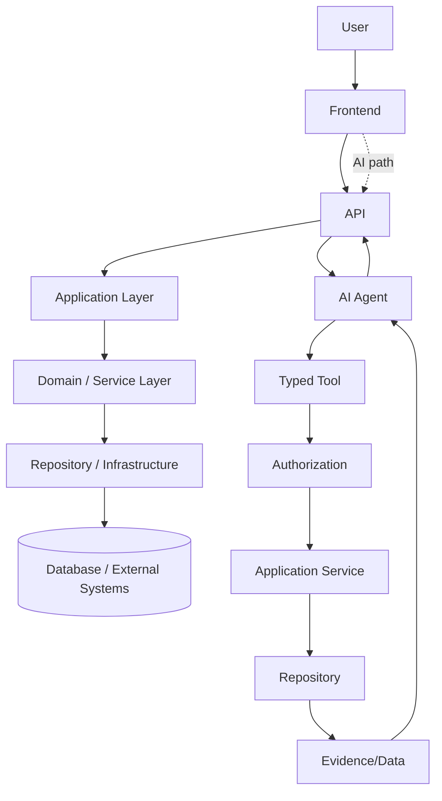

# Frontend Implementation Architecture

## 1. Purpose

This document is the anchor for `10_Frontend_Implementation/`. It translates [frontend-architecture.md](../02_System_Architecture/frontend-architecture.md), [api-architecture.md](../06_API_and_Integration/api-architecture.md), and [backend-implementation-architecture.md](../09_Backend_Implementation/backend-implementation-architecture.md) into a detailed frontend implementation blueprint. No application code exists in this document or milestone.

## 2. Scope

In scope: frontend architectural layers, state ownership, boundaries with the backend/AI/GIS layers, and implementation-blueprint detail for every concern named in this milestone's brief. Out of scope: any `.tsx`/`.jsx`/`.js`/`.css`/`.html` file, executable configuration, or package manifest.

## 3. Frontend Responsibilities

| Responsibility | Detail |
|---|---|
| Presentation | Rendering UI, GIS maps, dashboards, AI chat — unchanged from [frontend-architecture.md](../02_System_Architecture/frontend-architecture.md) Section 1 |
| Client-side state | Owning UI, cached server-data, and transient interaction state (Section 8) |
| API consumption | Consuming the versioned REST contract exclusively ([frontend-api-integration.md](frontend-api-integration.md)) |
| GIS rendering | Rendering geometry already computed/served by the backend ([frontend-gis-implementation.md](frontend-gis-implementation.md)) |
| AI conversation surface | Presenting AI Responses and their evidence, never generating or validating them itself ([frontend-ai-assistant-ui.md](frontend-ai-assistant-ui.md)) |

## 4. Frontend Non-Responsibilities

Restated as absolutes, unchanged from every prior milestone's boundary decisions (AD-002, AD-API-002, AD-DE-005, AD-DB-006, and [backend-implementation-architecture.md](../09_Backend_Implementation/backend-implementation-architecture.md) Sections 15–19):

| The Frontend Never | Because |
|---|---|
| Accesses the database directly | AD-002, restated at every layer since |
| Executes unrestricted GIS database queries | [backend-implementation-architecture.md](../09_Backend_Implementation/backend-implementation-architecture.md) Section 16 (GIS Boundary) |
| Accesses AI/model internals | The AI Agent Layer is entirely backend-owned ([ai-architecture.md](../02_System_Architecture/ai-architecture.md)) |
| Bypasses backend authorization | [authorization-implementation.md](../09_Backend_Implementation/authorization-implementation.md) Section 6 — frontend route guards are a UX convenience, never a security boundary (Section 17 below) |
| Bypasses typed AI tools | AD-API-002 |
| Contains authoritative district calculations | [backend-implementation-architecture.md](../09_Backend_Implementation/backend-implementation-architecture.md) Section 16 |
| Treats AI-generated text as authoritative evidence | [data-governance.md](../04_Data_Engineering/data-governance.md) Section 6 |

## 5. The Layered Chain

Both chains restate, unchanged, [backend-implementation-architecture.md](../09_Backend_Implementation/backend-implementation-architecture.md) Sections 2 and 11 — this document adds nothing new to the backend side, only confirms the frontend's single point of contact is the API in both cases. **Frontend → LLM → Database** and **Frontend → Database** and **Frontend → unrestricted GIS database** are all explicitly rejected topologies, never designed anywhere in this documentation set.

## 6. Presentation Architecture

Restated from [frontend-architecture.md](../02_System_Architecture/frontend-architecture.md) Section 2 (SPA shell, AD-FE-001): a single-page application with a persistent shell, routed feature views. Full structural detail in [frontend-application-structure.md](frontend-application-structure.md).

## 7. Feature-Oriented Organization

Restated unchanged from AD-STRUCT-002 ([frontend-structure.md](../03_Project_Structure/frontend-structure.md)): features are organized by domain (District, Dashboard, AI Assistant, Prediction, Simulation, Recommendations, Admin), mirroring the backend's domain-aligned service boundaries (AD-API-001). This document does not re-decide this; it builds on it.

## 8. State Ownership — Eight Categories

| State Category | Owner | Why It Belongs There |
|---|---|---|
| UI state | The component tree (local/component state) | Transient, presentation-only, has no meaning outside the component that owns it (e.g., "is this dropdown open") |
| Server/API state | A dedicated data-fetching/caching layer, never mixed with UI state | Per AD-FE-002 — server data has its own lifecycle (fetch, cache, revalidate) distinct from UI concerns |
| Domain display state | Derived, read-only, computed from Server/API state at render time | Never independently stored — e.g., "is this district's coverage gap above a display threshold" is computed from the fetched Analytical Result, not stored separately |
| GIS/map state | A dedicated map-state store (viewport, selected layers, selected entity) | Map interaction (pan/zoom/layer toggle) is high-frequency and map-library-specific; coupling it to generic UI state would cause unnecessary re-renders elsewhere |
| AI conversation state | A dedicated AI-session store (message history, in-flight query status) | Has its own lifecycle (a conversation persists across navigation within a session, per [frontend-ai-assistant-ui.md](frontend-ai-assistant-ui.md)) distinct from both UI and Server state |
| Authentication/session state | A cross-cutting, app-root-level store | Needed by nearly every component (for permission-aware rendering, Section 15 of [frontend-authentication-ui.md](frontend-authentication-ui.md)) but changes rarely — a natural fit for a single shared store, not component-local state |
| Notification state | A cross-cutting store, separate from AI conversation state | Notifications originate from multiple sources (background job completion, system messages) not tied to any one feature |
| Transient interaction state | Component-local, same as UI state, called out separately because it specifically covers short-lived interaction feedback (hover, drag, focus) | Never persisted, never shared beyond the interacting component |

This restates and extends [frontend-architecture.md](../02_System_Architecture/frontend-architecture.md) Section 6's three-way split into the eight/eleven-category detail this milestone requires — fully elaborated in [frontend-state-management.md](frontend-state-management.md).

## 9. Domain UI Boundaries

Each feature module owns its own components, hooks, and API calls; cross-feature interaction goes through shared state (Section 8), never direct cross-feature imports — restated unchanged from [frontend-structure.md](../03_Project_Structure/frontend-structure.md) Section 4.

## 10. API Boundary

The frontend's API client layer is the sole path to backend data — restated unchanged from [frontend-architecture.md](../02_System_Architecture/frontend-architecture.md) Section 7; full detail in [frontend-api-integration.md](frontend-api-integration.md).

## 11. Authentication Boundary

The frontend implements login/logout UX and route guards, but **the backend is the actual authorization authority** (Section 4) — full detail in [frontend-authentication-ui.md](frontend-authentication-ui.md).

## 12. AI Interaction Boundary

The frontend submits queries and renders AI Responses with their evidence; it never composes a prompt sent directly to an LLM provider and never receives raw model output bypassing the Grounding Validation stage ([ai-safety-and-grounding.md](../07_AI_GIS_and_Intelligence/ai-safety-and-grounding.md)) — full detail in [frontend-ai-assistant-ui.md](frontend-ai-assistant-ui.md).

## 13. GIS Rendering Boundary

The frontend renders geometry and computed results the backend already produced; it never performs an authoritative spatial computation itself — full detail in [frontend-gis-implementation.md](frontend-gis-implementation.md).

## 14. Error Boundaries

A top-level error boundary prevents a single component failure from blanking the application; feature-level error boundaries contain a failure to its own feature's UI region — restated unchanged from [frontend-architecture.md](../02_System_Architecture/frontend-architecture.md) Section 9, elaborated in [frontend-loading-error-empty-states.md](frontend-loading-error-empty-states.md).

## 15. Loading Boundaries

Every data-dependent view shows a skeleton state matching its eventual content's shape, never a generic spinner — restated unchanged from [frontend-architecture.md](../02_System_Architecture/frontend-architecture.md) Section 10, elaborated in [frontend-loading-error-empty-states.md](frontend-loading-error-empty-states.md).

## 16. Performance Boundaries

Full treatment in [frontend-performance-and-responsiveness.md](frontend-performance-and-responsiveness.md); this document notes only that performance is a first-class architectural boundary, not an afterthought — consistent with every prior milestone's UI-responsiveness treatment.

## 17. Security Boundaries

**Frontend authorization UI is not backend authorization.** A route guard or a hidden button is a UX convenience that prevents an authorized user from accidentally navigating somewhere confusing — it is never the mechanism that actually prevents unauthorized data access, which is enforced exclusively server-side ([authorization-implementation.md](../09_Backend_Implementation/authorization-implementation.md)). Full treatment in Section 21 of this milestone, folded into [frontend-authentication-ui.md](frontend-authentication-ui.md) Section 11.

## 18. Milestone Traceability

See each sibling document's own traceability section; consolidated in [ED-M3-P3-VALIDATION.md](ED-M3-P3-VALIDATION.md) Section 11.

## 19. Open Decisions

- Final frontend framework (React remains Proposed, unchanged — [technology-stack.md](../00_Engineering_Overview/technology-stack.md) §4.1).
- Every other technology named throughout this folder remains exactly as Proposed/Candidate/Under Evaluation as it was before this milestone.
