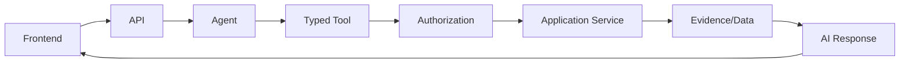

# AI/Frontend Boundary Resolution

## 1. Purpose

This document formalizes the AI boundary between the frontend and the backend's Agent/Typed Tool architecture, consolidating [frontend-ai-assistant-ui.md](../10_Frontend_Implementation/frontend-ai-assistant-ui.md) and [ai-agent-integration.md](../06_API_and_Integration/ai-agent-integration.md)/AD-API-002. No contradiction was found in this boundary.

## 2. The Formalized Chain

## 3. Consolidated Responsibilities

| Concern | Detail | Source |
|---|---|---|
| AI request handling | Frontend submits query text only; never composes a prompt or decides which tool to call | [frontend-ai-assistant-ui.md](../10_Frontend_Implementation/frontend-ai-assistant-ui.md) Section 4 |
| Tool execution status | Displayed only where the backend mechanism supports it (Under Evaluation) | Same, Section 7 |
| Evidence presentation | Resolvable citations, per Operation 17 | Same, Section 8 |
| Confidence/uncertainty | Never fabricated client-side; only what the backend provides (AD-AI-003) | Same, Section 10 |
| Six-category state labels | Source/Derived/Prediction/Simulation/Recommendation/AI Response, enforced visually | [frontend-dashboard-design.md](../10_Frontend_Implementation/frontend-dashboard-design.md) Section 11 |
| Unsafe or unsupported queries | Explicit "cannot answer," never reformulated automatically | [frontend-ai-assistant-ui.md](../10_Frontend_Implementation/frontend-ai-assistant-ui.md) Section 14 |
| Long-running AI tasks | Non-blocking, job-status-driven | Same, Section 16 |
| Cancellation | User-initiated, honored by the backend job lifecycle | Same, Section 17 |
| Error handling | Distinct, honest AI-specific error messaging | Same, Section 13 |

## 4. Frontend Never Becomes the Authoritative Intelligence Layer

Restated as the governing rule: the frontend never determines what counts as grounded, never fabricates a citation, never decides a claim's confidence, and never persists an AI Response as if it were source data ([data-governance.md](../04_Data_Engineering/data-governance.md) Section 6) — every one of these is a backend-owned decision the frontend only displays.

## 5. No Contradiction Found

This boundary was found consistent across every AI-related document in `06_API_and_Integration/`, `07_AI_GIS_and_Intelligence/`, `09_Backend_Implementation/`, and `10_Frontend_Implementation/` — no divergence was found. This document formalizes the consistency as a single consolidated reference.

## 6. Milestone Traceability

Applies from M3 onward (Grounded Agentic AI), extended through M6 as agent orchestration matures.

## 7. Open Decisions

- Tool-execution progress display and response streaming — both Under Evaluation, unchanged.
- Final AI provider — unresolved, unchanged (recorded in full in [unresolved-architecture-register.md](unresolved-architecture-register.md)).
