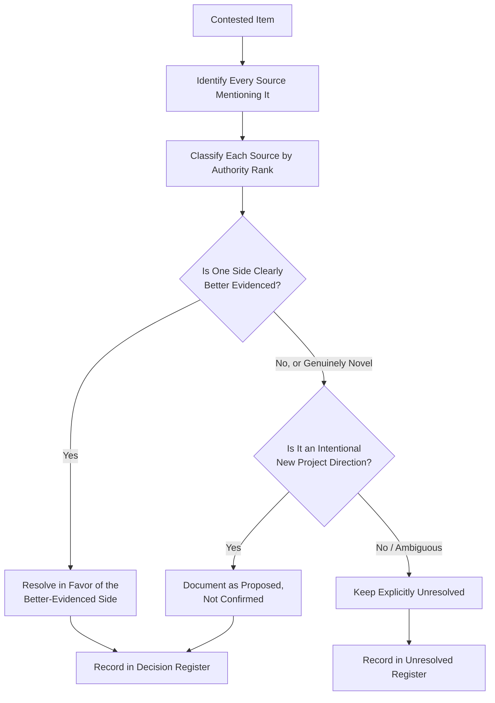

# Architecture Resolution Overview

## 1. Purpose

ED-M3 Part 4 exists specifically to investigate and, where evidence supports it, resolve the two contradictions [ED-M3-P3-VALIDATION.md](../10_Frontend_Implementation/ED-M3-P3-VALIDATION.md) Section 14 identified and deliberately left unresolved: the district route path convention (Contradiction A) and the visual/UI direction provenance gap (Contradiction B). This document is the anchor for `11_Architecture_Resolution/`.

## 2. Documents Reviewed

Every document under `docs/engineering/00_Engineering_Overview/` through `10_Frontend_Implementation/` (ED-M1 through ED-M3 Part 3), with the following consulted directly and specifically for this milestone's resolution work: [frontend-architecture.md](../02_System_Architecture/frontend-architecture.md), [naming-conventions.md](../03_Project_Structure/naming-conventions.md), [entity-catalog.md](../05_Database_Design/entity-catalog.md), [api-resource-model.md](../06_API_and_Integration/api-resource-model.md), [api-contracts.md](../06_API_and_Integration/api-contracts.md), [api-route-implementation.md](../09_Backend_Implementation/api-route-implementation.md), [frontend-routing-design.md](../10_Frontend_Implementation/frontend-routing-design.md), [frontend-animation-and-interaction.md](../10_Frontend_Implementation/frontend-animation-and-interaction.md), and [ED-M3-P3-VALIDATION.md](../10_Frontend_Implementation/ED-M3-P3-VALIDATION.md). The original **DistrictMind Abstract** and **DistrictMind Architecture Blueprint** were re-consulted (against this program's earlier full reading of both, during ED-M2 Part 2A) specifically for routing- and visual-direction-relevant content; neither specifies frontend route path conventions or a visual theme.

## 3. Contradictions Identified

| ID | Contradiction | First Reported |
|---|---|---|
| A | District route path convention: `/districts/:id` (ED-M2 Part 1) vs. `/district/:districtName` (ED-M3 Part 3 brief) | [ED-M3-P3-VALIDATION.md](../10_Frontend_Implementation/ED-M3-P3-VALIDATION.md) Section 14, item 1 |
| B | Visual/UI direction (dark theme, glassmorphism/neon, Inter font, ~70% map area, hover glow, fly-in) asserted as "established" but absent from [frontend-architecture.md](../02_System_Architecture/frontend-architecture.md) and both original source documents | Same report, item 2 |

## 4. Authority Hierarchy

Restated and applied from the source-priority discipline this documentation program has used since ED-M2 Part 2A:

| Rank | Source | Applies To |
|---|---|---|
| 1 | An existing, already-authored engineering/architecture document within this program (ED-M1 through ED-M3 Part 3), especially where corroborated by more than one independent document | Both contradictions |
| 2 | The original DistrictMind Abstract | Both |
| 3 | The original DistrictMind Architecture Blueprint | Both |
| 4 | An explicit instruction given directly through a milestone brief, with no supporting architectural document | Both — this is where the contested conventions in A and B actually originate |
| 5 | Engineering inference | Used only where no higher-ranked source resolves the question |

**Critical distinction applied throughout this milestone:** a milestone brief's instruction is not automatically Rank 1 merely because it is the most recent input — it is evaluated on whether it is *corroborated by an existing architectural document* (in which case it reinforces Rank 1) or *introduces a new, unsupported specific* (in which case it is treated as Rank 4, a candidate for adoption as a **Proposed** decision, not as evidence that overturns a higher-ranked, already-established document).

## 5. Resolution Methodology

This methodology is applied identically to both contradictions in [routing-resolution.md](routing-resolution.md) and [ui-visual-direction-resolution.md](ui-visual-direction-resolution.md).

## 6. Resolved Decisions

| ID | Summary | Full Detail |
|---|---|---|
| AD-RES-001 | District route path convention resolved in favor of the identifier-based, plural form (`/districts/:id`), with an optional Proposed human-readable alias mechanism | [routing-resolution.md](routing-resolution.md) |

## 7. Unresolved / Proposed-Only Decisions

| ID | Summary | Full Detail |
|---|---|---|
| AD-RES-002 | Visual/UI direction items (dark theme, glassmorphism/neon, Inter font, ~70% map area, hover glow, fly-in) recorded as Proposed Design Direction, not Confirmed, not source-established | [ui-visual-direction-resolution.md](ui-visual-direction-resolution.md) |

Full detail on every other still-open technology/architecture decision (unrelated to A/B but surfaced during this review) is in [unresolved-architecture-register.md](unresolved-architecture-register.md).

## 8. Consequences for Future Implementation

- [frontend-routing-design.md](../10_Frontend_Implementation/frontend-routing-design.md)'s AD-FE-005 ("Conflict Identified, Not Resolved") is now superseded in effect by AD-RES-001 — **this document does not itself edit [frontend-routing-design.md](../10_Frontend_Implementation/frontend-routing-design.md)**, per the instruction not to modify prior documentation; a future revision of that document should update its status to reflect this resolution, recorded as a recommendation in [implementation-readiness.md](implementation-readiness.md).
- The visual-direction items remain **Proposed**, meaning implementation may proceed using them as design intent, but no implementer should treat them as an immutable, stakeholder-confirmed specification — a future visual-design review remains appropriate.

## 9. Relationship to M1–M6

This milestone resolves *documentation-layer* contradictions that affect how M1 (district navigation, the earliest milestone requiring routing and visual design) is eventually implemented — it does not itself advance any product capability milestone. The resolutions here are prerequisites for a clean M1 implementation start, not new M1 functionality.

## 10. Milestone Traceability

Not applicable in the M1–M6 sense — this is a documentation-resolution milestone (ED-M3 Part 4), distinct from product capability milestones, per the same ED-M-vs-M distinction established in [naming-conventions.md](../03_Project_Structure/naming-conventions.md) Section 14 and restated in [implementation-strategy.md](../08_Implementation_Foundation/implementation-strategy.md) Section 1.

## 11. Open Decisions

See [unresolved-architecture-register.md](unresolved-architecture-register.md) for the complete list — this document does not attempt to resolve anything beyond Contradictions A and B.
