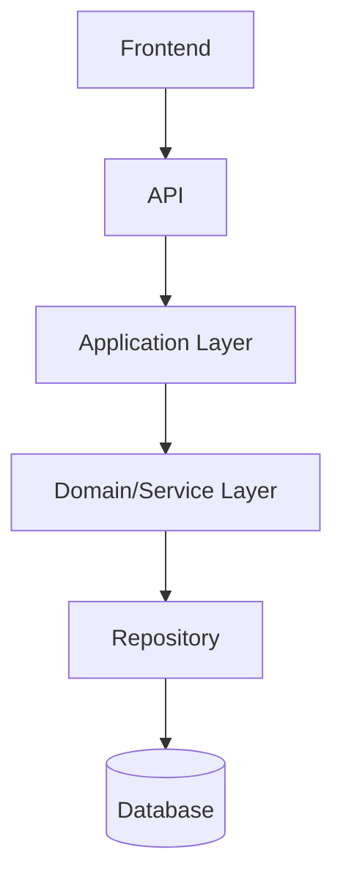

# Frontend/Backend Contract Resolution

## 1. Purpose

This document formalizes the authoritative ownership boundary across every layer from Frontend through Database, consolidating (not re-deciding) the ownership rules already established across [backend-implementation-architecture.md](../09_Backend_Implementation/backend-implementation-architecture.md) and [frontend-implementation-architecture.md](../10_Frontend_Implementation/frontend-implementation-architecture.md). No contradiction was found in this boundary — this document formalizes it as a single consolidated reference for implementation readiness.

## 2. The Layered Boundary

## 3. Ownership Table

| Concern | Owner | Source |
|---|---|---|
| Request ownership | Frontend constructs the request; API validates its structure | [backend-implementation-architecture.md](../09_Backend_Implementation/backend-implementation-architecture.md) Section 2 |
| Response ownership | API shapes the response per [api-contracts.md](../06_API_and_Integration/api-contracts.md); Frontend renders it, never reinterprets its meaning | Same, Section 5 |
| Validation ownership | Two-stage: API boundary (structural), Domain layer (semantic) — Frontend performs only basic well-formedness checks as a UX convenience, never the authoritative check | [request-response-validation.md](../09_Backend_Implementation/request-response-validation.md) Section 2 |
| Authorization ownership | Exclusively backend, enforced at the API boundary before Application Layer — Frontend's route guards/permission-aware UI are UX only | [authorization-implementation.md](../09_Backend_Implementation/authorization-implementation.md) Section 6; [frontend-authentication-ui.md](../10_Frontend_Implementation/frontend-authentication-ui.md) Section 14 |
| Error ownership | Backend classifies and shapes every error ([error-handling-design.md](../09_Backend_Implementation/error-handling-design.md)); Frontend maps the classified error to a state ([frontend-loading-error-empty-states.md](../10_Frontend_Implementation/frontend-loading-error-empty-states.md)), never invents its own error classification | Both documents |
| Loading state ownership | Frontend-only concern — the backend has no notion of a "loading state," only request/response and job status | [frontend-loading-error-empty-states.md](../10_Frontend_Implementation/frontend-loading-error-empty-states.md) |
| Async job ownership | Backend owns job lifecycle/state ([background-job-architecture.md](../09_Backend_Implementation/background-job-architecture.md)); Frontend polls and reflects that state, never determines when a job is "done" independently | Same document; [frontend-api-integration.md](../10_Frontend_Implementation/frontend-api-integration.md) Section 16 |
| Caching ownership | Both layers cache, for different reasons and at different scopes — backend caching reduces redundant computation across all clients ([caching-and-performance.md](../09_Backend_Implementation/caching-and-performance.md)); frontend caching reduces redundant network calls within one session ([frontend-api-integration.md](../10_Frontend_Implementation/frontend-api-integration.md) Section 13) — the two are never confused as a single cache |
| Provenance/evidence ownership | Backend computes and attaches provenance to every response ([evidence-provenance-flow.md](../06_API_and_Integration/evidence-provenance-flow.md)); Frontend displays it, never generates or infers it | [frontend-dashboard-design.md](../10_Frontend_Implementation/frontend-dashboard-design.md) Section 11 |

## 4. Explicit Prohibitions — Restated

| Prohibited Path | Why It Is Rejected |
|---|---|
| Frontend → Database | AD-002 and every subsequent layer decision; the frontend has no database credential of any kind |
| Frontend → unrestricted GIS | AD-FE-004; every spatial computation is server-side, per [backend-implementation-architecture.md](../09_Backend_Implementation/backend-implementation-architecture.md) Section 16 |
| Frontend → model internals | The AI/ML layer, including any model artifact, is entirely backend-owned; the frontend never receives a model weight, prompt template, or internal feature representation |
| Frontend → unrestricted LLM | The frontend never holds an AI provider credential and never calls an LLM provider directly — every AI interaction is mediated by the backend's Typed Tool boundary (AD-API-002), restated in [ai-frontend-boundary-resolution.md](ai-frontend-boundary-resolution.md) |

## 5. No Contradiction Found

Unlike Contradictions A and B, this boundary was found **fully consistent** across every document reviewed — [backend-implementation-architecture.md](../09_Backend_Implementation/backend-implementation-architecture.md) and [frontend-implementation-architecture.md](../10_Frontend_Implementation/frontend-implementation-architecture.md) describe the identical chain from opposite ends, with no divergence in responsibility assignment. This document exists to consolidate that consistency into one reference, not to resolve a conflict.

## 6. Milestone Traceability

Applies from M1 onward — this boundary is foundational to every capability in the product roadmap.

## 7. Open Decisions

None specific to this document — every open item (framework choices, etc.) is inherited from the documents this one consolidates.
