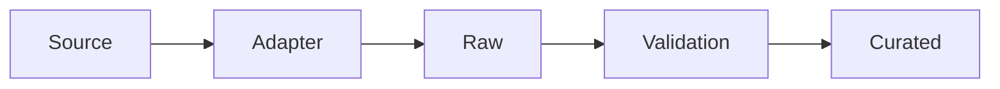

# Data Ingestion Implementation

## 1. Purpose

This document defines the implementation architecture for data ingestion, elaborating [data-ingestion.md](../04_Data_Engineering/data-ingestion.md) with implementation-blueprint detail. No ingestion framework is selected unless already confirmed (none is).

## 2. The Pipeline

Restated unchanged from [data-ingestion.md](../04_Data_Engineering/data-ingestion.md) Section 2, with **Adapter** made explicit as its own stage — the component responsible for normalizing a source-specific format into the shape Validation expects.

## 3. Ingestion Modes

| Mode | Implementation Detail |
|---|---|
| Batch ingestion | The default mode (AD-DE-003) — a scheduled or manually-triggered run processing a complete file/export |
| Scheduled ingestion | A recurring trigger per source-specific cadence (not fixed by this document) |
| Manual ingestion | Administrator-triggered (FR-035), identical pipeline, different trigger only |
| Event-driven ingestion | **Not justified at this time** — restated from AD-DE-003; no current source requires real-time delivery, and introducing an event-driven mechanism now would be premature per the "do not overengineer" discipline |
| Incremental ingestion | A run that only processes new/changed records since the last successful run, detected via source-provided change markers or content diffing |
| Full refresh | A run that reprocesses an entire source dataset, used when incremental change detection is unavailable or when a validation-rule change requires reprocessing (per AD-DE-002's ELT rationale) |

## 4. Source-Specific Format Normalization

The Adapter stage (Section 2) is responsible for: parsing the source's native format (CSV, GeoJSON, shapefile, API response), mapping its fields to the canonical schema's field names, and reprojecting any geometry to the canonical CRS ([spatial-data-implementation.md](spatial-data-implementation.md) Section 3) — all before the record reaches Validation. Each source category ([data-source-implementation.md](data-source-implementation.md)) has its own Adapter, but every Adapter produces the identical canonical shape for Validation to check.

## 5. Retry

Transient acquisition failures (network error, rate limit) are retried with bounded backoff — restated unchanged from [data-ingestion.md](../04_Data_Engineering/data-ingestion.md) Section 6 and [integration-architecture.md](../02_System_Architecture/integration-architecture.md) Section 13.

## 6. Quarantine

Records failing Validation are held in a visible, queryable quarantine state, never silently dropped or silently promoted — restated unchanged from [data-validation.md](../04_Data_Engineering/data-validation.md) Section 8, elaborated further in [data-validation-implementation.md](data-validation-implementation.md) Section 8.

## 7. Failure Recovery

A failed ingestion run commits nothing partial — restated unchanged from [data-ingestion.md](../04_Data_Engineering/data-ingestion.md) Section 6 (NFR-009). Recovery is either a retry (Section 5, for transient causes) or a corrected reprocessing run against the retained Raw layer (per AD-DE-002), never a manual patch directly against Curated data.

## 8. Duplicate Detection

Within a batch, records resolving to the same real-world entity (via the entity-matching logic in [data-transformation.md](../04_Data_Engineering/data-transformation.md) Section 6) are deduplicated during Transformation, not left for downstream consumers to reconcile — restated unchanged.

## 9. Idempotency

Re-running an ingestion for the same source snapshot uses an **upsert** pattern keyed on the stable identifier, never creating duplicate Curated records — restated unchanged from [data-ingestion.md](../04_Data_Engineering/data-ingestion.md) Section 6 and the Blueprint's own §9.3 description.

## 10. Ingestion Metadata

Every ingestion run records: source, trigger (scheduled/manual), start/end time, record counts (acquired/validated/quarantined/curated), and failure reason if applicable — restated unchanged from [data-ingestion.md](../04_Data_Engineering/data-ingestion.md) Section 9.

## 11. Ingestion Audit

Distinct from general operational logging — an ingestion run triggered by an administrator is itself an auditable administrative action (FR-036), logged through the Audit System, not merely the operational ingestion log.

## 12. Milestone Traceability

| Ingestion Capability | First Needed |
|---|---|
| Batch/scheduled ingestion for Geography | M1 |
| Full multi-domain ingestion, incremental updates | M2 |
| (No new ingestion capability required for M3–M6 — Prediction/Simulation/Recommendation consume already-ingested data) | — |

## 13. Open Decisions

- Ingestion orchestration tooling (Apache Airflow, a simpler scheduler) — remains Under Evaluation, unchanged from [data-ingestion.md](../04_Data_Engineering/data-ingestion.md) Section 12.
- Change-detection mechanism for incremental ingestion (Section 3) — implementation-time decision, not made here.
