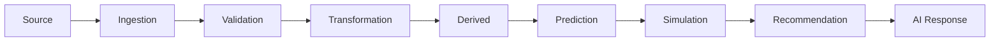

# Data Lineage and Provenance Implementation

## 1. Purpose

This document defines the implementation-level lineage chain, elaborating [data-lineage.md](../04_Data_Engineering/data-lineage.md) and [evidence-provenance-flow.md](../06_API_and_Integration/evidence-provenance-flow.md) with the metadata detail this milestone requires.

## 2. The Chain

Unchanged from [data-lineage.md](../04_Data_Engineering/data-lineage.md) Section 2, restated here at implementation granularity.

## 3. Metadata Per Stage

| Metadata Field | Definition | Populated At |
|---|---|---|
| Source identifier | Which external provider/category ([data-source-implementation.md](data-source-implementation.md)) | Ingestion |
| Ingestion timestamp | When DistrictMind acquired and validated the record | Ingestion/Validation |
| Effective timestamp | The date the underlying fact actually describes ([temporal-data-implementation.md](temporal-data-implementation.md)) | Ingestion (read from source) |
| Transformation metadata | Which transformation logic/version produced a Curated/Derived record | Transformation |
| Dataset version | The specific ingestion-run/version marker | Ingestion |
| Computation provenance | The computation-logic version for an Analytical Result | Analytical computation |
| Model provenance | Model name, version, training snapshot (Model Execution Metadata) — where relevant | Prediction |
| Simulation provenance | Originating Scenario + baseline snapshot reference | Simulation |
| Recommendation provenance | Every cited Analytical Result/Prediction/Scenario Output | Recommendation generation |

Every downstream result is traceable to upstream evidence **where applicable** — a purely Descriptive dashboard read traces back only as far as Source/Ingestion; a Recommendation traces back through the full chain.

## 4. How the Frontend Receives Provenance Metadata

Restated unchanged from [evidence-provenance-flow.md](../06_API_and_Integration/evidence-provenance-flow.md) Section 6 and [frontend-dashboard-design.md](../10_Frontend_Implementation/frontend-dashboard-design.md) Section 11: every API response carrying a factual claim includes the relevant metadata fields from Section 3 above, inline or via a resolvable reference (Operation 17, [api-contracts.md](../06_API_and_Integration/api-contracts.md)) — the frontend never independently derives or infers provenance; it only displays what the backend already attached.

## 5. Milestone Traceability

| Lineage Capability | First Needed |
|---|---|
| Source → Curated lineage (Geography) | M1 |
| Full lineage through Derived, across all domains | M2 |
| Lineage extended to AI Response/Evidence citation | M3 |
| Lineage extended to Prediction (model provenance) | M4 |
| Lineage extended to Simulation | M5 |
| Lineage extended to Recommendation (full evidence chain) | M6 |

## 6. Open Decisions

- Specific storage mechanism for lineage metadata (dedicated lineage store vs. metadata columns) — unchanged open item from [data-lineage.md](../04_Data_Engineering/data-lineage.md) Section 12.
