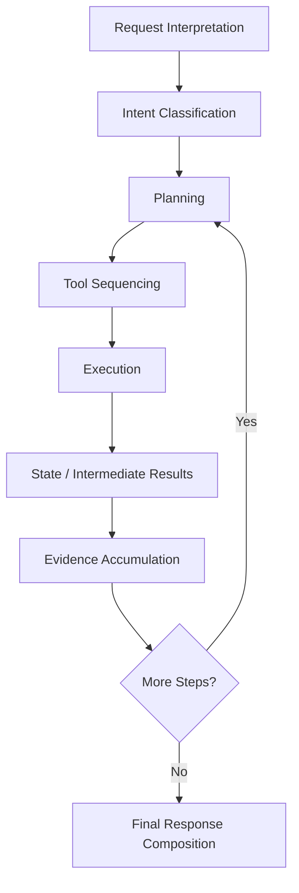

# Agent Implementation Architecture

## 1. Purpose

This document defines the Agent Layer's implementation architecture, elaborating [agent-execution-architecture.md](../07_AI_GIS_and_Intelligence/agent-execution-architecture.md) and [agent-planning-and-reasoning.md](../07_AI_GIS_and_Intelligence/agent-planning-and-reasoning.md). No agent framework is selected here — LangGraph and any alternative remain Candidate.

## 2. Agent Lifecycle

## 3. Request Interpretation

The Agent parses the user's natural-language request (or a structured dashboard-originated request composing the same underlying need) into a working representation of what is being asked — restated conceptually from [ai-agent-integration.md](../06_API_and_Integration/ai-agent-integration.md) Section 3.

## 4. Intent Classification

The Agent determines the general category of the request (a single-domain factual lookup, a spatial/coverage question, a cross-domain impact question, a prediction request, a scenario request, or a recommendation request) — this classification informs which typed tools are candidates for the plan, without being a rigid, exhaustive taxonomy that blocks legitimate novel questions.

## 5. Planning and Tool Selection/Sequencing

Restated from [ai-runtime-architecture.md](ai-runtime-architecture.md) Sections 5–6 and AD-AI-004: the Agent forms a plan of typed-tool calls, sequenced so that a later step's inputs can depend on an earlier step's Evidence (e.g., Worked Example C's Weather → Disaster → Transportation → Healthcare chain, where each stage's tool call depends conceptually on the prior stage's result).

## 6. State and Intermediate Results

The Agent maintains in-memory state across a multi-step plan: the original request, the plan, completed steps and their Evidence, and remaining steps. This state is session-scoped and never persisted as source-of-truth data (restated from [ai-runtime-architecture.md](ai-runtime-architecture.md) Section 8).

## 7. Evidence Accumulation

Each completed tool call's result is added to the Agent's accumulated Evidence set, each item retaining its own source, timestamp, and state-category label — restated unchanged from [grounding-and-evidence-implementation.md](grounding-and-evidence-implementation.md).

## 8. Reasoning Boundaries — LLM Reasoning vs. Deterministic Backend Computation

| LLM Reasoning (Agent) | Deterministic Backend Computation (Typed Tool / Application Service) |
|---|---|
| Interpreting intent, classifying request type | Executing the actual data retrieval or spatial/predictive computation |
| Deciding which tool(s) to call and in what order | Producing the tool's authoritative result |
| Synthesizing multiple Evidence items into an explanation | Computing any number, geometry, or classification within that explanation |
| Communicating uncertainty already present in Evidence | Determining that uncertainty value itself (e.g., a model's confidence output) |

**The Agent never invents a tool result.** If a typed tool is unavailable, fails, or returns no data, the Agent discloses that gap — it does not estimate a plausible-sounding substitute value. This restates and applies [ai-implementation-architecture.md](ai-implementation-architecture.md) Section 6 at the Agent's own internal decision boundary.

## 9. Final Response Composition

Restated unchanged from [ai-runtime-architecture.md](ai-runtime-architecture.md) Section 9 — response synthesis is strictly Evidence-grounded, followed by a distinct validation stage.

## 10. Failure Handling

Restated unchanged from [ai-runtime-architecture.md](ai-runtime-architecture.md) Section 11, applied at the Agent's own plan-execution level: a failed step does not silently terminate the Agent's ability to respond — it narrows what the Agent can honestly claim.

## 11. Authorization

The Agent's every tool call is subject to the same authorization enforcement as any direct API call to that tool's underlying service — restated unchanged from [ai-implementation-architecture.md](ai-implementation-architecture.md) Section 8. The Agent has no mechanism to bypass, elevate, or reinterpret authorization.

## 12. Auditability

Every plan, tool call, and Evidence item the Agent produces is traceable via the request's correlation ID — restated unchanged from [ai-runtime-architecture.md](ai-runtime-architecture.md) Section 18.

## 13. Observability

Restated unchanged from Section 12 above and [backend-observability.md](../09_Backend_Implementation/backend-observability.md).

## 14. Context Management

The Agent's working context (accumulated Evidence, plan state, retrieved RAG chunks) is bounded — restated consistent with the context-window constraint acknowledged in [rag-implementation.md](rag-implementation.md) Section 11; no unbounded context accumulation is assumed across an arbitrarily long multi-step plan.

## 15. Multi-Step Execution

Elaborated fully via Worked Example C below (Section 18) and in [ai-runtime-architecture.md](ai-runtime-architecture.md) Section 20.

## 16. Cancellation and Retry Behavior

Restated unchanged from [ai-runtime-architecture.md](ai-runtime-architecture.md) Sections 13–14, applied at the Agent's plan-execution granularity: a cancelled request halts further plan-step execution; a retried tool call is retried only if that specific tool call is idempotent (Section 15 of that document).

## 17. Loop Prevention and Maximum-Step Concept

The Agent's plan is bounded by a maximum-step concept — the Agent does not indefinitely re-plan or repeat tool calls in pursuit of an answer. **No specific numeric step limit is invented here**; the existence of such a bound is an implementation requirement, its exact value a tuning decision. A plan that would exceed this bound is treated as a failure case (Section 10), with the gap disclosed rather than the Agent looping indefinitely.

## 18. Canonical Examples Through the Agent Lifecycle

### 18.1 Example A — 10 km Healthcare Coverage
Single-step plan: intent classified as spatial/coverage; one tool call (`coverage_analysis`); one Evidence item; direct response synthesis.

### 18.2 Example B — Bridge Closure Impact
Intent classified as scenario/what-if; plan sequences `create_scenario` then `run_scenario`; Evidence accumulated from the scenario result (explicitly labeled Scenario-state, never conflated with Source-of-Truth); response discloses the hypothetical framing.

### 18.3 Example C — Rainfall → Disaster → Transportation → Healthcare (primary multi-tool workflow)
As detailed in [ai-runtime-architecture.md](ai-runtime-architecture.md) Section 20: a five-step plan (`get_weather` → `get_disaster_risk` → transportation impact via `spatial_query`/`accessibility_analysis` → healthcare `accessibility_analysis` → aggregation), each step's tool selection informed by the prior step's Evidence, each Evidence item retaining independent provenance, culminating in one synthesized, fully-grounded response.

## 19. Security

Restated unchanged from Section 11 above; full treatment in [ai-safety-implementation.md](ai-safety-implementation.md).

## 20. Milestone Traceability

| Agent Capability | First Needed |
|---|---|
| Single-step intent handling | M3 |
| Multi-step cross-domain planning (Example C class) | M3 (data-domain), M6 (full cross-domain with prediction/simulation/recommendation) |

## 21. Open Decisions

- Agent orchestration framework — Candidate, unchanged.
- Maximum-step bound value — unresolved, intentionally.
