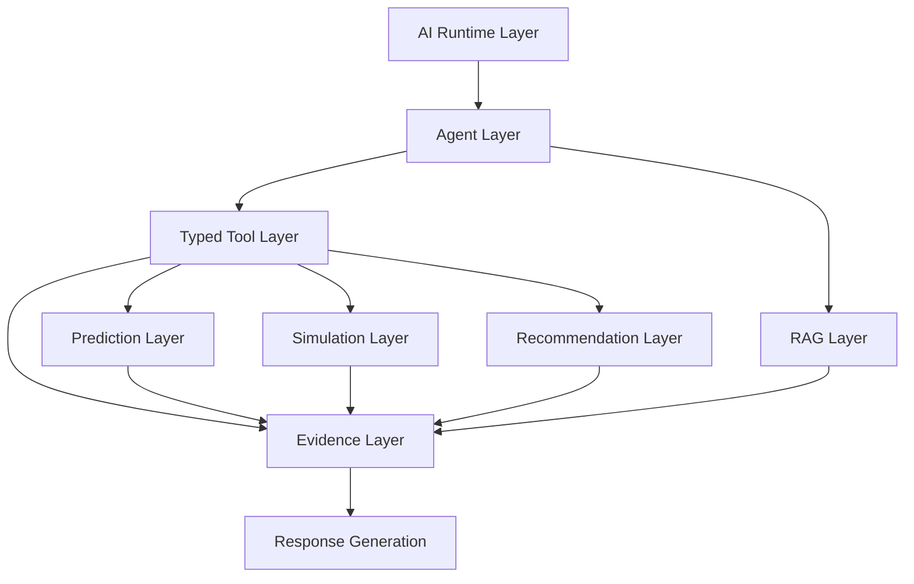

# AI Implementation Architecture

## 1. Purpose

This document is the anchor for `13_AI_Intelligence_Implementation/`. It translates [ai-architecture.md](../02_System_Architecture/ai-architecture.md), [ai-tool-contracts.md](../06_API_and_Integration/ai-tool-contracts.md), `07_AI_GIS_and_Intelligence/`, [ai-frontend-boundary-resolution.md](../11_Architecture_Resolution/ai-frontend-boundary-resolution.md), and `12_Data_GIS_Implementation/` into a complete implementation-level design for DistrictMind's AI runtime, RAG, agents, typed tools, grounding, safety, evaluation, feature engineering, prediction, model lifecycle, simulation, and recommendation systems. No AI code, model, or agent is implemented by this document or milestone.

**Project context note:** this milestone's brief names Warangal as the initial case-study/prototype focus district. No prior document (ED-M1 through ED-M4 Part 1) names a specific pilot district — [implementation-strategy.md](../08_Implementation_Foundation/implementation-strategy.md) Section 4 discusses "one district's boundary" as a pilot slice without naming which one, and [constraints.md](../01_Requirements/constraints.md) scopes M1 to "Telangana districts" generally. This is recorded as new project context, not a contradiction, and is carried through this folder's examples where relevant (e.g., [ED-M4-P2-VALIDATION.md](ED-M4-P2-VALIDATION.md) Section 29), without inventing any Warangal-specific dataset, boundary, or fact.

## 2. Scope

In scope: the complete AI/ML implementation blueprint across all 15 files in this folder. Out of scope: any application code, model artifact, agent implementation, or prompt template.

## 3. AI Implementation Boundaries — Restated

Unchanged from AD-API-002, AD-DE-005, AD-DB-006, and [ai-frontend-boundary-resolution.md](../11_Architecture_Resolution/ai-frontend-boundary-resolution.md):

**The AI Agent never appears left of "Typed Tool" in any call path.** This document does not revise this boundary; every subsequent document in this folder is designed within it.

## 4. AI Responsibilities

| Responsibility | Owner |
|---|---|
| Intent understanding | AI Agent |
| Planning / tool selection | AI Agent |
| Reasoning over retrieved Evidence | AI Agent |
| Response composition | AI Agent |
| Grounding validation | AI/ML layer (a distinct stage from the Agent's own reasoning, [ai-safety-implementation.md](ai-safety-implementation.md)) |

## 5. Non-AI Responsibilities

| Responsibility | Owner |
|---|---|
| Database access | Repository layer ([repository-layer-design.md](../09_Backend_Implementation/repository-layer-design.md)) |
| Spatial computation | GIS Service ([gis-computation-engine.md](../07_AI_GIS_and_Intelligence/gis-computation-engine.md)) |
| Business rules / invariants | Domain Logic layer ([domain-layer-design.md](../09_Backend_Implementation/domain-layer-design.md)) |
| Authorization decisions | Authorization module ([authorization-implementation.md](../09_Backend_Implementation/authorization-implementation.md)) — **never the AI itself** |
| Data validation | Validation pipeline ([data-validation-implementation.md](../12_Data_GIS_Implementation/data-validation-implementation.md)) |
| Prediction/Simulation execution | Prediction/Simulation Services ([prediction-implementation.md](prediction-implementation.md), [simulation-and-scenario-implementation.md](simulation-and-scenario-implementation.md)) — the AI Agent *invokes* these via typed tools, it does not execute them itself |
| Recommendation generation | Recommendation Service ([recommendation-and-decision-intelligence-implementation.md](recommendation-and-decision-intelligence-implementation.md)) |

## 6. AI Reasoning vs. Authoritative Computation — The Central Distinction

**An LLM never independently performs an authoritative GIS or database calculation when a backend tool can perform it.** This is the single most important rule this entire folder implements:

| AI Reasoning | Authoritative Computation |
|---|---|
| Interpreting what a user is asking | Computing a coverage-gap set (GIS Service) |
| Deciding which typed tools to call, in what order | Executing a spatial join (Repository/GIS layer) |
| Synthesizing retrieved Evidence into a coherent explanation | Running a trained Prediction model (Prediction Service) |
| Communicating confidence/uncertainty already computed by a backend service | Computing that confidence value itself (Model Execution Metadata, [model-lifecycle-implementation.md](model-lifecycle-implementation.md)) |
| Explaining a Recommendation's rationale | Scoring/ranking Recommendation candidates (Recommendation Service) |

If a question requires a number, a spatial result, or a business-rule determination, the Agent's job is to *find the right typed tool that already computes it correctly* — never to estimate, guess, or compute it via its own language-model reasoning.

## 7. AI Architecture Layers

| Layer | Detail Document |
|---|---|
| Runtime | [ai-runtime-architecture.md](ai-runtime-architecture.md) |
| Agent | [agent-implementation-architecture.md](agent-implementation-architecture.md) |
| Typed Tool | [typed-tool-implementation.md](typed-tool-implementation.md) |
| Evidence | [grounding-and-evidence-implementation.md](grounding-and-evidence-implementation.md) |
| RAG | [rag-implementation.md](rag-implementation.md), [embedding-and-retrieval-implementation.md](embedding-and-retrieval-implementation.md) |
| Prediction | [feature-engineering-implementation.md](feature-engineering-implementation.md), [prediction-implementation.md](prediction-implementation.md), [model-lifecycle-implementation.md](model-lifecycle-implementation.md) |
| Simulation | [simulation-and-scenario-implementation.md](simulation-and-scenario-implementation.md) |
| Recommendation | [recommendation-and-decision-intelligence-implementation.md](recommendation-and-decision-intelligence-implementation.md) |
| Response Generation | [ai-runtime-architecture.md](ai-runtime-architecture.md) Section 9 |

## 8. Authorization Boundary

Every Typed Tool invocation inherits the calling user's authorization scope, enforced server-side — restated unchanged from [authorization-implementation.md](../09_Backend_Implementation/authorization-implementation.md) Section 8. **The AI never decides its own authorization.**

## 9. Data-Access Boundary

The AI Agent has no database credential of any kind — restated unchanged from AD-DE-005/AD-DB-006/AD-API-002.

## 10. GIS Boundary

The AI Agent requests spatial computation via typed tools (`spatial_query`, `coverage_analysis`, `accessibility_analysis`); it never manipulates the authoritative spatial database directly — restated unchanged from AD-FE-004 and [gis-frontend-boundary-resolution.md](../11_Architecture_Resolution/gis-frontend-boundary-resolution.md), extended here to the AI layer specifically (which, unlike the frontend, is backend-resident but still subject to the identical prohibition).

## 11. Security Boundary

Full treatment in every document's own Security section (per this milestone's requirement); consolidated view in [ai-safety-implementation.md](ai-safety-implementation.md).

## 12. Observability

Every AI request, agent run, tool call, and safety event is traceable via a correlation ID — restated unchanged from [backend-observability.md](../09_Backend_Implementation/backend-observability.md) Sections 2–4, elaborated per-layer throughout this folder.

## 13. Failure Handling

Restated unchanged from [agent-execution-architecture.md](../07_AI_GIS_and_Intelligence/agent-execution-architecture.md) Sections 9–14 and [ai-safety-and-grounding.md](../07_AI_GIS_and_Intelligence/ai-safety-and-grounding.md) — every failure mode (missing evidence, conflicting sources, stale data, tool failure) resolves to an explicit, honest disclosure, never a fabricated answer.

## 14. Performance

Restated unchanged from [database-performance.md](../05_Database_Design/database-performance.md) Section 11, [caching-and-performance.md](../09_Backend_Implementation/caching-and-performance.md), and [frontend-performance-and-responsiveness.md](../10_Frontend_Implementation/frontend-performance-and-responsiveness.md)'s UI Responsiveness Contract — no numeric target is invented anywhere in this folder.

## 15. M1–M6 Alignment

| Milestone | AI Capability |
|---|---|
| M1 — Digital Twin Foundation | No AI capability required — the digital twin substrate this layer will later reason over |
| M2 — District Intelligence | No AI capability required — the multi-domain data this layer will later retrieve |
| M3 — Grounded Agentic AI | Runtime, Agent, Typed Tool, RAG, Grounding/Evidence, Safety, Evaluation (data-domain tools) |
| M4 — Predictive Intelligence | Feature Engineering, Prediction, Model Lifecycle |
| M5 — Scenario Simulation & Recommendations | Simulation/Scenario |
| M6 — Advanced Agentic District Intelligence | Recommendation/Decision Intelligence, full multi-agent orchestration |

## 16. Traceability to Existing Architecture Decisions

| This Folder Builds On | Decision |
|---|---|
| Typed-tool-only AI data access | AD-DE-005, AD-DB-006, AD-API-002 |
| Six-category state separation | AD-DB-005 |
| Simulation reuses trained Prediction models | AD-AI-002 |
| No fabricated numeric confidence | AD-AI-003 |
| Minimum-sufficient tool-call planning | AD-AI-004 |
| Documented, inspectable Recommendation scoring | AD-AI-005 |
| AI Agent has no unrestricted API data-access path | AD-API-002 |

## 17. Open Decisions

Every AI/ML technology status referenced throughout this folder remains exactly as unresolved as established in prior milestones — see [ED-M4-P2-VALIDATION.md](ED-M4-P2-VALIDATION.md) Section 27 for the consolidated audit.
