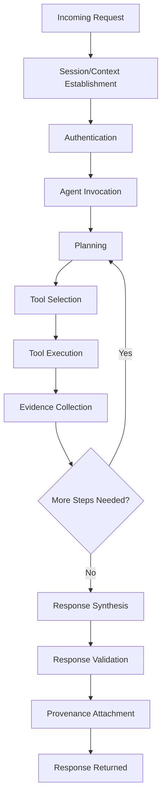

# AI Runtime Architecture

## 1. Purpose

This document defines the request lifecycle for an AI-mediated request, elaborating [agent-execution-architecture.md](../07_AI_GIS_and_Intelligence/agent-execution-architecture.md) and [ai-agent-integration.md](../06_API_and_Integration/ai-agent-integration.md) with implementation-level detail. No runtime code or framework selection occurs here.

## 2. Request Lifecycle — Overview

## 3. Session and Context Handling

A request carries a session identifier (per the calling user's authenticated session, [authentication-implementation.md](../09_Backend_Implementation/authentication-implementation.md)) and a conversation context (prior turns, if the interaction is multi-turn). Context is scoped strictly to that session — no cross-session or cross-user context is ever shared, consistent with the district- and user-scoped authorization model ([authorization-implementation.md](../09_Backend_Implementation/authorization-implementation.md)).

## 4. Agent Invocation

The API layer invokes the Agent Layer ([agent-implementation-architecture.md](agent-implementation-architecture.md)) with: the user's request text, the resolved authorization scope, and any relevant conversation context. The Agent never receives raw database credentials or unrestricted service handles — only its typed-tool interface ([typed-tool-implementation.md](typed-tool-implementation.md)).

## 5. Planning

The Agent interprets intent and produces a plan — a sequence of intended typed-tool calls. Planning is conceptual, not a fixed algorithm choice; no specific planning technique (ReAct, plan-and-execute, etc.) is selected here, consistent with the AI framework itself remaining Candidate ([technology-stack.md](../00_Engineering_Overview/technology-stack.md)).

## 6. Tool Selection and Execution

Restated from AD-AI-004 (minimum-sufficient tool-call planning): the Agent selects only the typed tools necessary to answer the request, avoiding redundant calls. Each tool execution passes through the full chain defined in [typed-tool-implementation.md](typed-tool-implementation.md) Section 3.

## 7. Evidence Collection

Each tool result becomes an Evidence item ([grounding-and-evidence-implementation.md](grounding-and-evidence-implementation.md)), accumulated across however many steps the plan requires.

## 8. Intermediate State

Intermediate state (partial evidence, plan progress) is held only for the duration of the request/session — restated unchanged from AD-DE-004's sandboxing principle applied to runtime state: intermediate reasoning state is never written to source-of-truth storage.

## 9. Response Synthesis and Validation

The Agent composes a natural-language response strictly from accumulated Evidence. A distinct validation stage ([ai-safety-implementation.md](ai-safety-implementation.md) Section 3) checks that every claim in the drafted response is traceable to Evidence before the response is finalized — this validation stage is conceptually separate from the Agent's own generation, consistent with Section 4 of [ai-implementation-architecture.md](ai-implementation-architecture.md).

## 10. Provenance Attachment

Before being returned, the response is attached with its supporting Evidence, sources, freshness, and confidence/uncertainty information ([grounding-and-evidence-implementation.md](grounding-and-evidence-implementation.md)) — restated unchanged from [evidence-provenance-flow.md](../06_API_and_Integration/evidence-provenance-flow.md).

## 11. Failure Recovery

| Failure | Runtime Behavior |
|---|---|
| Tool execution failure | The failure is surfaced as a distinct Evidence-gap condition; the Agent either retries (bounded, Section 14), substitutes an alternative tool if one exists, or discloses the gap in its final response — it never fabricates a substitute result |
| Partial plan failure | A response is still composed from whatever Evidence was successfully collected, with the gap explicitly disclosed, rather than failing the entire request |
| Total plan failure | An explicit "unable to answer" response, never a guessed one |

## 12. Timeout

A request-level and tool-call-level timeout concept exists (restated from [engineering-quality-gates.md](../08_Implementation_Foundation/engineering-quality-gates.md)); **no specific numeric timeout value is invented here** — the value itself remains an implementation/tuning decision.

## 13. Cancellation

A caller may cancel an in-flight request (e.g., the user navigates away); the runtime propagates cancellation to any in-flight tool call where the underlying service supports it, and discards partial state without persisting it.

## 14. Retries

Tool calls may be retried a bounded number of times on transient failure (no specific retry count invented) — restated consistent with [error-handling-design.md](../09_Backend_Implementation/error-handling-design.md) Section 6. Retries are only applied to idempotent tool calls (Section 15).

## 15. Idempotency

Read-oriented typed tools (`get_*`, `spatial_query`, `coverage_analysis`, `accessibility_analysis`) are naturally idempotent and safely retryable. `request_prediction`, `create_scenario`, and `run_scenario` require idempotency consideration at the Application Service layer (restated from [background-job-architecture.md](../09_Backend_Implementation/background-job-architecture.md) Section 5) since a retried invocation should not create duplicate Prediction/Scenario records.

## 16. Concurrency

Multiple tool calls within a single plan step that have no data dependency on one another may execute concurrently (e.g., retrieving Weather and Transportation evidence independently before assessing impact) — restated consistent with the async execution classification in [agent-execution-architecture.md](../07_AI_GIS_and_Intelligence/agent-execution-architecture.md) Section 8.

## 17. Resource Isolation

An AI request's tool executions run within the same authorization and resource boundaries as any other API-driven request — no elevated or unrestricted execution context is granted to the Agent, restated unchanged from [ai-implementation-architecture.md](ai-implementation-architecture.md) Section 8.

## 18. Observability and Auditability

Every stage in Section 2's lifecycle emits a trace event under a shared correlation ID for the request, allowing a full reconstruction of: which plan was formed, which tools were called with which (authorized) inputs, which Evidence was collected, and how the final response was composed — restated unchanged from [backend-observability.md](../09_Backend_Implementation/backend-observability.md) and elaborated further in [ai-safety-implementation.md](ai-safety-implementation.md) Section 12.

## 19. Worked Example — Simple Single-Step Request

**"What is the population of District X?"**

1. Session established, user authenticated/authorized for District X.
2. Agent plans a single tool call: `get_demographics(districtId=X)`.
3. Tool executes through the full typed-tool chain ([typed-tool-implementation.md](typed-tool-implementation.md)).
4. One Evidence item is collected.
5. Response synthesized directly from that Evidence item, with provenance attached.
6. Response returned.

## 20. Worked Example — Multi-Step Agentic Request

**"How could heavy rainfall affect disaster risk, transportation and healthcare access?"** (Canonical Example C)

1. Session established, authorization resolved.
2. Agent plans a multi-step sequence: Weather evidence → disaster risk assessment → transportation impact → healthcare accessibility → aggregation.
3. Step 1: `get_weather(...)` — collects rainfall Evidence.
4. Step 2: `get_disaster_risk(...)` — using the rainfall Evidence as context, retrieves (not independently computes) the disaster risk assessment.
5. Step 3: `spatial_query`/`accessibility_analysis` against Transportation — assesses which road segments/areas are affected.
6. Step 4: `accessibility_analysis` against Healthcare — re-evaluates healthcare accessibility given the transportation impact.
7. Step 5: Evidence Aggregation — all four Evidence items combined, each retaining its own source, timestamp, and state-category label (Observed/Derived/Predicted, per [digital-twin-state-model.md](../05_Database_Design/digital-twin-state-model.md)).
8. Response synthesis — a single coherent explanation citing the full chain, with per-claim provenance.
9. Response validation — every claim checked against the aggregated Evidence set.
10. Provenance attachment and return.

This mirrors the identical 10-stage shape used in [gis-computation-implementation.md](../12_Data_GIS_Implementation/gis-computation-implementation.md) Section 4 for the same example, extended here with the Agent/Evidence layer specifically.

## 21. Security

The runtime never grants the Agent any authority beyond what its typed tools already enforce — restated unchanged from [ai-implementation-architecture.md](ai-implementation-architecture.md) Sections 8–10; full treatment in [ai-safety-implementation.md](ai-safety-implementation.md).

## 22. Performance

Long-running multi-step requests (Section 20) are candidates for asynchronous/background execution with progressive result delivery, consistent with the UI Responsiveness Contract ([frontend-performance-and-responsiveness.md](../10_Frontend_Implementation/frontend-performance-and-responsiveness.md)); streaming is noted as a future/Proposed mechanism only, not committed. No numeric latency target is invented.

## 23. Milestone Traceability

| Runtime Capability | First Needed |
|---|---|
| Single-step tool invocation | M3 |
| Multi-step agentic planning, evidence aggregation | M3 (data-domain), M6 (full cross-domain) |

## 24. Open Decisions

- Agent orchestration framework (e.g., LangGraph) — Candidate, unchanged.
- Specific timeout/retry numeric values — unresolved, intentionally.
