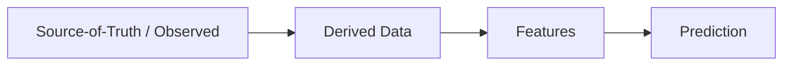

# Feature Engineering Implementation

## 1. Purpose

This document defines the implementation approach for turning Source-of-Truth and Derived data into features suitable for Prediction models, elaborating [feature-engineering.md](../07_AI_GIS_and_Intelligence/feature-engineering.md). No exact formula beyond what source documents already establish is invented here.

## 2. The Observed/Derived/Feature/Prediction Boundary

**Features are a distinct stage from both Derived data and Prediction output** — restated unchanged from [digital-twin-state-model.md](../05_Database_Design/digital-twin-state-model.md): a feature is an input to a model, never itself presented to a user as a Prediction, and never confused with the raw Observed value it was built from.

## 3. Feature Types

| Type | Example |
|---|---|
| Source features | A raw rainfall observation value |
| Derived features | A rolling average of rainfall over a preceding period |
| Spatial features | Distance to nearest health facility, road density within a village boundary |
| Temporal features | Season indicator, day-of-year, time since last observation |

## 4. Aggregation

District-level or village-level aggregation of finer-grained observations (e.g., station-level rainfall aggregated to district average) follows the same spatial-aggregation computation already defined in [gis-computation-engine.md](../07_AI_GIS_and_Intelligence/gis-computation-engine.md) Section 2.11 — feature engineering does not invent a separate aggregation mechanism.

## 5. Normalization Concept

Feature values are normalized/scaled prior to model input where the modeling approach requires it — no specific normalization technique or exact formula is prescribed here; this is a model-specific implementation detail.

## 6. Categorical Handling

Categorical attributes (e.g., soil type for Crop prediction, road class for Traffic prediction) are encoded into a model-consumable form — no specific encoding scheme is mandated.

## 7. Missing Data and Outliers

| Concern | Approach |
|---|---|
| Missing data | Handled consistent with the data-quality discipline already established ([data-quality-implementation.md](../12_Data_GIS_Implementation/data-quality-implementation.md)) — a missing input is disclosed as a feature-completeness gap, never silently imputed with an unstated assumption |
| Outliers | Flagged consistent with the same data-quality validation stage ([data-validation-implementation.md](../12_Data_GIS_Implementation/data-validation-implementation.md)) before being used as model input |

## 8. Feature Lineage, Versioning, Freshness

| Concern | Detail |
|---|---|
| Lineage | Every feature traces back to its contributing Source/Derived records, restated unchanged from [data-lineage-and-provenance-implementation.md](../12_Data_GIS_Implementation/data-lineage-and-provenance-implementation.md) |
| Versioning | A feature definition (its computation logic) is versioned independently of the model that consumes it, per [model-lifecycle-implementation.md](model-lifecycle-implementation.md) Section 3 |
| Freshness | A feature's freshness is inherited from its most-stale contributing input |

## 9. Feature-Leakage Prevention

A feature must never incorporate information that would not have been available at the point in time the Prediction is meant to represent (e.g., a rainfall feature must not include readings from after the forecast target date) — this is treated as a correctness defect, restated consistent with the temporal-integrity discipline in [temporal-data-implementation.md](../12_Data_GIS_Implementation/temporal-data-implementation.md).

## 10. Training-Serving Consistency

The exact feature computation logic used at model training time must be identical to the logic used at prediction-serving time — a divergence between the two (e.g., a different aggregation window) is treated as a defect that invalidates the model's applicability, restated consistent with the embedding-compatibility discipline in [embedding-and-retrieval-implementation.md](embedding-and-retrieval-implementation.md) Section 16.

## 11. District-Level Aggregation

Restated from Section 4 — every domain's features that are ultimately consumed at district granularity (for district-level Prediction/Recommendation) are aggregated through the same Geography hierarchy backbone (State → District → Mandal → Village) established in [data-gis-integration.md](../12_Data_GIS_Implementation/data-gis-integration.md) Section 5.

## 12. Cross-Domain Features

A feature may combine multiple domains (e.g., a Healthcare Demand feature combining Demographics, Healthcare capacity, and Transportation accessibility) — restated consistent with [feature-engineering.md](../07_AI_GIS_and_Intelligence/feature-engineering.md) Section 7's cross-domain construction discipline, with temporal alignment enforced per [data-gis-integration.md](../12_Data_GIS_Implementation/data-gis-integration.md) Section 6.

## 13. Domain Examples

| Domain | Example Features |
|---|---|
| Weather/Rainfall | Rolling rainfall average, seasonal indicator, station-to-district aggregation |
| Transportation/Road connectivity | Road density, distance to nearest major road, network centrality of a village |
| Healthcare access | Distance to nearest facility, facility capacity relative to nearby population |
| Population/Demographics | Population density, growth trend indicator |
| Infrastructure | Facility count per capita, infrastructure age/condition indicator (where available) |
| Agriculture | Crop-season indicator, historical yield trend, soil-type category |
| Environmental conditions | Temperature trend, combined rainfall/humidity indicators |

## 14. Security

Feature computation reads only through the same authorized Repository/Application Service layer as any other data access — no direct, unmediated database access is introduced for feature engineering, restated unchanged from [ai-implementation-architecture.md](ai-implementation-architecture.md) Section 9.

## 15. Observability

Feature computation runs are traceable, including which feature-definition version and which underlying data version produced a given feature value — restated consistent with [model-lifecycle-implementation.md](model-lifecycle-implementation.md) Section 9.

## 16. Milestone Traceability

| Feature Engineering Capability | First Needed |
|---|---|
| Source/Derived feature construction | M4 |
| Cross-domain feature construction | M4 (data-domain), M6 (full cross-domain with recommendation) |

## 17. Open Decisions

- Specific feature store technology, if adopted — Candidate, unresolved.
- Normalization/encoding technique specifics — unresolved, intentionally left as a modeling detail.
