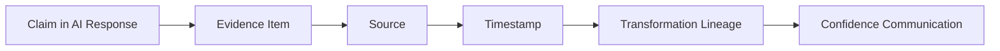

# Grounding and Evidence Implementation

## 1. Purpose

This document implements the Claim → Evidence → Source → Timestamp → Transformation → Confidence chain first established in [ai-safety-and-grounding.md](../07_AI_GIS_and_Intelligence/ai-safety-and-grounding.md), at implementation-level detail. No numeric confidence threshold is invented here.

## 2. The Chain

**Every claim in an AI response must trace back through this full chain.** A claim that cannot be traced is not included in the response ([ai-runtime-architecture.md](ai-runtime-architecture.md) Section 9's validation stage).

## 3. Evidence Object Concept

An Evidence item conceptually carries: the claim/data it supports, its source identity and version, its timestamp, its transformation lineage (if derived/predicted/simulated), and its state-category label (Observed/Derived/Prediction/Simulation/Recommendation, per [digital-twin-state-model.md](../05_Database_Design/digital-twin-state-model.md)). No fixed JSON schema is invented here — the concept, not the wire format, is what this document defines (restated consistent with the AI-frontend boundary's own refusal to invent exact schemas, [ai-frontend-boundary-resolution.md](../11_Architecture_Resolution/ai-frontend-boundary-resolution.md)).

## 4. Source Identity and Version

Every Evidence item's source is identifiable and versioned — restated unchanged from [data-lineage-and-provenance-implementation.md](../12_Data_GIS_Implementation/data-lineage-and-provenance-implementation.md). A RAG-retrieved chunk's source is its document identifier/version ([rag-implementation.md](rag-implementation.md) Section 8); a typed-tool result's source is the underlying dataset/model version ([typed-tool-implementation.md](typed-tool-implementation.md)).

## 5. Timestamp and Freshness

Every Evidence item carries the timestamp of the underlying data (observation time) and, where relevant, the computation/retrieval time — restated unchanged from [temporal-data-implementation.md](../12_Data_GIS_Implementation/temporal-data-implementation.md). Freshness (age relative to now) is derivable from this and disclosed wherever staleness is material to the claim.

## 6. Transformation Lineage

For Derived, Prediction, Simulation, and Recommendation Evidence, the chain of transformations that produced the value is preserved — restated unchanged from [data-lineage-and-provenance-implementation.md](../12_Data_GIS_Implementation/data-lineage-and-provenance-implementation.md) Section 4, extended here to explicitly include Prediction ([prediction-implementation.md](prediction-implementation.md) model/feature version), Simulation ([simulation-and-scenario-implementation.md](simulation-and-scenario-implementation.md) baseline reference), and Recommendation ([recommendation-and-decision-intelligence-implementation.md](recommendation-and-decision-intelligence-implementation.md) scoring inputs) provenance.

## 7. Provenance by Category

| Category | Provenance Carried |
|---|---|
| Derived computation | Contributing Source records, computation timestamp, computation type ([data-transformation-implementation.md](../12_Data_GIS_Implementation/data-transformation-implementation.md)) |
| Prediction | Model version, feature version, forecast horizon, uncertainty indicator |
| Simulation | Originating Scenario, baseline snapshot reference |
| Recommendation | Contributing Evidence/Prediction/Simulation inputs, scoring rationale (per AD-AI-005) |
| AI Response | The full aggregated Evidence set behind the composed answer |

## 8. Confidence Communication

Where a backend service (a Prediction model, a data-quality pipeline) already computes a confidence or uncertainty indicator, that indicator is carried through Evidence and communicated in the response — restated unchanged from AD-AI-003: **the AI never fabricates a confidence value that was not produced by a validated model or method.** Where no such indicator exists, the response communicates qualitative uncertainty (e.g., "based on limited data") rather than inventing a number.

## 9. Evidence Aggregation

For a multi-step request (Worked Example C), Evidence items from each step are aggregated into a single set behind the final response, each retaining its own independent provenance — restated unchanged from [ai-runtime-architecture.md](ai-runtime-architecture.md) Section 7 and Section 20.

## 10. Conflicting Evidence

Where two Evidence items disagree (e.g., two data sources on the same fact, restated from [data-gis-integration.md](../12_Data_GIS_Implementation/data-gis-integration.md) Section 7), the response discloses the conflict rather than silently resolving it via the Agent's own judgment — the Agent is not a source-precedence authority; that resolution belongs to the data layer.

## 11. Missing Evidence

Where a claim would require Evidence that could not be obtained (tool failure, empty retrieval), that gap is disclosed explicitly in the response, never silently omitted in a way that implies completeness.

## 12. Stale Evidence

Where the freshest available Evidence for a claim is old enough to be material, its age is disclosed alongside the claim — restated unchanged from [data-quality-implementation.md](../12_Data_GIS_Implementation/data-quality-implementation.md).

## 13. Unsupported Claims

**A response never contains a claim without a corresponding Evidence item.** This is enforced by the response validation stage ([ai-runtime-architecture.md](ai-runtime-architecture.md) Section 9), elaborated further as a safety control in [ai-safety-implementation.md](ai-safety-implementation.md) Section 2.

## 14. Provenance Propagation to the Frontend

The API response carries Evidence/provenance/confidence information to the frontend as structured response fields (answer, evidence, provenance, confidence/uncertainty, data-state category, warnings) — restated unchanged from [ai-frontend-boundary-resolution.md](../11_Architecture_Resolution/ai-frontend-boundary-resolution.md); the frontend renders this information without independently deriving or recomputing any of it.

## 15. Canonical Examples

### 15.1 Example A
The coverage-gap claim's Evidence is the `coverage_analysis` tool result; its Source is the Village/Health Facility datasets; its Timestamp is the computation time; its Transformation lineage is the buffer+containment computation; its Confidence is qualitative (deterministic geometric computation, not a probabilistic model).

### 15.2 Example B
The accessibility-delta claim's Evidence is the `run_scenario` result; its Source is the pre-closure baseline graph; its Timestamp is the scenario execution time; its Transformation lineage is the network-impact recomputation on the cloned graph; the response explicitly frames this as hypothetical, never as a Source-of-Truth fact.

### 15.3 Example C
Each of the four chained claims (rainfall level, disaster risk, transportation impact, healthcare accessibility) carries independent Evidence, and the final aggregated response's Confidence reflects the weakest link in the chain (e.g., if the disaster risk assessment is itself a Prediction with disclosed uncertainty, the downstream claims inherit that qualification rather than presenting a false certainty).

## 16. Security

Evidence and provenance metadata are never editable by the Agent itself — only by the process that produced them, restated unchanged from [data-gis-integration.md](../12_Data_GIS_Implementation/data-gis-integration.md) Section 9.

## 17. Observability

Every Evidence item's creation is traceable under the request correlation ID — restated unchanged from [ai-runtime-architecture.md](ai-runtime-architecture.md) Section 18.

## 18. Milestone Traceability

| Grounding Capability | First Needed |
|---|---|
| Claim-to-Evidence chain for single-tool responses | M3 |
| Multi-step Evidence aggregation with conflict/staleness disclosure | M3 (data-domain), M6 (full cross-domain) |

## 19. Open Decisions

- None beyond what is already open at the underlying data/prediction/simulation/recommendation layers — this document's chain concept itself is not contingent on any unresolved technology choice.
