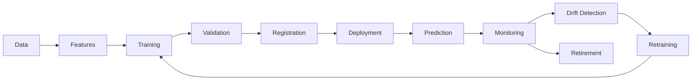

# Model Lifecycle Implementation

## 1. Purpose

This document defines the implementation approach for the full model lifecycle, elaborating [model-lifecycle.md](../07_AI_GIS_and_Intelligence/model-lifecycle.md). No specific ML platform is selected here, and no numeric threshold (accuracy, drift magnitude, retraining cadence) is invented.

## 2. The Lifecycle

## 3. Dataset, Feature, and Model Versioning

Each of the three is versioned independently: a dataset version identifies the training data snapshot; a feature version identifies the feature-computation logic ([feature-engineering-implementation.md](feature-engineering-implementation.md) Section 8); a model version identifies the trained artifact and its hyperparameters/architecture. This three-way independence is what makes reproducibility (Section 4) possible.

## 4. Reproducibility

Given a dataset version, feature version, and model version, the exact same training process is reproducible — restated consistent with the reproducibility discipline already required of AI evaluation ([ai-evaluation-implementation.md](ai-evaluation-implementation.md) Section 10).

## 5. Validation

A newly trained model is validated against held-out data before being considered for promotion — no specific validation metric or numeric passing threshold is invented here; the existence of a validation gate is the requirement, not its calibration.

## 6. Registration and Model Registry Concept

A validated model is registered in a model registry (conceptual — no specific product selected) recording its version, training lineage (dataset/feature versions), and validation results — this registry is what [prediction-implementation.md](prediction-implementation.md) Section 6 refers to when attaching model version metadata to a Prediction output.

## 7. Deployment Abstraction

A registered model is deployed behind the Prediction Service's serving boundary ([prediction-implementation.md](prediction-implementation.md) Section 12) — the calling Application Service addresses "the current model for domain X," not a specific deployment artifact path, so that a model swap does not require caller-side changes.

## 8. Promotion and Rollback

A new model version is promoted to serve live predictions only after passing validation; if a promoted model's monitored performance (Section 9) degrades, it can be rolled back to the prior registered version — restated consistent with the rollback discipline already established for application deployments in [environment-management.md](../08_Implementation_Foundation/environment-management.md).

## 9. Monitoring

Post-deployment, a model's prediction quality is monitored on an ongoing basis (e.g., comparing predictions against eventual observed outcomes where available) — no specific monitoring metric value is invented; the mechanism's existence, not its calibration, is defined here.

## 10. Drift Detection

Feature-distribution drift (input data changing shape over time) and target/performance drift (the model's predictions becoming systematically less accurate) are both monitored — restated consistent with Section 9; detection triggers a review, not an automatic retrain, since drift alone does not guarantee retraining is the correct response.

## 11. Retraining Triggers

Retraining is triggered by validated drift or degradation findings (Section 10), not by an arbitrary invented schedule (e.g., "every N days") — the cadence itself remains an operational decision outside this document's scope.

## 12. Retirement

A model version is retired when superseded by a validated replacement or when its underlying domain/feature set is deprecated — restated consistent with the dataset-deprecation gap identified in [data-governance-implementation.md](../12_Data_GIS_Implementation/data-governance-implementation.md) Section 10, extended here to model artifacts. A retired model's registry entry and lineage are retained for audit, never deleted outright.

## 13. Provenance and Auditability

Every stage in Section 2 is logged against the model's registry entry — training run, validation result, promotion/rollback event, monitoring alert, retraining trigger, retirement — providing a full audit trail consistent with [data-lineage-and-provenance-implementation.md](../12_Data_GIS_Implementation/data-lineage-and-provenance-implementation.md)'s provenance discipline applied to models rather than data records.

## 14. Security

Model artifacts and training data are accessed only through the same authorized boundaries as any other backend resource — no unrestricted access path is introduced for model lifecycle operations.

## 15. Observability

Every lifecycle event (Section 13) emits a trace/log entry; monitoring and drift-detection findings are surfaced through the same observability channel as any other backend alert ([backend-observability.md](../09_Backend_Implementation/backend-observability.md)).

## 16. Milestone Traceability

| Lifecycle Capability | First Needed |
|---|---|
| Training, validation, registration, deployment | M4 |
| Monitoring, drift detection, retraining, retirement | M4 (mechanism design), ongoing operational practice thereafter |

## 17. Open Decisions

- ML platform/model registry product — Candidate, unresolved.
- Specific validation metrics, drift thresholds, retraining cadence — intentionally unresolved, not invented.
