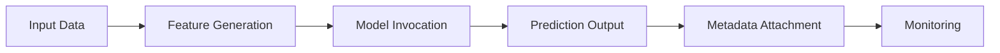

# Prediction Implementation

## 1. Purpose

This document defines the implementation approach for the Prediction layer, elaborating [prediction-architecture.md](../07_AI_GIS_and_Intelligence/prediction-architecture.md). No specific model architecture is selected here.

## 2. Prediction Pipeline

## 3. Input Pipeline

Prediction input is assembled from Curated/Derived data via the feature generation stage defined in [feature-engineering-implementation.md](feature-engineering-implementation.md) — no Prediction reads directly from raw Source data, ensuring the same validation/quality guarantees apply.

## 4. Feature Generation

Restated unchanged from [feature-engineering-implementation.md](feature-engineering-implementation.md) — the exact same feature-computation logic used at training time must be used at serving time (Section 10 of that document).

## 5. Model Invocation

The Prediction Service invokes a registered, versioned model ([model-lifecycle-implementation.md](model-lifecycle-implementation.md) Section 4) through a serving boundary — the Agent invokes this only via the `request_prediction` typed tool ([typed-tool-implementation.md](typed-tool-implementation.md) Section 8.3), never directly.

## 6. Output and Metadata

A Prediction output carries: the predicted value, forecast horizon, an uncertainty indicator (only if produced by the model itself, per AD-AI-003), and metadata — model version, feature version, and generation timestamp — restated unchanged from [typed-tool-implementation.md](typed-tool-implementation.md) Section 8.3.

## 7. Forecast Horizon Concept

Every Prediction is associated with a forecast horizon (how far into the future it applies) — no specific horizon value (days/weeks) is invented here; this is domain- and model-specific.

## 8. Uncertainty

Restated unchanged from AD-AI-003 and [grounding-and-evidence-implementation.md](grounding-and-evidence-implementation.md) Section 8: uncertainty is communicated only when a validated model or method actually produces it.

## 9. Validation, Monitoring, and Drift

| Concern | Detail |
|---|---|
| Validation | A model's output is validated against held-out data before deployment ([model-lifecycle-implementation.md](model-lifecycle-implementation.md) Section 5) |
| Monitoring | Ongoing prediction quality is monitored post-deployment ([model-lifecycle-implementation.md](model-lifecycle-implementation.md) Section 9) |
| Drift | Feature or target distribution drift is detected and triggers review ([model-lifecycle-implementation.md](model-lifecycle-implementation.md) Section 10) |
| Retraining | Triggered by validated drift or degradation, not on an arbitrary invented schedule |

## 10. Failure Handling

If a model is unavailable, input features are insufficient, or an input falls outside the model's valid distribution, the Prediction tool returns a disclosed failure rather than a guessed value — restated unchanged from [typed-tool-implementation.md](typed-tool-implementation.md) Section 8.3 and [ai-safety-implementation.md](ai-safety-implementation.md) Section 14.

## 11. Provenance

Every Prediction's model version, feature version, and generation timestamp is carried into its Evidence representation — restated unchanged from [grounding-and-evidence-implementation.md](grounding-and-evidence-implementation.md) Section 7.

## 12. Serving Boundary

The Prediction Service is invoked only through the Application Service layer, consistent with AD-DE-005/AD-API-002 — no direct model access exists outside this boundary, for the Agent or for any other caller.

## 13. Source-Supported Prediction Domains

Restated from the Blueprint's five-model list ([prediction-architecture.md](../07_AI_GIS_and_Intelligence/prediction-architecture.md) Section 3): **Flood, Rainfall, Population Growth, Traffic, Crop.** Each domain's implementation follows the identical pipeline in Section 2 — no domain-specific pipeline variant is invented beyond what feature engineering already documents per-domain (Section 13, [feature-engineering-implementation.md](feature-engineering-implementation.md)).

## 14. Healthcare Demand — Unresolved Contradiction, Explicitly Not Resolved Here

**This document does not silently resolve the Healthcare Demand forecasting gap.** As first identified in [prediction-architecture.md](../07_AI_GIS_and_Intelligence/prediction-architecture.md) Section 4.6 and restated in every subsequent milestone's contradiction audit:

- The **Abstract** references Healthcare Demand as a forecast target of the system.
- The **Blueprint's** explicit five-model list (Section 13 above) does not clearly include Healthcare Demand as a sixth model.

This implementation document states plainly: **Healthcare Demand's implementation status is UNRESOLVED.** No pipeline, feature set, or model is designed for it in this document, and none should be assumed to exist, until this divergence is explicitly resolved by a future architecture decision (analogous to how [routing-resolution.md](../11_Architecture_Resolution/routing-resolution.md) resolved the routing contradiction). Should Healthcare Demand forecasting ultimately be confirmed in scope, it would follow the identical pipeline structure defined in Section 2, with its own feature set drawing on Demographics, Healthcare, and Transportation domains (per the cross-domain feature concept in [feature-engineering-implementation.md](feature-engineering-implementation.md) Section 12) — but this remains a conditional statement, not a committed design.

## 15. Security

Restated unchanged from Section 12 — no model artifact or raw training data is exposed outside the Prediction Service boundary.

## 16. Observability

Restated unchanged from [model-lifecycle-implementation.md](model-lifecycle-implementation.md) Section 9.

## 17. Milestone Traceability

| Prediction Capability | First Needed |
|---|---|
| Flood, Rainfall, Population Growth, Traffic, Crop prediction | M4 |
| Healthcare Demand prediction | Unresolved — not assigned to any milestone pending the Section 14 gap's resolution |

## 18. Open Decisions

- Model architecture per domain — Candidate, unresolved.
- Healthcare Demand scope — **explicitly unresolved**, restated per Section 14.
- Forecast horizon values, drift-detection thresholds — intentionally unresolved, not invented.
