# Recommendation and Decision Intelligence Implementation

## 1. Purpose

This document defines the implementation approach for the Recommendation Engine and its relationship to AI-generated explanation, elaborating [recommendation-engine.md](../07_AI_GIS_and_Intelligence/recommendation-engine.md) and [decision-intelligence-workflows.md](../07_AI_GIS_and_Intelligence/decision-intelligence-workflows.md). **The weighted-scoring technique itself is not silently promoted into a confirmed technical decision by this document** — restated and elaborated in Section 6.

## 2. Decision Intelligence Pipeline

```mermaid
flowchart LR
    Context[Decision Context] --> EvColl[Evidence Collection]
    EvColl --> Derived[Derived Metrics]
    Derived --> PredIn[Prediction Inputs]
    PredIn --> SimRes[Scenario Results]
    SimRes --> Candidates[Candidate Actions]
    Candidates --> Constraints[Constraints]
    Constraints --> Scoring[Scoring]
    Scoring --> TradeOffs[Trade-offs]
    TradeOffs --> RecGen[Recommendation Generation]
    RecGen --> Explain[AI Explanation]
```



## 3. Decision Context

A Recommendation request originates from a decision context — a specific question a decision-maker is trying to answer (e.g., "where should a new health facility be sited," restated from [recommendation-engine.md](../07_AI_GIS_and_Intelligence/recommendation-engine.md) Section 2) — restated unchanged, not reinterpreted here.

## 4. Evidence Collection, Derived Metrics, Prediction Inputs, Scenario Results

The Recommendation Service assembles its inputs from exactly the same Evidence, Derived, Prediction, and Simulation layers already defined elsewhere in this folder — it introduces no independent data-access path, consistent with [ai-implementation-architecture.md](ai-implementation-architecture.md) Section 5's ownership table.

## 5. Candidate Actions and Constraints

Candidate actions (e.g., candidate facility sites) are generated from the decision context's structural constraints (e.g., within the uncovered area from Example A, on land within a village boundary) — restated unchanged from [recommendation-engine.md](../07_AI_GIS_and_Intelligence/recommendation-engine.md) Section 4.

## 6. Scoring Concept — The Weighted-Scoring Technique Gap

Restated unchanged from the Blueprint §14.3 formula already documented in [recommendation-engine.md](../07_AI_GIS_and_Intelligence/recommendation-engine.md) Section 5:

```
score = w1*(population_uncovered) + w2*(distance_to_nearest_facility) + w3*(projected_growth) - w4*(construction_cost_proxy)
```

AD-AI-005 established this scoring approach as "documented, inspectable" — meaning its structure is transparent and auditable, not that its weights or underlying technique are confirmed technology. **As identified in this milestone's brief, no dedicated `technology-stack.md` entry exists for the scoring/weighting technique itself** (e.g., whether it is implemented as a fixed weighted sum, a configurable rules engine, or a learned ranking model). This document does not resolve that gap — it is restated here as **UNRESOLVED**, consistent with the AI-provider and Healthcare Demand gaps also carried through this folder (Section 7, [prediction-implementation.md](prediction-implementation.md) Section 14).

## 7. Trade-offs

Where candidate actions trade off against one another (e.g., lower cost vs. faster coverage improvement), the scoring breakdown (Section 6) is preserved and surfaced rather than collapsed into a single opaque rank — restated consistent with AD-AI-005's inspectability intent.

## 8. Recommendation Generation vs. LLM-Generated Explanation

**This is a critical distinction, restated and elaborated from [ai-implementation-architecture.md](ai-implementation-architecture.md) Section 6 and [typed-tool-implementation.md](typed-tool-implementation.md) Section 8.5:**

| Recommendation Engine | LLM-Generated Explanation |
|---|---|
| Computes candidate scores deterministically from Evidence/Prediction/Simulation inputs (Section 6) | Explains, in natural language, a recommendation already produced by the engine |
| Is the sole authority on ranking/scoring | Never invents its own ranking or introduces a candidate the engine did not produce |
| Produces the same result given the same inputs (deterministic or model-versioned, consistent with reproducibility elsewhere in this folder) | May vary in phrasing but must never vary in the underlying facts it explains |

**The LLM explains evidence-backed recommendations; it never independently invents an authoritative decision.**

## 9. Provenance

Every Recommendation carries the full chain of Evidence/Prediction/Simulation inputs that fed its score, restated unchanged from [grounding-and-evidence-implementation.md](grounding-and-evidence-implementation.md) Section 7.

## 10. Uncertainty

Where a Recommendation's inputs include a Prediction with disclosed uncertainty (AD-AI-003), that uncertainty propagates into the Recommendation's own confidence framing rather than being discarded at the scoring stage.

## 11. Explainability

The scoring breakdown (Section 6/7) is what makes a Recommendation explainable — the AI's explanation restates and contextualizes this breakdown rather than substituting its own reasoning for it, restated from Section 8.

## 12. Human Review

A Recommendation is presented as a decision-support input, not an autonomous decision — restated unchanged from [decision-intelligence-workflows.md](../07_AI_GIS_and_Intelligence/decision-intelligence-workflows.md) Section 2's framing that a human decision-maker remains in the loop.

## 13. Auditability

Every Recommendation generation run (inputs, candidate set, scores, final ranking) is logged, restated unchanged from [ai-safety-implementation.md](ai-safety-implementation.md) Section 12.

## 14. Decision-Intelligence Workflows Mapped to the Canonical Examples

| Workflow | Basis |
|---|---|
| Healthcare accessibility | Example A's coverage-gap result feeds candidate facility-siting Recommendations |
| Bridge closure | Example B's Scenario Result feeds a Recommendation for mitigating transportation impact (e.g., alternate route investment) |
| Heavy rainfall | Example C's cross-domain Scenario/Prediction chain feeds a Recommendation for disaster-preparedness action |
| Full disaster/transportation/healthcare chain | The complete Example C aggregation, as traced in [ai-runtime-architecture.md](ai-runtime-architecture.md) Section 20, is the richest input set a Recommendation can draw from |

Restated consistent with [decision-intelligence-workflows.md](../07_AI_GIS_and_Intelligence/decision-intelligence-workflows.md)'s 10 workflows — no new workflow is invented here.

## 15. M1–M6 Mapping

| Milestone | Recommendation Capability |
|---|---|
| M6 — Advanced Agentic District Intelligence | Full Recommendation/Decision Intelligence, including cross-domain workflows |

## 16. Security

Recommendation generation reads only through already-authorized Evidence/Prediction/Simulation access paths — no independent data-access path is introduced, restated unchanged from Section 4.

## 17. Observability

Restated unchanged from Section 13.

## 18. Open Decisions

- **Weighted-scoring technique implementation approach — UNRESOLVED**, restated per Section 6; no technology-stack entry exists for it.
- Weight calibration (w1–w4) — unresolved, uncalibrated, unchanged from [recommendation-engine.md](../07_AI_GIS_and_Intelligence/recommendation-engine.md).
- Whether scoring is ever replaced or supplemented by a learned ranking model — not committed, Candidate at most.
