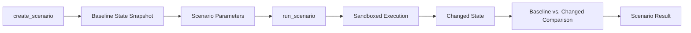

# Simulation and Scenario Implementation

## 1. Purpose

This document defines the implementation approach for the Simulation/Scenario layer, elaborating [simulation-architecture.md](../07_AI_GIS_and_Intelligence/simulation-architecture.md) and [scenario-engine.md](../07_AI_GIS_and_Intelligence/scenario-engine.md). No simulation formula beyond what source documents already establish is invented here.

## 2. Prediction vs. Simulation vs. Recommendation vs. AI Response — Restated

| Category | Meaning |
|---|---|
| Prediction | An expected future value/forecast, produced by a trained model against real conditions |
| Simulation | A hypothetical changed condition ("what if X changed") — restated unchanged from AD-AI-002 |
| Recommendation | A proposed action, derived from Evidence/Prediction/Simulation inputs |
| AI Response | A natural-language explanation of any of the above — never itself an authoritative category |

These four remain structurally distinct at every layer, consistent with the six-information-category discipline in [digital-twin-state-model.md](../05_Database_Design/digital-twin-state-model.md).

## 3. Scenario Lifecycle

## 4. Scenario Parameters

A scenario is defined by its type (e.g., CloseRoad, RainfallEvent) and its type-specific parameters (e.g., which Road Segment, what rainfall magnitude) — restated unchanged from [scenario-engine.md](../07_AI_GIS_and_Intelligence/scenario-engine.md) Section 3; no new scenario type is introduced beyond what that document already establishes.

## 5. Baseline and Changed State

`create_scenario` captures a baseline snapshot of the relevant state (e.g., the current routable road graph); `run_scenario` applies the scenario's parameters to a **cloned** copy of that baseline, producing a changed state — the baseline itself is never mutated, restated unchanged from AD-DE-004.

## 6. Affected Entities and Spatial Impact

The set of entities affected by a scenario (e.g., villages whose healthcare accessibility changes after a road closure) is computed via the same GIS computation operations already defined in [gis-computation-implementation.md](../12_Data_GIS_Implementation/gis-computation-implementation.md) Section 3 (`networkImpact`, `accessibility`) — no separate simulation-specific spatial engine is invented.

## 7. Downstream Effects

A scenario may cascade across domains (Example C's rainfall scenario cascading into disaster risk, transportation, and healthcare) — restated unchanged from [gis-computation-implementation.md](../12_Data_GIS_Implementation/gis-computation-implementation.md) Section 4 and [ai-runtime-architecture.md](ai-runtime-architecture.md) Section 20, with each downstream stage's result explicitly labeled Scenario-state.

## 8. Comparison

The Scenario Result is fundamentally a baseline-vs-changed comparison (e.g., before/after accessibility) — restated unchanged from [gis-computation-implementation.md](../12_Data_GIS_Implementation/gis-computation-implementation.md) Section 3, Stage 8.

## 9. Evidence and Provenance

Every Scenario Result carries: the originating Scenario identifier, its parameters, the baseline snapshot reference, and the execution timestamp — restated unchanged from [grounding-and-evidence-implementation.md](grounding-and-evidence-implementation.md) Section 7.

## 10. Uncertainty

Where a scenario's downstream effect relies on a Prediction model (e.g., AD-AI-002's reuse of trained Prediction models within Simulation), the Prediction's own uncertainty is inherited and disclosed in the Scenario Result — restated unchanged from AD-AI-003.

## 11. Sandboxing

Restated unchanged from AD-DE-004: scenario execution operates on a cloned, discard-after-use state; **scenario execution must never mutate Source-of-Truth data.** This is treated as a correctness-critical invariant, not a preference.

## 12. Authorization

Scenario creation and execution require an elevated role (Analyst/District Officer+), restated unchanged from [gis-computation-implementation.md](../12_Data_GIS_Implementation/gis-computation-implementation.md) Section 3 and [typed-tool-implementation.md](typed-tool-implementation.md) Section 8.4.

## 13. Failure Handling

| Condition | Behavior |
|---|---|
| Target entity does not exist (e.g., invalid Road Segment) | `create_scenario` rejected with a disclosed validation error |
| Scenario in a non-runnable state | `run_scenario` rejected, restated from [scenario-engine.md](../07_AI_GIS_and_Intelligence/scenario-engine.md) Section 6 |
| Downstream Prediction unavailable mid-scenario | The Scenario Result discloses the incomplete downstream stage rather than presenting a partial result as complete, restated from [ai-safety-implementation.md](ai-safety-implementation.md) Section 14 |

## 14. Canonical Examples

### 14.1 Bridge Closure (Example B)
As fully traced in [gis-computation-implementation.md](../12_Data_GIS_Implementation/gis-computation-implementation.md) Section 3 — a CloseRoad scenario against a specific Road Segment, producing a before/after healthcare-accessibility comparison.

### 14.2 Rainfall Scenario Reasoning (within Example C)
A hypothetical rainfall magnitude may be supplied as a scenario parameter (rather than an observed Weather reading) to explore "what if rainfall reached level Y" — this reuses the identical Weather → Disaster → Transportation → Healthcare chain from [ai-runtime-architecture.md](ai-runtime-architecture.md) Section 20, but every stage's output is labeled Scenario-state rather than Observed/Derived, and the response explicitly frames the entire chain as hypothetical.

## 15. Security

Restated unchanged from Section 12; sandbox isolation (Section 11) itself is a security-relevant control preventing an authorized-but-malicious scenario from corrupting production state.

## 16. Observability

Every scenario's lifecycle (creation, execution, result) is traceable under the request's correlation ID, restated unchanged from [ai-runtime-architecture.md](ai-runtime-architecture.md) Section 18.

## 17. Milestone Traceability

| Simulation Capability | First Needed |
|---|---|
| Scenario creation/execution, sandboxed comparison | M5 |
| Cross-domain scenario cascades (Example C class) | M5 (mechanism), M6 (full cross-domain with recommendation) |

## 18. Open Decisions

- Simulation execution technology (in-memory clone vs. dedicated sandbox infrastructure) — Candidate, unresolved.
- Additional scenario types beyond those already defined in [scenario-engine.md](../07_AI_GIS_and_Intelligence/scenario-engine.md) — none introduced here; any addition is out of scope for this milestone.
