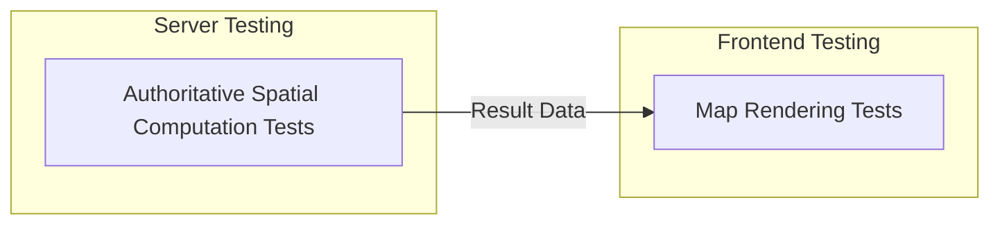

# GIS and Spatial Testing

## 1. Purpose

This is a critical DistrictMind-specific document, defining testing for spatial correctness across the GIS subsystem, elaborating [gis-computation-implementation.md](../12_Data_GIS_Implementation/gis-computation-implementation.md) and [gis-implementation-architecture.md](../12_Data_GIS_Implementation/gis-implementation-architecture.md). No specific GIS library is invented.

## 2. The Central Distinction: Frontend Rendering vs. Authoritative Server-Side Computation

| Test Type | Verifies | Never Verifies |
|---|---|---|
| Frontend map rendering tests | The map correctly displays geometry/attribute data it received, pan/zoom interaction, layer toggling ([frontend-gis-implementation.md](../10_Frontend_Implementation/frontend-gis-implementation.md)) | Whether the underlying spatial result itself is correct — restated unchanged from AD-FE-004, the frontend never computes |
| Authoritative server-side GIS computation tests | Whether a spatial operation (buffer, containment, network impact, coverage, accessibility) produces the mathematically/geographically correct result | How that result is later rendered |

**These two test categories are never merged.** A passing rendering test never substitutes for a passing computation test, and vice versa.

## 3. District Boundaries

Server-side tests verify that District boundary geometry is valid (Section 12) and that containment queries against it (a point/village falling within a district) return correct results against a known test boundary set — restated unchanged from [engineering-quality-gates.md](../08_Implementation_Foundation/engineering-quality-gates.md) Gate 2.

## 4. Mandal and Village Relationships

Tests verify the Geography hierarchy (District → Mandal → Village) resolves correctly — a Village correctly nests within its Mandal, which correctly nests within its District, restated unchanged from [data-domain-model.md](../04_Data_Engineering/data-domain-model.md) Section 3.

## 5. Facility Locations

Tests verify Health Facility (and other point-feature) geometry is valid and correctly associated with its containing Village/Mandal/District.

## 6. Spatial Joins

Tests verify the join mechanisms defined in [data-gis-integration.md](../12_Data_GIS_Implementation/data-gis-integration.md) Section 3 — e.g., a Population Observation correctly resolves to its Village's geometry via stable identifier, never via a stale stored join.

## 7. Distance Calculations

Tests verify distance/nearest-feature computations against known test geometries with independently verifiable expected results (e.g., a facility placed exactly 5 km from a test point).

## 8. Healthcare Coverage — Primary GIS Test Case

**"Which areas are outside the 10 km healthcare coverage?"** is the primary GIS test case for this document, restated from [gis-computation-implementation.md](../12_Data_GIS_Implementation/gis-computation-implementation.md) Section 2:

| Test | Verifies |
|---|---|
| Buffer generation | A 10 km buffer around each test Health Facility is geometrically correct |
| Containment composition | Villages correctly identified as inside vs. outside the union of all buffers |
| Coverage-gap result | The returned gap set exactly matches the independently computed expected set for the test fixture |
| Radius boundary case | A village whose centroid/boundary sits exactly at 10 km is handled per a documented, consistent rule (not left ambiguous) |
| Empty result | A test district with full coverage correctly returns an empty gap set, not an error |
| No facilities | A test district with zero Health Facilities correctly returns the full village set as the gap, not an error |

## 9. Accessibility

Tests verify `accessibility_analysis` correctly computes travel-time/distance-based accessibility to the nearest Health Facility, per [gis-computation-engine.md](../07_AI_GIS_and_Intelligence/gis-computation-engine.md) Section 2.

## 10. Road-Network Analysis

Tests verify the routable road graph correctly resolves shortest paths and correctly reflects network topology (a disconnected segment does not falsely appear reachable).

## 11. Bridge Closure

Restated from [gis-computation-implementation.md](../12_Data_GIS_Implementation/gis-computation-implementation.md) Section 3:

| Test | Verifies |
|---|---|
| Baseline snapshot | The pre-closure routable graph is correctly captured |
| Cloned graph mutation | The target Road Segment is removed only from the clone, never the production graph (AD-DE-004) |
| Recomputed accessibility | Post-closure accessibility to the nearest Health Facility correctly reflects the removed segment for affected origin-destination pairs |
| Unaffected areas | Villages whose nearest-facility path does not use the closed segment show no accessibility change |

## 12. Rainfall Impact Areas

Restated from [gis-computation-implementation.md](../12_Data_GIS_Implementation/gis-computation-implementation.md) Section 4:

| Test | Verifies |
|---|---|
| Spatial aggregation | Station-level rainfall correctly aggregates to a district/region-level value |
| Affected-area intersection | The computed affected-area geometry correctly intersects with Road Segments to identify impacted roads |
| Cross-domain chain | The full Weather → Disaster → Transportation → Healthcare composition (restated from [ai-runtime-architecture.md](../13_AI_Intelligence_Implementation/ai-runtime-architecture.md) Section 20) produces spatially consistent results at every stage |

## 13. Spatial Filtering

Tests verify both client-side (small, already-fetched layer) and server-side (large layer) filtering paths return correct, consistent results — restated unchanged from [gis-implementation-architecture.md](../12_Data_GIS_Implementation/gis-implementation-architecture.md) Section 12.

## 14. Geometry Validity

Every ingested and computed geometry is tested for structural validity (no self-intersecting polygons, no degenerate geometries) before being used in any downstream computation — restated consistent with [data-validation-implementation.md](../12_Data_GIS_Implementation/data-validation-implementation.md).

## 15. Coordinate/Reference-System Correctness Concept

Tests verify that geometry is consistently interpreted under a single, documented coordinate reference system throughout the pipeline — a CRS mismatch (e.g., a dataset ingested under a different reference system than expected) is tested as a validation failure, restated conceptually from [engineering-quality-gates.md](../08_Implementation_Foundation/engineering-quality-gates.md) Gate 4's "CRS discipline." No specific CRS/EPSG code is mandated here beyond what is already documented elsewhere.

## 16. Large Geometry Payloads

Tests verify level-of-detail scoping (AD-GIS-001) correctly reduces payload size/detail for wide-extent or low-zoom requests, and that a request for an unbounded scope is rejected, tiled, or coarsened rather than returning an unbounded payload — restated unchanged from [gis-implementation-architecture.md](../12_Data_GIS_Implementation/gis-implementation-architecture.md) Section 9.

## 17. Spatial Edge Cases

| Case | Test |
|---|---|
| Point exactly on a boundary | Containment result is consistent with a documented boundary-inclusion rule |
| Overlapping buffers | Union-based coverage composition correctly avoids double-counting |
| Degenerate/empty geometry | Rejected at validation, never silently passed to computation |
| Antimeridian/extreme coordinate values | Not applicable to DistrictMind's Telangana/India scope, but the computation engine should not silently produce an incorrect result if ever exposed to out-of-scope input — tested as a defensive case |

## 18. Security

Spatial computation tests never expose an unrestricted geometry-expression interface — restated unchanged from [typed-tool-implementation.md](../13_AI_Intelligence_Implementation/typed-tool-implementation.md) Section 8.2's bounded operation set.

## 19. Observability

Every GIS test failure should be traceable to the specific operation, input dataset version, and expected-vs-actual result — restated consistent with [gis-computation-engine.md](../07_AI_GIS_and_Intelligence/gis-computation-engine.md) observability discussion.

## 20. Milestone Traceability

| GIS Testing Scope | First Needed |
|---|---|
| Boundary/containment | M1 |
| Coverage/accessibility | M2 |
| Bridge closure (scenario) | M5 |
| Rainfall cross-domain chain | M2 (data), M4 (prediction), M5 (scenario) |

## 21. Open Decisions

- GIS library/spatial database extension — Candidate, unresolved; test approach above is designed to remain valid regardless of which is eventually confirmed.
- Test geometry fixture set — not yet created (depends on Section 22's data-source blocker).

## 22. Known Blocker

Restated unchanged from [spatial-data-implementation.md](../12_Data_GIS_Implementation/spatial-data-implementation.md): no confirmed district-boundary dataset exists yet, so no real test fixture beyond synthetic/illustrative geometry can currently be created.
