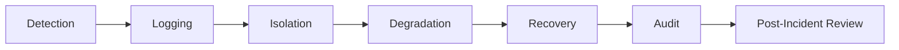

# Incident and Failure Management

## 1. Purpose

This document defines how DistrictMind should behave during failures, elaborating [error-handling-design.md](../09_Backend_Implementation/error-handling-design.md) and [ai-safety-implementation.md](../13_AI_Intelligence_Implementation/ai-safety-implementation.md) Section 14. No exact recovery-time objective is invented — restated consistent with NFR-038's "To Be Finalized During Architecture Design" status, which remains unresolved.

## 2. Failure Lifecycle

## 3. Failure Classification

| Class | Example |
|---|---|
| Dependency unavailability | Database, GIS service, external source, AI provider down |
| Data-quality failure | Stale, conflicting, or invalid data |
| Execution failure | A specific tool, prediction, simulation, or recommendation run fails |
| Access failure | Authentication or authorization failure |
| Boundary failure | Frontend/API contract mismatch |

## 4. Detection

Every failure class in Section 3 is detected via the monitoring categories already defined in [observability-and-monitoring.md](observability-and-monitoring.md) Section 10 — detection is a prerequisite for every subsequent lifecycle stage.

## 5. Logging

Every detected failure is logged with sufficient context (correlation ID, failure class, affected layer) to support later diagnosis — restated unchanged from [observability-and-monitoring.md](observability-and-monitoring.md) Section 3.

## 6. Alerting Concept

A failure exceeding a normal/expected occurrence pattern should trigger an alert to a responsible party — this document defines the concept only; no specific alerting tool or numeric alert threshold is invented.

## 7. Isolation

A failure in one domain/layer is contained so it does not cascade into an unrelated domain — e.g., a Weather data-source outage should not prevent an unrelated Healthcare coverage query from succeeding, restated consistent with the domain-aligned service boundary discipline (AD-API-001).

## 8. Degradation

Where a non-critical dependency fails, the system degrades to a reduced-capability but honest state (Section 11, [performance-and-responsiveness-testing.md](performance-and-responsiveness-testing.md)) rather than failing an entire request that could still be partially, honestly answered.

## 9. Recovery

Recovery follows the retry/backoff discipline already established in [error-handling-design.md](../09_Backend_Implementation/error-handling-design.md) Section 6 and [ai-runtime-architecture.md](../13_AI_Intelligence_Implementation/ai-runtime-architecture.md) Section 14 — bounded retry for transient failures, explicit failure disclosure once retry is exhausted.

## 10. Fallback

A fallback response is always an honest, disclosed reduced-capability response — **never a fabricated substitute for the failed capability.** This restates the central discipline of [ai-safety-implementation.md](../13_AI_Intelligence_Implementation/ai-safety-implementation.md) Section 14 and extends it to every non-AI failure class in this document.

## 11. Human Escalation

Restated unchanged from [ai-safety-implementation.md](../13_AI_Intelligence_Implementation/ai-safety-implementation.md) Section 13 and [data-gis-integration.md](../12_Data_GIS_Implementation/data-gis-integration.md) Section 7.1: a failure or conflict that automated recovery cannot confidently resolve is escalated to human review rather than resolved by a silent guess.

## 12. Audit

Every failure, its detected cause, and its resolution path are audit-logged — restated unchanged from [observability-and-monitoring.md](observability-and-monitoring.md).

## 13. Post-Incident Review

A conceptual post-incident review process exists for any failure with meaningful user or data impact — no specific review cadence, template, or tooling is invented here.

## 14. Failure Scenarios

| Scenario | System Must NOT | Safe Behavior | Evidence/State Preserved |
|---|---|---|---|
| Database unavailable | Return a fabricated or cached-as-current result without disclosure | Return a disclosed service-unavailable response | The failure event itself, correlation ID |
| GIS service failure | Fall back to client-side spatial computation | Return a disclosed computation-failure response; frontend never computes a substitute (AD-FE-004) | Failed operation parameters for diagnosis |
| External source unavailable | Silently serve stale data as if current | Serve the most recent valid data with its freshness/staleness explicitly disclosed | Last-known-good record and its timestamp |
| Stale data | Present it as current | Disclose staleness alongside the value, restated from [data-quality-implementation.md](../12_Data_GIS_Implementation/data-quality-implementation.md) | Freshness metadata |
| Conflicting data | Silently pick one side | Disclose the conflict; queue for human review if unresolvable ([data-gis-integration.md](../12_Data_GIS_Implementation/data-gis-integration.md) Section 7.1) | Both disagreeing values and their provenance |
| AI provider unavailable | Fabricate a plausible-sounding response | Return an explicit "cannot answer at this time" (restated from NFR-031/FR-022) | The request and its correlation ID for later retry/audit |
| LLM response failure (malformed/incomplete) | Present a partial or malformed response as complete | Discard and retry within bounds, then disclose failure | Attempted request trace |
| RAG failure | Fabricate contextual content the system did not actually retrieve | Disclose that no contextual document was found ([rag-implementation.md](../13_AI_Intelligence_Implementation/rag-implementation.md) Section 15) | Query and empty-result trace |
| Typed tool failure | Invent a plausible tool result | Disclose the specific evidence gap ([agent-implementation-architecture.md](../13_AI_Intelligence_Implementation/agent-implementation-architecture.md) Section 8) | The failed tool call's arguments and error |
| Prediction failure | Guess a forecast value | Return a disclosed prediction-unavailable response ([prediction-implementation.md](../13_AI_Intelligence_Implementation/prediction-implementation.md) Section 10) | Model/feature version attempted |
| Simulation failure | Present an incomplete simulation as a final result | Disclose incompleteness explicitly ([simulation-and-scenario-implementation.md](../13_AI_Intelligence_Implementation/simulation-and-scenario-implementation.md) Section 13) | Baseline snapshot reference, partial results if any |
| Recommendation failure | Present a recommendation without sufficient supporting evidence | Decline to recommend, disclosing insufficient evidence ([recommendation-and-decision-intelligence-implementation.md](../13_AI_Intelligence_Implementation/recommendation-and-decision-intelligence-implementation.md)) | Candidate set considered, reason for non-recommendation |
| Authentication failure | Reveal whether a username/identifier exists | Return a generic, non-information-leaking failure response | Security event log entry |
| Authorization failure | Reveal the existence or shape of the unauthorized resource | Return a generic 403-equivalent response | Security event log entry (restated from [security-architecture.md](../02_System_Architecture/security-architecture.md) Section 18) |
| Frontend/API failure | Render a silent blank state | Render an explicit, honest error state ([frontend-loading-error-empty-states.md](../10_Frontend_Implementation/frontend-loading-error-empty-states.md)) | Correlation ID surfaced for user-reported diagnosis where appropriate |

## 15. Security

Sections 11–14 collectively enforce that a failure never becomes an information-disclosure or authorization-bypass vector — restated unchanged from [security-testing.md](security-testing.md).

## 16. Observability

Every failure scenario in Section 14 is itself a monitored category, restated unchanged from [observability-and-monitoring.md](observability-and-monitoring.md) Section 10.

## 17. Milestone Traceability

| Failure Management Scope | First Needed |
|---|---|
| Database/API/authentication/authorization failures | M1 |
| GIS/data-source failures | M2 |
| AI/RAG/typed-tool failures | M3 |
| Prediction failures | M4 |
| Simulation failures | M5 |
| Recommendation failures | M6 |

## 18. Open Decisions

- Recovery time objective (RTO) / recovery point objective (RPO) — restated unresolved from NFR-038, "To Be Finalized During Architecture Design."
- Alerting technology — Candidate, unresolved.
- Post-incident review process/template — not defined.
