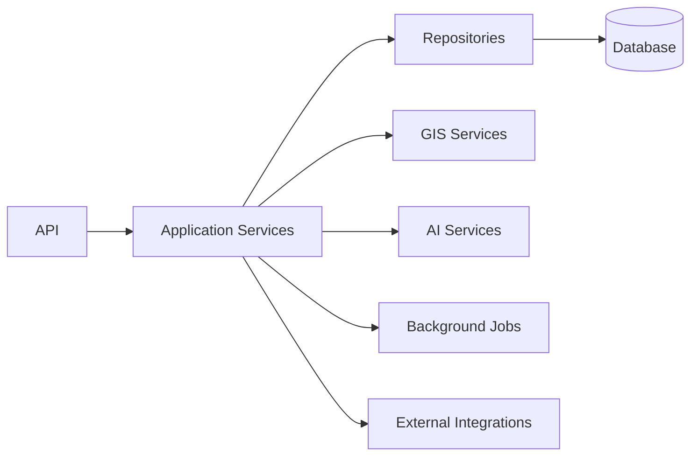

# Integration Testing

## 1. Purpose

This document defines integration testing across DistrictMind's cross-component boundaries, elaborating [test-architecture.md](test-architecture.md) Section 3. No test is implemented here.

## 2. Scope

Each arrow above is a distinct integration-test boundary.

## 3. Transaction Behavior

Restated unchanged from [repository-layer-design.md](../09_Backend_Implementation/repository-layer-design.md)'s Transaction Design: a multi-step write (e.g., recording a Recommendation review action alongside its audit entry) either fully commits or fully rolls back — an integration test verifies this atomicity by inducing a mid-transaction failure and confirming no partial state persists.

## 4. Persistence

An Application Service's write correctly persists through the Repository to the database, and a subsequent read returns the same data — restated consistent with [database-design.md](../05_Database_Design/database-design.md).

## 5. Authorization

Integration tests verify that authorization is enforced at the actual service boundary, not merely in a unit-tested pure function ([unit-testing.md](unit-testing.md) Section 11) — restated unchanged from [authorization-implementation.md](../09_Backend_Implementation/authorization-implementation.md).

## 6. Data Consistency

A cross-domain read (e.g., a Village's population figure joined against its geometry, restated from [data-gis-integration.md](../12_Data_GIS_Implementation/data-gis-integration.md) Section 2) returns consistent, correctly joined results across the Repository and GIS Service boundaries.

## 7. Evidence Propagation

An integration test verifies that a typed-tool call's result correctly becomes an Evidence item with intact source/timestamp/transformation metadata as it crosses the Application Service → Evidence boundary — restated unchanged from [grounding-and-evidence-implementation.md](../13_AI_Intelligence_Implementation/grounding-and-evidence-implementation.md).

## 8. Provenance

Restated unchanged from Section 7 — provenance metadata must survive intact across every layer transition (Repository → Application Service → Evidence → Response), not just within a single layer.

## 9. Failure Handling

An integration test induces a dependency failure (e.g., a GIS Service timeout) and verifies the Application Service surfaces the correctly shaped, disclosed error — restated unchanged from [error-handling-design.md](../09_Backend_Implementation/error-handling-design.md).

## 10. Retry Behavior

Restated unchanged from [ai-runtime-architecture.md](../13_AI_Intelligence_Implementation/ai-runtime-architecture.md) Section 14 and [background-job-architecture.md](../09_Backend_Implementation/background-job-architecture.md): an integration test verifies that a retried operation is only retried when idempotent, and that a retry does not produce duplicate side effects (e.g., a duplicate Scenario record).

## 11. Dependency Failures

| Dependency | Failure Mode Tested |
|---|---|
| Database | Connection loss mid-request |
| GIS Service | Invalid geometry or computation timeout |
| AI provider | Provider unavailable or malformed response |
| External integration | Upstream source unavailable ([external-integration-design.md](../06_API_and_Integration/external-integration-design.md)) |
| Background job queue | Job execution failure and requeue behavior |

## 12. Integration Test — Healthcare Coverage (Canonical Example A)

| Step | Verified |
|---|---|
| API receives coverage request | Request validated, authorized |
| Application Service invokes GIS Service | `coverage_analysis` executes against real (test) Village/Health Facility fixtures |
| Result persistence/caching (if applicable) | Result correctly labeled as Derived state |
| Evidence assembly | Coverage-gap result correctly becomes an Evidence item with dataset version and computation timestamp |

## 13. Integration Test — Bridge Closure (Canonical Example B)

| Step | Verified |
|---|---|
| `create_scenario` | Baseline snapshot correctly captured, elevated-role authorization enforced |
| `run_scenario` | Executes against a cloned graph; production Road Segment table verified unmutated (AD-DE-004) |
| Result | Before/after accessibility comparison correctly labeled Scenario-state, never conflated with Observed data |

## 14. Integration Test — Rainfall Cross-Domain Workflow (Canonical Example C)

| Step | Verified |
|---|---|
| Weather evidence retrieval | `get_weather` returns correctly sourced Evidence |
| Disaster risk assessment | Correctly invoked with the Weather Evidence as context, not independently computed by the Agent |
| Transportation impact | `spatial_query`/`accessibility_analysis` correctly composes with the disaster risk result |
| Healthcare accessibility | Correctly re-evaluated given the transportation impact |
| Aggregation | All four Evidence items correctly aggregated with independent provenance intact ([ai-runtime-architecture.md](../13_AI_Intelligence_Implementation/ai-runtime-architecture.md) Section 20) |

## 15. Security

Every integration test scenario in Sections 12–14 implicitly verifies the AI→Typed-Tool→Authorization→Application-Service boundary holds — restated unchanged from [ai-safety-implementation.md](../13_AI_Intelligence_Implementation/ai-safety-implementation.md).

## 16. Observability

Integration tests should verify that a correlation ID propagates correctly across every layer boundary exercised — restated consistent with [ai-runtime-architecture.md](../13_AI_Intelligence_Implementation/ai-runtime-architecture.md) Section 18.

## 17. Milestone Traceability

| Integration Scope | First Needed |
|---|---|
| Service↔Repository↔Database | M1 |
| GIS Service integration | M1 (basic), M2 (full) |
| AI/Tool integration | M3 |
| Background job integration | M4 |
| Simulation sandboxing integration | M5 |

## 18. Open Decisions

- Integration test harness/runner — not selected, pending framework confirmation.
- Test database/GIS engine instance provisioning approach — not selected.
