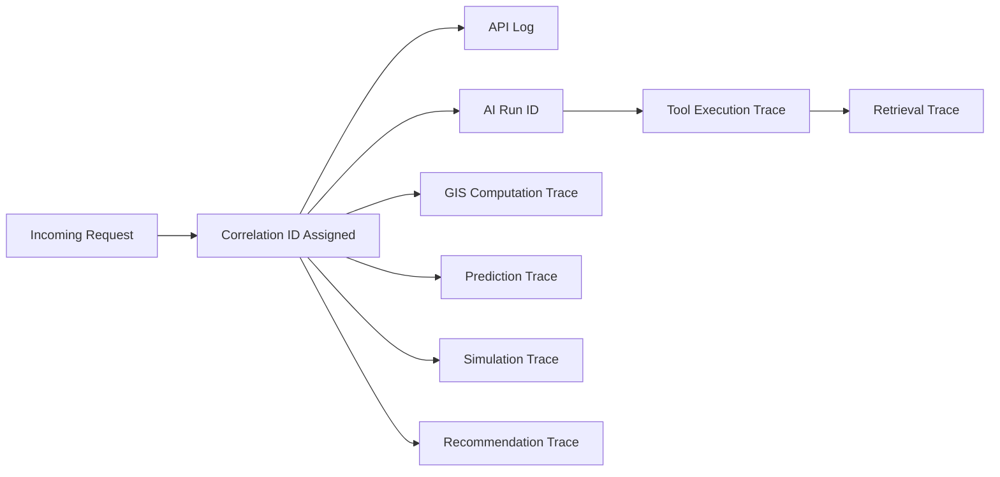

# Observability and Monitoring

## 1. Purpose

This document defines the implementation architecture for observability, elaborating [backend-observability.md](../09_Backend_Implementation/backend-observability.md) Section 5 and [engineering-quality-gates.md](../08_Implementation_Foundation/engineering-quality-gates.md) Section 7. No observability vendor is selected, and no numeric monitoring threshold is invented.

## 2. The Four Signal Types

| Signal | Purpose |
|---|---|
| Logs | Structured records of discrete events (requests, errors, business events) — restated unchanged from NFR-025 |
| Metrics | Aggregate, time-series measurements (error rates, request volume) — no specific metric backend selected |
| Traces | The path of a single request across every layer/service it touches |
| Audit events | Immutable records of security- and governance-relevant actions (FR-036/FR-037) |

## 3. Correlation and Identifier Model

A single correlation ID, generated at the originating request, propagates through every downstream service, tool, and agent call belonging to that interaction — restated unchanged from [ai-runtime-architecture.md](../13_AI_Intelligence_Implementation/ai-runtime-architecture.md) Section 18 and [api-design-principles.md](../06_API_and_Integration/api-design-principles.md) Section 13. An AI Run ID identifies a specific Agent invocation within that correlation, allowing a full multi-step plan (Example C) to be reconstructed after the fact.

## 4. Tool Execution Traces

Every typed-tool call is traced with: tool name, arguments (with any sensitive field redacted per Section 12), result summary, and timestamp — restated unchanged from [typed-tool-implementation.md](../13_AI_Intelligence_Implementation/typed-tool-implementation.md) Section 10.

## 5. Retrieval Traces

Every RAG retrieval query is traced with the query, chunks returned, and any relevance signal — restated unchanged from [rag-implementation.md](../13_AI_Intelligence_Implementation/rag-implementation.md) Section 19.

## 6. GIS Computation Traces

Every spatial computation is traced with: operation type, input dataset versions, and execution time — restated unchanged from [gis-computation-engine.md](../07_AI_GIS_and_Intelligence/gis-computation-engine.md).

## 7. Prediction Traces

Every Prediction invocation is traced with model/feature version, forecast horizon, and confidence indicator (where produced) — restated unchanged from [model-lifecycle-implementation.md](../13_AI_Intelligence_Implementation/model-lifecycle-implementation.md) Section 15.

## 8. Simulation Traces

Every Scenario execution is traced with Scenario ID, baseline reference, and status transitions — restated unchanged from [simulation-and-scenario-implementation.md](../13_AI_Intelligence_Implementation/simulation-and-scenario-implementation.md) Section 16.

## 9. Recommendation Traces

Every Recommendation generation run is traced with the candidate set considered, the scoring breakdown, and the generating Agent Execution reference — restated unchanged from [recommendation-and-decision-intelligence-implementation.md](../13_AI_Intelligence_Implementation/recommendation-and-decision-intelligence-implementation.md) Section 13.

## 10. Monitoring Categories

| Category | What Is Watched |
|---|---|
| API errors | Error rate by category (validation, authorization, dependency failure, timeout — restated from [error-handling-design.md](../09_Backend_Implementation/error-handling-design.md) Section 6) |
| Authorization failures | Frequency and pattern (a spike may indicate probing or a misconfigured client) |
| Data-quality failures | Quarantine rate, validation failure rate — restated from [data-quality-implementation.md](../12_Data_GIS_Implementation/data-quality-implementation.md) |
| Ingestion failures | Failed/retried ingestion runs |
| GIS failures | Computation errors, invalid-geometry rejections |
| AI failures | Tool failures, provider errors, plan failures |
| Retrieval failures | Empty or low-confidence RAG retrieval occurrences |
| Prediction failures | Model-unavailable or out-of-distribution rejections |
| Simulation failures | Non-runnable scenario rejections, sandbox violations (treated as critical per Gate 8's rollback condition) |
| Recommendation failures | Insufficient-evidence rejections |
| Performance degradation | Qualitative latency/responsiveness drift versus the system's own historical baseline — no numeric threshold invented |
| Stale data | Records/Evidence exceeding expected freshness |
| Unusual agent behavior | Repeated plan failures, excessive tool-call counts (relative to AD-AI-004's minimum-sufficient expectation), repeated authorization rejections from the same session |

## 11. What Should Be Observable — Without Selecting a Vendor

Every category in Sections 4–10 must be *emittable* by the system in a structured, machine-readable form — this document defines the requirement, not the destination (log aggregator, metrics backend, tracing system). No vendor or product is selected, consistent with [technology-stack.md](../00_Engineering_Overview/technology-stack.md).

## 12. Privacy and Security Boundaries

Restated unchanged from [engineering-quality-gates.md](../08_Implementation_Foundation/engineering-quality-gates.md) Section 5: no log, metric, trace, or audit event ever contains a credential, secret, or unredacted personal data field. Correlation IDs and trace content are designed to be diagnostically useful without exposing the underlying sensitive values they reference — restated unchanged from [ai-runtime-architecture.md](../13_AI_Intelligence_Implementation/ai-runtime-architecture.md) Section 18's closing note.

## 13. Distinguishing the Six Information Categories in Observability

Every trace/log entry that carries a data value also carries that value's state-category label (Observed/Derived/Prediction/Simulation/Recommendation/AI Response) — this is what allows monitoring to distinguish, e.g., an elevated "Prediction failure" rate from an unrelated "Source ingestion failure" rate, rather than conflating all "data problems" into one undifferentiated signal.

## 14. Security

Observability infrastructure is itself a security-sensitive surface (Section 12) — access to logs/traces/audit events is itself subject to authorization, restated unchanged from [security-testing.md](security-testing.md) Section 14 (Provenance Security) applied here to observability data specifically.

## 15. Milestone Traceability

| Observability Scope | First Needed |
|---|---|
| API/backend logs, correlation IDs | M1 |
| GIS computation traces | M2 |
| AI/tool/retrieval traces | M3 |
| Prediction traces | M4 |
| Simulation/Recommendation traces | M5, M6 |

## 16. Open Decisions

- Observability platform (logging, metrics, tracing backend) — Candidate, unresolved.
- No monitoring threshold value is defined — intentionally, per this milestone's instruction.
