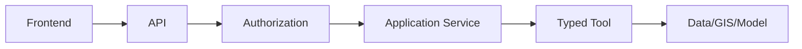

# Security Testing

## 1. Purpose

This document defines implementation-level security testing, elaborating [engineering-quality-gates.md](../08_Implementation_Foundation/engineering-quality-gates.md) Section 5 and [ai-safety-implementation.md](../13_AI_Intelligence_Implementation/ai-safety-implementation.md). **No compliance certification or regulatory standard is claimed** unless already source-supported (none currently is).

## 2. The Boundary Under Test

Every security test targets a specific link in this chain — restated unchanged from [ai-implementation-architecture.md](../13_AI_Intelligence_Implementation/ai-implementation-architecture.md) Section 3.

## 3. Authentication

Tests verify: an invalid/expired/missing credential is rejected; a valid credential correctly establishes the expected identity — restated unchanged from [authentication-implementation.md](../09_Backend_Implementation/authentication-implementation.md).

## 4. Authorization and Role Enforcement

Tests verify every role's permitted and forbidden actions per [authorization-implementation.md](../09_Backend_Implementation/authorization-implementation.md) — e.g., a standard user cannot create a Scenario (elevated-role requirement), and a District Officer for District X cannot act on District Y's data.

## 5. District Scope

Tests verify every district-scoped request is rejected when it targets a district outside the caller's authorization, restated unchanged from Section 4 and tested across both ordinary API operations and AI-originated typed-tool calls identically.

## 6. API Security

Restated unchanged from [api-testing.md](api-testing.md) Sections 5–8 — authentication, authorization, and structured error behavior are re-verified here specifically under adversarial (not merely valid-path) conditions.

## 7. Input Validation

Tests submit malformed, oversized, and boundary-violating inputs to every documented endpoint and typed tool, verifying rejection with the correct structured error rather than a crash or silent acceptance — restated unchanged from [request-response-validation.md](../09_Backend_Implementation/request-response-validation.md).

## 8. Injection Prevention

Tests attempt injection-style payloads (e.g., strings resembling SQL fragments) in text fields and verify the system's parameterized-query discipline ([coding-standards.md](../08_Implementation_Foundation/coding-standards.md) Section 4) neutralizes them — restated unchanged from [engineering-quality-gates.md](../08_Implementation_Foundation/engineering-quality-gates.md) Section 5.

## 9. Raw Query Prevention

Tests verify no code path — including any AI-originated request — can reach a raw SQL execution capability, since none is ever exposed as a typed tool or API operation, restated unchanged from [typed-tool-implementation.md](../13_AI_Intelligence_Implementation/typed-tool-implementation.md) Section 9.

## 10. Secret Handling

Tests verify no credential, API key, or secret value ever appears in a log, error response, or trace — restated unchanged from [configuration-management.md](../08_Implementation_Foundation/configuration-management.md).

## 11. Session Security

Tests verify session tokens/cookies (once an authentication mechanism is confirmed) are correctly scoped, expired, and invalidated on logout — restated unchanged from [authentication-authorization.md](../06_API_and_Integration/authentication-authorization.md).

## 12. Access Control

Restated unchanged from Sections 4–5, additionally tested for privilege-escalation attempts (a lower-privileged role attempting to invoke a higher-privileged operation directly).

## 13. Data Exposure

Tests verify no API response or typed-tool result includes a field beyond its documented schema — restated unchanged from [typed-tool-implementation.md](../13_AI_Intelligence_Implementation/typed-tool-implementation.md) Section 8.1.

## 14. Provenance Security

Tests verify provenance/Evidence metadata cannot be modified by any downstream consumer, including the AI Agent itself — restated unchanged from [data-gis-integration.md](../12_Data_GIS_Implementation/data-gis-integration.md) Section 9.

## 15. AI Prompt Injection

Restated unchanged from [ai-and-agent-testing.md](ai-and-agent-testing.md) Section 15 — tested here specifically as a security boundary verification: an injected instruction must never expand the Agent's authorization or tool access.

## 16. Malicious RAG Content

Restated unchanged from [ai-and-agent-testing.md](ai-and-agent-testing.md) Section 16.

## 17. Tool Abuse

Tests verify the Agent cannot invoke a tool outside the fixed, allow-listed set ([typed-tool-implementation.md](../13_AI_Intelligence_Implementation/typed-tool-implementation.md) Section 3), and that excessive/redundant tool-call attempts are bounded (AD-AI-004, [agent-implementation-architecture.md](../13_AI_Intelligence_Implementation/agent-implementation-architecture.md) Section 17).

## 18. Arbitrary Execution Prevention

Tests verify no shell, Python, or other arbitrary-code-execution capability is ever reachable from any AI or API code path — restated unchanged from [typed-tool-implementation.md](../13_AI_Intelligence_Implementation/typed-tool-implementation.md) Section 9. This is a structural (design-verifiable) guarantee as much as a runtime-testable one.

## 19. Filesystem Restrictions

Restated unchanged from Section 18 — no unrestricted filesystem-access tool is ever exposed.

## 20. External API Restrictions

Tests verify the AI Agent cannot make an unrestricted outbound HTTP call — any external integration goes through a governed adapter ([external-integration-design.md](../06_API_and_Integration/external-integration-design.md)), never an open-ended tool.

## 21. Model/Data Isolation

Tests verify the AI Agent has no direct database or GIS-database credential of any kind — restated unchanged from AD-DE-005/AD-DB-006/AD-API-002, and re-verified specifically as a security test (attempting to observe any credential or connection string reachable from the Agent's execution context, expecting none to exist).

## 22. Audit Logging

Tests verify every authorization failure, tool-abuse attempt, and administrative action produces a correctly-shaped, immutable audit log entry — restated unchanged from FR-036/FR-037 and [ai-safety-implementation.md](../13_AI_Intelligence_Implementation/ai-safety-implementation.md) Section 12.

## 23. Explicit Test: AI Cannot Bypass Authorization

**This is tested as a dedicated, standalone test category, not folded into general authorization testing:** a request crafted specifically to induce the Agent to attempt an out-of-scope tool call (via prompt injection, malformed context, or direct instruction) is verified to be rejected at the server-side Authorization stage of the typed-tool chain ([typed-tool-implementation.md](../13_AI_Intelligence_Implementation/typed-tool-implementation.md) Section 6) regardless of what the Agent itself "believes" it is authorized to do. **A single passing instance of this test category is treated as necessary but not sufficient — the absence of a bypass path is a structural property of the typed-tool architecture, verified by design as well as by test (restated from [ai-implementation-architecture.md](../13_AI_Intelligence_Implementation/ai-implementation-architecture.md) Section 3's "never appears left of Typed Tool" invariant).**

## 24. No Invented Compliance Claims

This document does not claim conformance with any named security standard, certification, or regulatory framework not already established by a prior source document — restated unchanged from [ai-safety-implementation.md](../13_AI_Intelligence_Implementation/ai-safety-implementation.md) Section 1's governing constraint.

## 25. Observability

Every security test's outcome (pass/fail, and every triggered audit event) should be traceable — restated unchanged from Section 22 and [observability-and-monitoring.md](observability-and-monitoring.md).

## 26. Milestone Traceability

| Security Testing Scope | First Needed |
|---|---|
| Authentication/authorization/API security | M1 |
| AI-specific security (Sections 15–23) | M3 |
| Scenario/Recommendation-specific security | M5, M6 |

## 27. Open Decisions

- Authentication/authorization provider — Candidate, unresolved.
- Security testing/scanning tooling — not selected.
- No compliance certification is pursued or claimed by this document.
