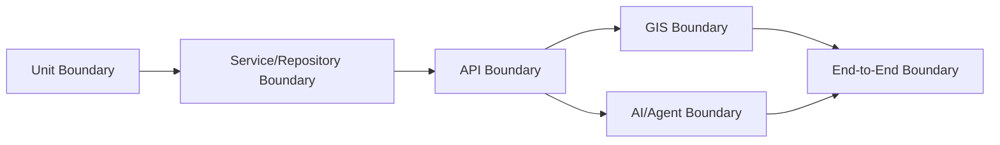

# Test Architecture

## 1. Purpose

This document defines the implementation-level test architecture: boundaries, isolation, environments, data, and mocking strategy. No testing framework is selected — none is Confirmed per [technology-stack.md](../00_Engineering_Overview/technology-stack.md).

## 2. Test Boundaries

Test boundaries mirror the architectural boundaries already established, not an arbitrary layering:

Each boundary corresponds to a real architectural seam (Domain Logic, Repository, API route, GIS Service, AI Agent/Typed Tool) — restated unchanged from [backend-implementation-architecture.md](../09_Backend_Implementation/backend-implementation-architecture.md) and [ai-implementation-architecture.md](../13_AI_Intelligence_Implementation/ai-implementation-architecture.md).

## 3. Test Isolation

| Level | Isolation Principle |
|---|---|
| Unit | No I/O — database, network, filesystem, and AI calls are all excluded from a unit test's scope ([unit-testing.md](unit-testing.md)) |
| Integration | Real interaction between two or more adjacent layers (e.g., Service + Repository), but isolated from the full system |
| API | The full backend stack, isolated from the frontend and from live external systems |
| GIS | Real spatial computation, isolated from live production geometry — exercised against known test geometries |
| AI | The Agent/Typed Tool chain, isolated from a live LLM provider where practical, using a controlled or recorded response mechanism (Section 8) |
| End-to-End | The full system, as close to production shape as practical, still isolated from live external data sources |

## 4. Test Environments

Restated conceptually parallel to [environment-management.md](../08_Implementation_Foundation/environment-management.md): a Local/Development environment for Unit and most Integration tests, a dedicated Test/CI environment for API/GIS/AI/End-to-End tests, and Staging for pre-release End-to-End and Performance validation — no specific environment provisioning technology is selected here.

## 5. Test Data

| Concern | Approach |
|---|---|
| Production data separation | Test data is never sourced from production Curated/Analytical data directly — restated unchanged from [data-governance-implementation.md](../12_Data_GIS_Implementation/data-governance-implementation.md)'s classification discipline applied to test fixtures |
| Test data separation | Test databases/indexes are logically and physically separate from any production or staging store |
| No sensitive data leakage | Any data resembling Potentially Sensitive classification (e.g., population/health-adjacent figures) used in tests is synthetic or explicitly de-identified test fixture data, never a real record |
| Reproducibility | A test run against a given fixture set produces the same result on every run — this is what makes Section 9's "realistic vs. mocked" distinction meaningful in the first place |

## 6. Fixtures Concept

A fixture is a known, versioned, reusable test dataset (e.g., a small set of Village boundaries and Health Facility points for the 10 km coverage example) — restated consistent with the dataset-versioning discipline in [model-lifecycle-implementation.md](../13_AI_Intelligence_Implementation/model-lifecycle-implementation.md) Section 3, applied here to test data rather than training data. No specific fixture format or tooling is prescribed.

## 7. Mocks/Stubs Concept

| Concept | Use |
|---|---|
| Mock | A substitute for a dependency that records and verifies how it was called (e.g., verifying an Authorization check was invoked with the correct scope) |
| Stub | A substitute that returns a fixed, known response (e.g., a stubbed `get_weather` tool result feeding a downstream disaster-risk test) |

## 8. What Should Be Mocked vs. Realistic Data

| Layer | Mocked/Stubbed | Realistic |
|---|---|---|
| Unit | All I/O (database, GIS, AI, external services) | N/A — pure logic only |
| Integration | External services beyond the two components under test (e.g., an external LLM provider) | The actual database/GIS engine against realistic fixture data |
| API | The AI provider call itself, where the LLM's own output would introduce non-determinism unrelated to the API contract being tested | Real request/response cycles through the actual routing and validation layers |
| GIS | Nothing beyond the boundary of the test — spatial computation should run against real (test) geometry, not a mocked spatial engine, since the computation's correctness is exactly what is under test | Known test geometries with documented expected results |
| AI/Agent | The underlying LLM provider call, using a recorded/deterministic response where reproducibility is required (e.g., regression tests, restated from [ai-evaluation-implementation.md](../13_AI_Intelligence_Implementation/ai-evaluation-implementation.md) Section 4) | Typed tool execution, evidence assembly, and grounding validation should run for real against test fixtures — only the LLM's own generation is substituted where needed |
| End-to-End | As little as possible — ideally nothing beyond genuinely external, non-DistrictMind systems | Everything else |

## 9. Service-Level Tests

Exercise a single Application Service in isolation from the API layer above it and mocked below it at the Repository boundary — restated consistent with [service-layer-implementation.md](../09_Backend_Implementation/service-layer-implementation.md).

## 10. Repository Tests

Exercise the Repository layer against a real (test) database instance, verifying query correctness and transaction behavior — restated consistent with [repository-layer-design.md](../09_Backend_Implementation/repository-layer-design.md).

## 11. API Tests

Elaborated fully in [api-testing.md](api-testing.md).

## 12. GIS Tests

Elaborated fully in [gis-and-spatial-testing.md](gis-and-spatial-testing.md).

## 13. AI Tests

Elaborated fully in [ai-and-agent-testing.md](ai-and-agent-testing.md).

## 14. Model Tests

Prediction model tests are distinct from AI/Agent tests — they evaluate a trained model's own output against held-out data, restated from [model-lifecycle-implementation.md](../13_AI_Intelligence_Implementation/model-lifecycle-implementation.md) Section 5, independent of how the Agent later consumes that output.

## 15. End-to-End Tests

Elaborated fully in [end-to-end-testing.md](end-to-end-testing.md).

## 16. Security

Test environments and test data are subject to the same secret-handling discipline as production — restated unchanged from [engineering-quality-gates.md](../08_Implementation_Foundation/engineering-quality-gates.md) Section 5: no real credential ever appears in a test fixture, test log, or this documentation.

## 17. Observability

Test runs themselves should be traceable (which fixture version, which environment, which commit) to support reproducibility — restated consistent with Section 5's reproducibility requirement.

## 18. Milestone Traceability

Test architecture applies from M1 onward; AI-specific and Model-test concerns first apply at M3/M4 respectively, restated unchanged from [testing-strategy.md](testing-strategy.md) Section 18.

## 19. Open Decisions

- Testing framework/runner — not selected, pending backend/frontend framework confirmation.
- Fixture management tooling — not selected.
- LLM response recording/replay mechanism for deterministic AI tests — Candidate concept, no tooling selected.
