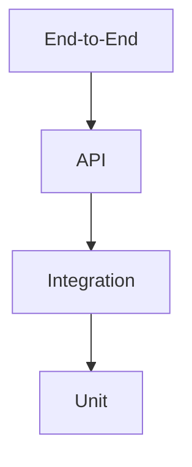

# Testing Strategy

## 1. Purpose

This document defines DistrictMind's overall testing strategy, elaborating the Testing Foundation already established in [engineering-quality-gates.md](../08_Implementation_Foundation/engineering-quality-gates.md) Section 8 and the Ten Gates of AD-IMP-005. No test is implemented, and no numerical coverage target is invented anywhere in this document.

## 2. Testing Objectives

| Objective | Detail |
|---|---|
| Functional correctness | Every layer behaves per its documented contract ([api-contracts.md](../06_API_and_Integration/api-contracts.md), [ai-tool-contracts.md](../06_API_and_Integration/ai-tool-contracts.md)) |
| Data correctness | Data moves through Source→Raw→Validation→Curated→Analytical→AI/ML-ready→Serving without silent corruption ([data-and-pipeline-testing.md](data-and-pipeline-testing.md)) |
| Spatial correctness | GIS computation is authoritative and correct ([gis-and-spatial-testing.md](gis-and-spatial-testing.md)) |
| AI correctness | AI responses are grounded, safe, and boundary-respecting ([ai-and-agent-testing.md](ai-and-agent-testing.md)) |
| Security | Every boundary (authentication, authorization, AI-tool boundary) holds under adversarial conditions ([security-testing.md](security-testing.md)) |
| Performance | The system remains responsive under realistic and expensive-operation load ([performance-and-responsiveness-testing.md](performance-and-responsiveness-testing.md)) |
| Reliability | Failures degrade gracefully rather than corrupting state or misleading the user ([incident-and-failure-management.md](incident-and-failure-management.md)) |
| Observability | Every layer's behavior is inspectable after the fact ([observability-and-monitoring.md](observability-and-monitoring.md)) |
| Regression prevention | A defect once found and fixed does not silently reappear |

## 3. Quality Objectives

Restated unchanged from [engineering-quality-gates.md](../08_Implementation_Foundation/engineering-quality-gates.md): quality is assessed qualitatively (does the behavior demonstrably and correctly work) against the Ten Gates, not against invented numerical thresholds. This document's testing layers are the mechanism by which each gate's "Required validation" is actually exercised.

## 4. Testing Philosophy

- **Test the boundary, not the framework.** Since no frontend/backend/database/AI technology is Confirmed, tests are designed around DistrictMind's own architectural boundaries (Section 6), not around a specific framework's idioms.
- **Grounding over generation.** For AI, correctness is judged by whether a response is properly evidenced, not by how fluent it reads — restated from [ai-evaluation-implementation.md](../13_AI_Intelligence_Implementation/ai-evaluation-implementation.md).
- **Server-side authority.** For GIS, correctness is judged against authoritative server-side computation, never frontend rendering — restated from AD-FE-004.
- **No invented precision.** No coverage percentage, latency number, or accuracy threshold is stated unless a prior document already established it as an "Initial Target / To Be Validated" ([non-functional-requirements.md](../01_Requirements/non-functional-requirements.md)).

## 5. Test Pyramid

Read bottom-up: Unit tests are the widest, cheapest, fastest layer; End-to-End tests are the narrowest, most expensive, slowest layer — restated and extended from the five-level flow already established in [engineering-quality-gates.md](../08_Implementation_Foundation/engineering-quality-gates.md) Section 8 (Unit → Integration → API → GIS → AI/Tool → End-to-End), with GIS and AI/Tool testing treated as specialized integration-level concerns (Section 6) rather than separate pyramid tiers.

## 6. Testing Layers

| Layer | Scope | Detail Document |
|---|---|---|
| Unit | Domain logic, application services, transformations, scoring, deterministic computation | [unit-testing.md](unit-testing.md) |
| Integration | Cross-component interaction (service↔repository↔database↔GIS↔AI↔background jobs) | [integration-testing.md](integration-testing.md) |
| API | Contract conformance, authorization, error shaping | [api-testing.md](api-testing.md) |
| GIS/Spatial | Server-side spatial computation correctness | [gis-and-spatial-testing.md](gis-and-spatial-testing.md) |
| AI/Agent | Grounding, safety, tool-boundary correctness | [ai-and-agent-testing.md](ai-and-agent-testing.md) |
| Data/Pipeline | Ingestion, validation, transformation, lineage | [data-and-pipeline-testing.md](data-and-pipeline-testing.md) |
| End-to-End | Full user journeys | [end-to-end-testing.md](end-to-end-testing.md) |
| Performance | Responsiveness under load and expensive operations | [performance-and-responsiveness-testing.md](performance-and-responsiveness-testing.md) |
| Security | Boundary enforcement under adversarial conditions | [security-testing.md](security-testing.md) |

## 7. Testing Ownership Concept

| Layer | Conceptual Owner |
|---|---|
| Unit, Integration | The engineer implementing the corresponding module |
| API, GIS, Data/Pipeline | The team owning the corresponding service boundary |
| AI/Agent | Jointly owned by AI/backend engineering, since correctness spans both the Agent's reasoning and the typed-tool/authorization boundary |
| End-to-End, Performance, Security | A cross-cutting quality function, exercised at integration points across all Ten Gates |

No specific team structure or role title is invented — this table describes conceptual accountability, not an organizational chart.

## 8. Functional Correctness

Verified primarily at Unit, Integration, and API layers against documented contracts — restated unchanged from [engineering-quality-gates.md](../08_Implementation_Foundation/engineering-quality-gates.md) Section 8's DistrictMind-Specific Test Scenarios.

## 9. Data Correctness

Verified at the Data/Pipeline layer against the seven-stage chain and the fragmentation-resolution strategy ([data-and-pipeline-testing.md](data-and-pipeline-testing.md)).

## 10. Spatial Correctness

Verified at the GIS/Spatial layer, explicitly distinguishing frontend rendering from authoritative server-side computation ([gis-and-spatial-testing.md](gis-and-spatial-testing.md)).

## 11. AI Correctness

Verified at the AI/Agent layer through **AI Evaluation** (Section 12) — a distinct discipline from ordinary functional testing, since correctness for a generative system is judged by groundedness and safety rather than exact output matching.

## 12. Distinguishing Implementation Tests, System Tests, Acceptance Validation, and AI Evaluation

| Category | What It Verifies | Example |
|---|---|---|
| Implementation tests | A unit or integration behaves per its internal contract | A scoring function returns the documented weighted-sum structure for given inputs |
| System tests | A subsystem behaves correctly across its own boundary (API, GIS, Data/Pipeline) | `coverage_analysis` returns the correct village set for a known test boundary |
| Acceptance validation | A full user-facing journey satisfies its originating requirement | FR-020–FR-022's natural-language query journey succeeds end-to-end |
| AI evaluation | An AI response is grounded, safe, and appropriately uncertain — not merely "produces an output" | Restated fully in [ai-and-agent-testing.md](ai-and-agent-testing.md) and [ai-evaluation-implementation.md](../13_AI_Intelligence_Implementation/ai-evaluation-implementation.md) |

**AI evaluation is never substituted for by ordinary implementation/system testing, and vice versa** — a well-tested typed tool does not guarantee a well-grounded agent response, and a well-evaluated agent response does not substitute for verifying the typed tool's own contract.

## 13. Security in the Testing Strategy

Restated and elaborated fully in [security-testing.md](security-testing.md) — security is treated as a first-class testing layer, not an afterthought bolted onto functional tests.

## 14. Performance in the Testing Strategy

Restated and elaborated fully in [performance-and-responsiveness-testing.md](performance-and-responsiveness-testing.md) — no numerical target invented, consistent with [non-functional-requirements.md](../01_Requirements/non-functional-requirements.md)'s "Initial Target / To Be Validated" convention.

## 15. Reliability

Restated and elaborated fully in [incident-and-failure-management.md](incident-and-failure-management.md) — reliability is tested by deliberately inducing failure conditions and verifying safe, disclosed behavior rather than silent corruption or fabrication.

## 16. Observability

Restated and elaborated fully in [observability-and-monitoring.md](observability-and-monitoring.md) — testing verifies that a failure or anomaly is actually observable, not just that it is handled.

## 17. Regression Prevention

A regression test suite accumulates from every defect found across Unit through End-to-End layers; no specific regression-suite size or automation percentage is invented here.

## 18. Milestone Mapping

| Milestone | Testing Emphasis |
|---|---|
| M1 — Digital Twin Foundation | Unit, Integration, API, GIS (Gates 1–5) |
| M2 — District Intelligence | Data/Pipeline, expanded API/GIS coverage |
| M3 — Grounded Agentic AI | AI/Agent, Security (tool boundary), Gate 6 |
| M4 — Predictive Intelligence | Prediction-specific Integration/Data tests, Gate 7 |
| M5 — Scenario Simulation & Recommendations | Simulation sandboxing tests, Gate 8 |
| M6 — Advanced Agentic District Intelligence | Full End-to-End, Recommendation provenance, Gate 9–10 |

## 19. Security

Restated unchanged from [engineering-quality-gates.md](../08_Implementation_Foundation/engineering-quality-gates.md) Section 5 — the AI→Typed-Tools→Authorized-Services→Controlled-Data rule is the single most important invariant this entire testing strategy protects.

## 20. Observability

Every test failure, once implementation begins, should be traceable back to a specific layer and gate — restated consistent with Section 16.

## 21. Milestone Traceability

Restated unchanged from [engineering-quality-gates.md](../08_Implementation_Foundation/engineering-quality-gates.md) Section 9 (Gates 1–5 = M1, Gate 6 = M3, Gate 7 = M4, Gate 8 = M5, Gate 9 = M6, Gate 10 = ongoing/M6 close).

## 22. Open Decisions

- Test automation framework/runner — not selected, Candidate at most, pending backend/frontend framework confirmation.
- No numerical coverage target is defined — intentionally, per this document's governing instruction.
