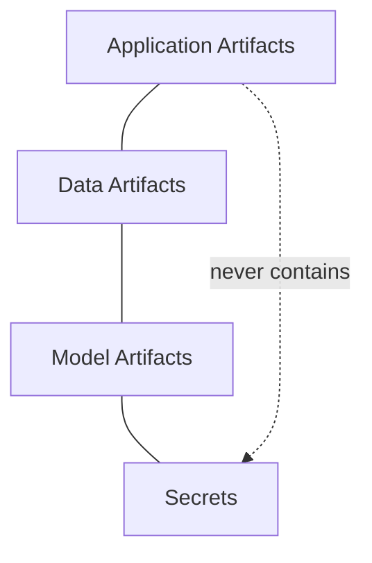

# Application Packaging

## 1. Purpose

This document defines how DistrictMind should conceptually be packaged for deployment. **No Dockerfile is created, and no container technology is selected as Confirmed** — where containers are discussed, they are classified exactly as [technology-stack.md](../00_Engineering_Overview/technology-stack.md) already classifies them (Docker — Proposed, Kubernetes — To Be Evaluated).

## 2. Artifact Categories

| Category | Contents | Examples |
|---|---|---|
| Application artifacts | Compiled/bundled code | Frontend build output, backend service artifact, AI runtime code |
| Data artifacts | Versioned datasets | Curated data snapshots, RAG source documents, spatial fixture sets |
| Model artifacts | Trained model outputs | A registered Prediction model version ([model-lifecycle-implementation.md](../13_AI_Intelligence_Implementation/model-lifecycle-implementation.md) Section 6) |
| Secrets | Sensitive credentials | Database credentials, AI provider keys — **never bundled into any of the above** |

**These four categories are never merged into a single artifact.** A data artifact never ships inside an application artifact's build output, a model artifact is versioned and deployed independently of the application code that invokes it, and a secret is never embedded in any artifact at all (elaborated in [configuration-and-secrets-operations.md](configuration-and-secrets-operations.md)).

## 3. Frontend Artifact

A built, static/client-rendered bundle produced from the frontend source — deployable independently of the backend, consistent with the render-only GIS boundary. No frontend artifact ever embeds a secret (Section 8, [configuration-and-secrets-operations.md](configuration-and-secrets-operations.md)) or a database credential.

## 4. Backend Artifact

A packaged runtime unit containing the API, Application Services, GIS computation module, AI runtime, Prediction/Simulation/Recommendation services — restated unchanged from AD-BE-001/AD-002: **one deployable backend unit, not several independently packaged microservices.**

## 5. AI Runtime Artifact

The Agent orchestration and Typed Tool dispatch logic ships as part of the backend artifact (Section 4) — it is not packaged as a separate deployment unit, since it has no independent data-access path outside the backend's own Application Service layer (AD-DE-005/AD-DB-006/AD-API-002).

## 6. Model Artifacts

Trained Prediction models are packaged and versioned independently of the backend artifact (Section 4) — restated unchanged from [model-lifecycle-implementation.md](../13_AI_Intelligence_Implementation/model-lifecycle-implementation.md) Section 6's registry concept, so that a model update does not require a full backend redeploy, and a backend redeploy does not implicitly change which model version is live.

## 7. GIS/Data Artifacts

| Artifact | Packaging Concept |
|---|---|
| Spatial reference/boundary data | Versioned data artifact, loaded into the database/spatial store independently of application code deployment |
| RAG source documents/index | Versioned data artifact, ingested and indexed independently of the backend artifact ([embedding-and-retrieval-implementation.md](../13_AI_Intelligence_Implementation/embedding-and-retrieval-implementation.md) Section 16) |

## 8. Configuration

Configuration is never baked into an application artifact — it is supplied at deploy/runtime per environment, restated unchanged from [configuration-and-secrets-operations.md](configuration-and-secrets-operations.md); an artifact built once is deployable, unmodified, across Development → Testing → Staging → Production, with only its externally-supplied configuration differing.

## 9. Static Assets

Frontend static assets (images, fonts, compiled stylesheets) are part of the frontend artifact (Section 3) — no static asset ever contains an embedded secret or environment-specific hardcoded endpoint; environment-specific values are injected at build or serve time per [configuration-and-secrets-operations.md](configuration-and-secrets-operations.md).

## 10. Documentation

This documentation set itself (`docs/engineering/`) is versioned alongside the codebase in the same repository, but is never bundled into any deployed artifact — it is a development-time and audit-time reference, not a runtime dependency.

## 11. Reproducibility

An artifact built from a given source commit and dependency lock state is reproducible — building it again from the same inputs produces a behaviorally identical artifact. This mirrors the reproducibility discipline already established for model training ([model-lifecycle-implementation.md](../13_AI_Intelligence_Implementation/model-lifecycle-implementation.md) Section 4) and for test fixtures ([test-architecture.md](../14_Testing_Security_Observability/test-architecture.md) Section 5), extended here to the deployable artifact itself. Reproducibility is what makes environment promotion (Section 8; [environment-architecture.md](environment-architecture.md) Section 9) meaningful — the artifact promoted to Staging must be the *same* artifact validated in Testing, not a rebuild that could silently differ.

## 12. Containers — Classification Only

Where a container format (e.g., Docker) is eventually used to package the frontend or backend artifact for portability across environments, it is classified exactly as [technology-stack.md](../00_Engineering_Overview/technology-stack.md) already classifies it:

| Technology | Status |
|---|---|
| Docker (or equivalent container format) | Proposed |
| Kubernetes (or equivalent orchestration) | To Be Evaluated |

**No Dockerfile, container manifest, or orchestration configuration is created by this document or this milestone.** A container, if adopted, would be a packaging *mechanism* for the artifacts already defined in Sections 3–7 — it does not change what those artifacts are or how the four categories in Section 2 remain separated.

## 13. Security

Secrets are never packaged into any artifact category (Section 2) — restated unchanged from [configuration-and-secrets-operations.md](configuration-and-secrets-operations.md) Section 2's non-negotiable rule.

## 14. Observability

Every artifact is versioned/tagged such that a running instance can be traced back to the exact source commit and dependency state that produced it — supporting the correlation-ID-based diagnosis already established in [observability-and-monitoring.md](../14_Testing_Security_Observability/observability-and-monitoring.md).

## 15. Milestone Traceability

| Packaging Concept | First Needed |
|---|---|
| Frontend/backend artifact packaging | M1 |
| Model artifact packaging | M4 |
| RAG artifact packaging | M3 |

## 16. Open Decisions

- Container technology (Docker — Proposed, Kubernetes — To Be Evaluated) — restated unchanged, not advanced by this document.
- Build/packaging tooling — not selected, pending frontend/backend framework confirmation.
- Artifact registry/storage location — not selected.
