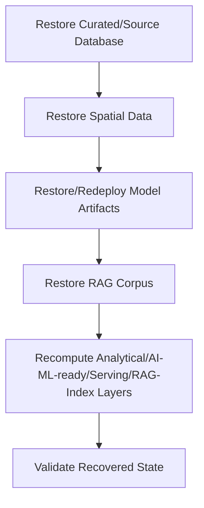

# Backup and Recovery

## 1. Purpose

This document defines DistrictMind's backup and recovery architecture, elaborating [storage-and-persistence-operations.md](storage-and-persistence-operations.md) Section 17's authoritative-vs-recomputable distinction. **No RPO, RTO, backup frequency, or retention period is invented** — restated unchanged from NFR-037/NFR-038's "frequency to be defined during infrastructure design" and "RTO/RPO... Decision Status: To Be Finalized During Architecture Design," both explicitly still unresolved.

## 2. Backup Scope

| Category | Backup Priority | Rationale |
|---|---|---|
| Database (Curated, Source-of-Truth) | Highest | Authoritative — restated from [storage-and-persistence-operations.md](storage-and-persistence-operations.md) Section 17 |
| Spatial data (boundaries, facility geometry) | Highest | Authoritative and typically slow-changing but expensive to re-source |
| Source/Raw data | High | Supports re-processing without re-fetching from external systems, which may not always remain available |
| Model artifacts | Medium-High | Recomputable via retraining, but retraining has real cost and may depend on historical data no longer easily reproducible |
| RAG index/artifacts | Medium | The source document corpus is higher priority than the derived vector index, which is recomputable given the corpus and a fixed embedding-model version |
| Configuration (where safe) | Medium | Non-secret configuration values only — restated from Section 7 below |
| Audit records | High | Immutable and legally/governance significant (FR-036/FR-037) — loss would remove the system's own accountability trail |
| Provenance records | High | Tied directly to Evidence/grounding integrity ([grounding-and-evidence-implementation.md](../13_AI_Intelligence_Implementation/grounding-and-evidence-implementation.md)) — loss would silently degrade the system's ability to justify past AI Responses |
| Analytical/AI-ML-ready/Serving data | Low | Fully recomputable from Curated data, per [storage-and-persistence-operations.md](storage-and-persistence-operations.md) Section 3 |

## 3. Consistency

A database backup must be internally consistent (e.g., a Village record and its geometry must not be backed up at different, inconsistent points in time) — restated as a requirement any eventual backup mechanism must satisfy, not a specific technical implementation (e.g., snapshot isolation) mandated here.

## 4. Restore Testing

A backup is only meaningful if its restore path has actually been exercised — restated consistent with the reproducibility discipline established throughout `13_AI_Intelligence_Implementation/` and `14_Testing_Security_Observability/`: an untested backup is not treated as a verified recovery capability, regardless of how frequently it is taken.

## 5. Backup Validation

Every backup should be validated (e.g., checksum/integrity verification, or a restore-and-spot-check process) before being relied upon — restated conceptually; no specific validation tool or cadence is defined.

## 6. Corruption Detection

Restated unchanged from [storage-and-persistence-operations.md](storage-and-persistence-operations.md) Section 11 — a corrupted backup is detectable against the same provenance/integrity trail used to detect corruption in live data, so that a corrupted backup is not silently relied upon during a real recovery.

## 7. Configuration Backup — Where Safe

Non-secret configuration (Section 2, [configuration-and-secrets-operations.md](configuration-and-secrets-operations.md)) may be backed up alongside other artifacts; **Secrets are never included in a backup artifact in plaintext** — restated unchanged from that document's Section 10 non-negotiable rule. Where a secrets-management mechanism (Under Evaluation) provides its own backup/recovery capability, that remains a property of the eventual tooling, not something this document specifies.

## 8. Audit Records and Provenance Records

Restated from Section 2 — both require backup treatment consistent with their authoritative, immutable nature (Section 7, [storage-and-persistence-operations.md](storage-and-persistence-operations.md)); a recovery that silently drops audit/provenance history is not an acceptable recovery outcome.

## 9. Authoritative Data vs. Derived/Recomputable Artifacts — Restated

| Authoritative (Strong Preservation Required) | Derived/Recomputable (May Be Rebuilt) |
|---|---|
| Source/Raw/Curated data | Analytical data |
| Spatial boundary/facility geometry | AI/ML-ready feature data |
| Audit and provenance records | Serving-layer caches |
| Model training datasets (where retained) | The RAG vector index (given its source corpus) |
| | Registered model artifacts *could* be retrained, but are treated as closer to authoritative given real retraining cost (Section 2) |

**Some derived artifacts may be rebuilt from authoritative sources; Source-of-Truth data itself requires the strongest preservation guarantee DistrictMind provides, since no recomputation path exists for genuinely lost authoritative data.**

## 10. Recovery Sequencing

Authoritative data is restored first; derived/recomputable layers are rebuilt afterward — restoring in the reverse order would risk rebuilding derived data against a not-yet-consistent authoritative base.

## 11. Recovery Dependencies

| Recovered Component | Depends On |
|---|---|
| Analytical data | A consistent, restored Curated database |
| AI/ML-ready features | A consistent, restored Curated database and a known feature-computation version ([feature-engineering-implementation.md](../13_AI_Intelligence_Implementation/feature-engineering-implementation.md) Section 8) |
| Prediction serving | A restored/redeployed model artifact plus restored feature data |
| RAG retrieval | A restored source corpus plus a known embedding-model version ([embedding-and-retrieval-implementation.md](../13_AI_Intelligence_Implementation/embedding-and-retrieval-implementation.md) Section 16) |
| Simulation | A restored, consistent Curated baseline — Simulation itself never depends on a backup of its own sandboxed output, since that output is discard-after-use by design (AD-DE-004) |

## 12. Simulation and Backup — Explicit Non-Requirement

**Simulation output is never backed up as authoritative data**, restated unchanged from AD-DE-004: a Scenario Result is reproducible by re-running the scenario against a properly recovered baseline, so it carries no independent backup requirement beyond whatever operational value a specific historical Scenario Result might have (a governance, not a recovery, question).

## 13. Security

Backup artifacts are subject to the same access restrictions as the live data they represent — restated unchanged from [networking-and-access.md](networking-and-access.md) Section 15 (Restricted Database Access) and Section 7 above's secrets exclusion.

## 14. Observability

Every backup run, validation result, and restore test is logged and auditable, restated unchanged from [observability-and-monitoring.md](../14_Testing_Security_Observability/observability-and-monitoring.md).

## 15. Milestone Traceability

| Backup/Recovery Concern | First Needed |
|---|---|
| Database/Curated data backup | M1 |
| Spatial data backup | M1–M2 |
| Model artifact backup | M4 |
| RAG artifact backup | M3 |

## 16. Open Decisions — Explicitly Unresolved

- **RPO (Recovery Point Objective)** — Unresolved, restated from NFR-038.
- **RTO (Recovery Time Objective)** — Unresolved, restated from NFR-038.
- **Backup frequency** — Unresolved, restated from NFR-037.
- **Retention periods for backups** — Unresolved, restated from [storage-and-persistence-operations.md](storage-and-persistence-operations.md) Section 9.
- Backup storage vendor/technology — Unresolved, pending database/infrastructure confirmation.
