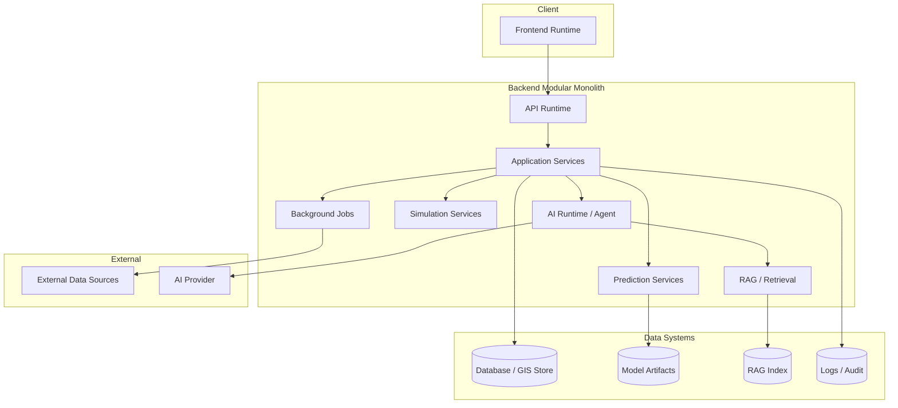

# Deployment Architecture

## 1. Purpose

This document defines DistrictMind's conceptual deployment architecture, elaborating [system-architecture.md](../02_System_Architecture/system-architecture.md), [backend-architecture.md](../02_System_Architecture/backend-architecture.md), and [implementation-strategy.md](../08_Implementation_Foundation/implementation-strategy.md) at the deployment level. **No cloud provider, hosting platform, or infrastructure technology is selected here** — restated unchanged from [constraints.md](../01_Requirements/constraints.md) Infrastructure/Deployment Constraints ("No hosting provider or deployment environment has been confirmed").

## 2. Deployment Objectives

| Objective | Detail |
|---|---|
| Preserve architectural boundaries | Every boundary established in `02_System_Architecture/` through `13_AI_Intelligence_Implementation/` (modular monolith, AI typed-tool boundary, GIS server-side authority) must survive translation into a physical deployment |
| Environment reproducibility | A deployment is reproducible across environments from the same artifacts and versioned configuration ([application-packaging.md](application-packaging.md)) |
| Operational safety | Deployment must never allow AI Response to overwrite Source-of-Truth data, and Simulation must never run against production Curated state (AD-DE-004) |
| Responsiveness | Deployment must not introduce a physical topology that causes the frontend to freeze under expensive GIS/AI workloads ([runtime-topology.md](runtime-topology.md)) |
| No premature technology commitment | Every infrastructure choice remains Proposed/Candidate/To Be Evaluated until real evidence justifies confirmation |

## 3. Logical Architecture vs. Physical Deployment — The Central Distinction

| Logical Architecture | Physical Deployment |
|---|---|
| Defines *what* components exist and how they relate (Frontend, API, Application Services, Repository/GIS/Model layers, AI Agent, Typed Tools) — already fully specified across `02_System_Architecture/` through `13_AI_Intelligence_Implementation/` | Defines *where* those components actually run, on what compute, and how they physically communicate |
| Stable regardless of hosting choice | Varies depending on which hosting/infrastructure technology is eventually confirmed |
| Already complete in this documentation program | **Deliberately left open** — this document describes deployment *concepts* (what must be true of any physical deployment), not a specific target |

A modular monolith's logical architecture does not imply any specific physical deployment shape (a single process, several processes, or containers) — this document addresses the concepts that any of those shapes must satisfy, without selecting among them.

## 4. Logical Components

Restated unchanged from [ai-implementation-architecture.md](../13_AI_Intelligence_Implementation/ai-implementation-architecture.md) Section 7 and [backend-implementation-architecture.md](../09_Backend_Implementation/backend-implementation-architecture.md):

| Component | Role |
|---|---|
| Frontend runtime | Renders UI, GIS map (render-only), dashboards; consumes the API |
| API runtime | Domain-aligned routes (AD-API-001), request/response validation, authentication/authorization entry point |
| Application Services | Business logic, orchestrates Repository/GIS/Model/AI access |
| Database | Source-of-Truth/Curated/Analytical/Derived storage |
| GIS computation | Authoritative server-side spatial operations |
| AI runtime | Agent execution, planning, response synthesis |
| RAG/retrieval | Contextual document retrieval feeding the Agent |
| Prediction services | Model invocation for forecast domains |
| Simulation services | Sandboxed scenario execution |
| Background jobs | Asynchronous/long-running work (ingestion, large predictions, simulations) |
| External data sources | Governed adapters to outside data providers |
| Observability | Logs/metrics/traces/audit events |
| Authentication/Authorization | Identity and access enforcement |
| Storage | Data, model, RAG, and log/audit artifact persistence |

## 5. Conceptual Deployment Diagram

This diagram is illustrative of logical placement, not a physical provisioning plan — no box above implies a specific server, container, or cloud service.

## 6. Frontend Runtime

Deployed as a static/client-rendered artifact (exact model depends on the eventually confirmed frontend framework, [technology-stack.md](../00_Engineering_Overview/technology-stack.md)) served independently of the backend, consistent with the render-only GIS boundary (AD-FE-004) — the frontend never requires server-side compute of its own beyond serving static assets.

## 7. API Runtime and Application Services

Deployed as part of the same modular-monolith process/deployment unit — restated unchanged from AD-BE-001/AD-BE-002/AD-API-001: **DistrictMind is not deployed as microservices.** Domain-aligned service boundaries exist as internal module boundaries within this single deployable unit, not as independently deployed services.

## 8. Database

The database is a distinct, independently-provisioned system from the application runtime, consistent with standard separation-of-concerns — no specific database product is Confirmed (PostgreSQL/PostGIS remain Candidate per [technology-stack.md](../00_Engineering_Overview/technology-stack.md)).

## 9. GIS Computation

GIS computation executes within the backend modular monolith (or, if ever justified by real evidence, a dedicated computation module within it) — never client-side, restated unchanged from AD-FE-004. No dedicated "GIS microservice" is introduced; this remains a module, not a separate deployment unit, consistent with Section 7.

## 10. AI Runtime and RAG/Retrieval

The AI runtime (Agent, Typed Tool dispatch) runs within the backend modular monolith; the underlying LLM provider itself is an external dependency (AI provider — Unresolved). RAG retrieval depends on a vector index (Candidate technology, [technology-stack.md](../00_Engineering_Overview/technology-stack.md)) that may be co-located with the primary database (e.g., pgvector) or a separate index store, depending on the eventual technology decision.

## 11. Prediction and Simulation Services

Both execute within the backend modular monolith, invoking model artifacts (Section 4, [application-packaging.md](application-packaging.md)) — Simulation executes in a sandboxed context that never writes to the authoritative database (AD-DE-004), restated unchanged.

## 12. Background Jobs

Long-running work (ingestion, large predictions, large simulations) executes via a background-job mechanism — technology unresolved (job queue remains To Be Evaluated) — kept logically distinct from the synchronous API request path so expensive work never blocks a frontend-facing request ([runtime-topology.md](runtime-topology.md)).

## 13. External Data Sources

Accessed only through governed adapters ([external-integration-design.md](../06_API_and_Integration/external-integration-design.md)) — no direct, unmediated external connection exists from the Frontend or the AI Agent.

## 14. Observability

Logs, metrics, traces, and audit events (restated unchanged from [observability-and-monitoring.md](../14_Testing_Security_Observability/observability-and-monitoring.md)) are emitted by every component above; no observability platform is selected.

## 15. Authentication/Authorization

A distinct concern from any other component — every request, including AI-originated tool calls, passes through the same authentication/authorization enforcement regardless of physical deployment shape, restated unchanged from [authorization-implementation.md](../09_Backend_Implementation/authorization-implementation.md).

## 16. Storage

Restated and elaborated fully in [storage-and-persistence-operations.md](storage-and-persistence-operations.md) — data, model, RAG, and log/audit artifacts each have distinct persistence and lifecycle needs.

## 17. Modular Monolith Preserved

**This document does not introduce microservices.** Every component in Section 4 is a module within one backend deployable unit (or, for the frontend, one separately-served static/client artifact) — restated unchanged from AD-BE-001/AD-002. A future justified split (e.g., isolating Prediction execution onto separate compute for resource reasons) would be a *scaling* decision ([scalability-and-capacity.md](scalability-and-capacity.md)), not an architectural redesign, and would require its own evidence-based decision, not one assumed here.

## 18. Security

Restated unchanged from [security-testing.md](../14_Testing_Security_Observability/security-testing.md) — the AI Agent has no direct database/GIS-database access in any physical deployment shape; this is a structural guarantee independent of infrastructure choice.

## 19. Performance

No physical deployment choice may compromise the UI-must-not-freeze requirement ([performance-and-responsiveness-testing.md](../14_Testing_Security_Observability/performance-and-responsiveness-testing.md)) — expensive GIS/AI/Prediction/Simulation work is isolated to backend/background execution, never blocking the frontend-facing request path.

## 20. Milestone Traceability

| Deployment Concept | First Needed |
|---|---|
| Frontend + API + Database deployment | M1 |
| GIS computation deployment | M1–M2 |
| AI runtime deployment | M3 |
| Prediction/Simulation service deployment | M4, M5 |
| Full integrated deployment | M6 |

## 21. Open Decisions

- Cloud provider / hosting platform — Unresolved, restated from [constraints.md](../01_Requirements/constraints.md).
- Container technology (Docker — Proposed; Kubernetes — To Be Evaluated) — restated unchanged from [technology-stack.md](../00_Engineering_Overview/technology-stack.md), elaborated in [application-packaging.md](application-packaging.md).
- Job queue technology — To Be Evaluated.
