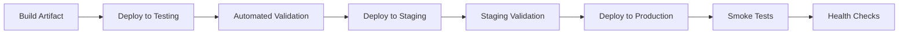

# Deployment Strategy

## 1. Purpose

This document defines DistrictMind's deployment strategy, elaborating [environment-architecture.md](environment-architecture.md) Section 9 and [application-packaging.md](application-packaging.md) Section 11. **No specific deployment pattern (blue-green, canary, rolling) is selected as Confirmed** — where discussed, each is classified Proposed/Candidate.

## 2. Deployment Stages

## 3. Environment Promotion

Restated unchanged from [environment-architecture.md](environment-architecture.md) Section 9: the same artifact (Section 11, [application-packaging.md](application-packaging.md)) is promoted Development → Testing → Staging → Production, with only externally-supplied configuration differing per environment — no environment is skipped for a production-bound release.

## 4. Artifact Consistency

The artifact deployed to Production is byte-identical (or behaviorally identical, for a compiled/bundled artifact) to the one validated in Staging — restated unchanged from [application-packaging.md](application-packaging.md) Section 11's reproducibility requirement. A rebuild between Staging validation and Production deployment is never acceptable, since it would invalidate what Staging actually verified.

## 5. Configuration Separation

Restated unchanged from [configuration-and-secrets-operations.md](configuration-and-secrets-operations.md) Section 15 — configuration *shape* is consistent across environments; configuration *values* are supplied per environment at deploy time, never baked into the artifact itself.

## 6. Data Migration Considerations

A schema or data-model change accompanying a release is deployed with explicit consideration for: whether the migration is backward-compatible with the currently-running artifact (Section 8), whether it requires a maintenance window, and whether it can be rolled back independently of the application code change — restated conceptually; no specific migration tool is selected.

## 7. Schema Compatibility

A new artifact version should tolerate the database schema of the version it is replacing during a rolling/staged deployment (Section 9) — restated as a design principle: additive, backward-compatible schema changes are preferred over breaking changes that require simultaneous artifact-and-schema cutover.

## 8. Model Compatibility

A Prediction model version is deployed independently of the backend artifact (restated from [application-packaging.md](application-packaging.md) Section 6) — a backend release must remain compatible with the currently-live model version's input/output contract, and a model promotion must not silently break a backend release that has not yet adopted a changed contract.

## 9. RAG Index Compatibility

Restated unchanged from [embedding-and-retrieval-implementation.md](../13_AI_Intelligence_Implementation/embedding-and-retrieval-implementation.md) Section 16: an embedding-model version change requires a full corpus re-index before the new model is used for retrieval — a deployment that changes the embedding model without a corresponding completed re-index is treated as an incompatible release, not deployed to Production.

## 10. Backward Compatibility

An API contract change (restated from [api-design-principles.md](../06_API_and_Integration/api-design-principles.md)) preserves backward compatibility for any consumer (frontend, external integration) not yet updated to expect the new shape, wherever practical — a breaking change is deployed only alongside a coordinated consumer update, never silently.

## 11. Deployment Validation

Every deployment is validated before being considered complete — restated unchanged from [quality-assurance-and-release-readiness.md](../14_Testing_Security_Observability/quality-assurance-and-release-readiness.md) Section 2's Implementation Validation dimension, applied here specifically to the deployment event itself.

## 12. Smoke Tests

A minimal, fast-running set of checks confirming the newly deployed artifact is basically functional (the API responds, the database connection is healthy, a simple GIS query returns) — restated conceptually from [end-to-end-testing.md](../14_Testing_Security_Observability/end-to-end-testing.md), scoped down to only what is needed to gate a deployment's continuation, not a full regression suite.

## 13. Health Checks

Elaborated fully in [operational-monitoring.md](operational-monitoring.md) — a deployment is not considered successful until the newly deployed instance reports healthy per its readiness/liveness checks.

## 14. Rollback Readiness

Every deployment is undertaken with a known, exercised rollback path already available before the deployment begins — restated unchanged from [release-and-rollback.md](release-and-rollback.md), elaborated fully there.

## 15. Conceptual Deployment Strategies

| Strategy | Concept | Status |
|---|---|---|
| Staged deployment | Deploy to a subset of infrastructure/traffic first, expand upon successful validation | Proposed/Candidate — not selected as Confirmed |
| Controlled promotion | A release only advances to the next environment after explicit validation gates pass (Section 2) | Proposed — consistent with the Ten Gates discipline (AD-IMP-005) already established |
| Rollback | A failed or degraded deployment is reverted to the last known-good artifact/configuration state | Proposed — elaborated fully in [release-and-rollback.md](release-and-rollback.md) |
| Blue-green | Two parallel production environments, traffic cut over only after validation | Candidate — not selected, would require infrastructure not yet confirmed |
| Canary | A new release receives a small fraction of traffic before full rollout | Candidate — not selected, same reasoning |

**No deployment pattern beyond "staged, validated, rollback-ready" is committed to** — the more specific patterns (blue-green, canary) remain Candidate until real infrastructure and operational maturity justify choosing among them.

## 16. Security

Every deployment stage (Section 2) enforces the same authorization/access restrictions on who may trigger a promotion as any other administrative action — restated unchanged from [networking-and-access.md](networking-and-access.md) Section 9.

## 17. Performance

A deployment event itself must not degrade the UI-must-not-freeze requirement for end users — restated consistent with [performance-and-responsiveness-testing.md](../14_Testing_Security_Observability/performance-and-responsiveness-testing.md); a staged/controlled promotion strategy (Section 15) is specifically chosen as a concept precisely because it avoids an all-at-once cutover that could introduce a user-visible disruption.

## 18. Observability

Every deployment event, its validation results, and its outcome are logged and auditable, restated unchanged from [operational-monitoring.md](operational-monitoring.md).

## 19. Milestone Traceability

| Deployment Strategy Concept | First Needed |
|---|---|
| Environment promotion, smoke tests, health checks | M1 |
| Model compatibility handling | M4 |
| RAG index compatibility handling | M3 |

## 20. Open Decisions

- Specific deployment pattern (staged, blue-green, canary) — Proposed/Candidate only, unresolved.
- Deployment automation tooling — not selected (explicitly out of scope for this documentation-only milestone; no CI/CD configuration is created).
