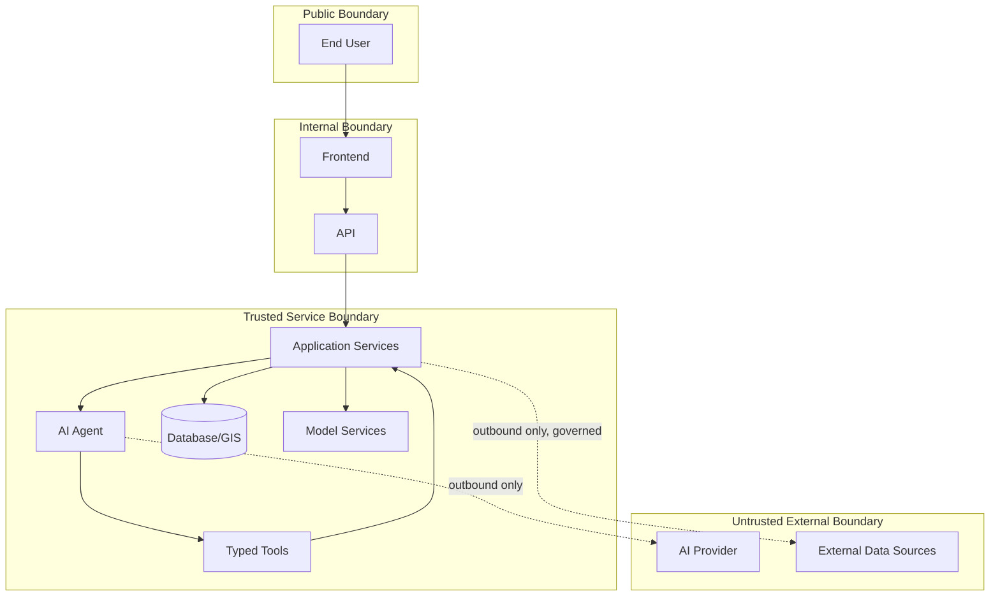

# Networking and Access

## 1. Purpose

This document defines DistrictMind's networking and access boundaries conceptually, elaborating [security-architecture.md](../02_System_Architecture/security-architecture.md) and [ai-implementation-architecture.md](../13_AI_Intelligence_Implementation/ai-implementation-architecture.md) Section 3 at the deployment level. **No specific network vendor, cloud networking architecture, or product is selected.**

## 2. Boundary Classification

| Boundary | Membership |
|---|---|
| Public boundary | The end user's own device/browser — outside DistrictMind's control |
| Internal boundary | Frontend and API — reachable from the public boundary, but themselves not trusted with unrestricted data access |
| Trusted service boundary | Application Services, AI Agent, Typed Tools, Database/GIS, Model Services — never directly reachable from the public boundary |
| Untrusted external boundary | AI provider, external data sources — DistrictMind treats these as untrusted-by-default even though DistrictMind itself initiates the connection (restated from [ai-safety-implementation.md](../13_AI_Intelligence_Implementation/ai-safety-implementation.md) Section 5) |

## 3. Frontend-to-API

The only network path available to the public boundary — all requests are authenticated/authorized at this boundary before reaching any trusted-boundary component, restated unchanged from [authentication-implementation.md](../09_Backend_Implementation/authentication-implementation.md).

## 4. API-to-Database

Restricted to the trusted service boundary — the database is never directly reachable from the internal boundary (Frontend/API code paths do not hold a direct database connection outside the Repository layer, restated unchanged from [repository-layer-design.md](../09_Backend_Implementation/repository-layer-design.md)), and never reachable at all from the public boundary.

## 5. API-to-GIS

The GIS computation module is reached only through Application Services, within the trusted service boundary — restated unchanged from AD-FE-004; no direct network path from the Frontend to a GIS computation endpoint that would allow bypassing server-side authority exists.

## 6. API-to-AI

The AI Agent is invoked only from within the trusted service boundary (via the API's own request handling) — restated unchanged from [ai-implementation-architecture.md](../13_AI_Intelligence_Implementation/ai-implementation-architecture.md) Section 3; the Frontend never connects to the AI Agent or an AI provider directly.

## 7. AI-to-Typed-Tools

Internal to the trusted service boundary — the Agent's only outbound path within DistrictMind's own infrastructure is to the Typed Tool dispatch mechanism, restated unchanged from [typed-tool-implementation.md](../13_AI_Intelligence_Implementation/typed-tool-implementation.md) Section 2. The Agent's only path to the untrusted external boundary is its outbound call to the AI provider itself (Section 2's dotted line) — a path that carries no direct data-access capability, only the request/response text of the LLM interaction.

## 8. External Data-Source Access

Restricted to governed adapters within the trusted service boundary, reaching outward to the untrusted external boundary — restated unchanged from [external-integration-design.md](../06_API_and_Integration/external-integration-design.md); no other component holds a direct network path to an external data source.

## 9. Administrative Access

Administrative operations (user/role management, FR-034; data-source configuration, FR-035) require the most restricted network access of any internal-boundary function — restated consistent with [environment-management.md](../08_Implementation_Foundation/environment-management.md) Section 6's Production access restrictions, requiring an audited, authorized path distinct from ordinary user access.

## 10. Monitoring Access

Observability tooling (Section on Observability, [operational-monitoring.md](operational-monitoring.md)) requires read access to logs/metrics/traces across the trusted service boundary, but never write access to production data, and never a path that would allow bypassing the Database/GIS access restrictions in Sections 4–5.

## 11. TLS Concept

Every network path crossing the public boundary (Section 3), and every path within the internal/trusted boundaries wherever the eventual infrastructure supports it, is encrypted in transit — restated as a conceptual requirement; no specific TLS implementation, certificate authority, or termination point is prescribed.

## 12. Authentication and Authorization

Restated unchanged from Section 3 and [authorization-implementation.md](../09_Backend_Implementation/authorization-implementation.md) — every request crossing from the public boundary into the internal boundary is authenticated; every request crossing from the internal boundary into the trusted service boundary is authorized against the caller's resolved identity and scope, including AI-originated typed-tool calls (restated unchanged from [ai-safety-implementation.md](../13_AI_Intelligence_Implementation/ai-safety-implementation.md) Section 6).

## 13. Network Segmentation Concept

The boundary classification in Section 2 implies a conceptual segmentation: the trusted service boundary (Database, GIS, Model Services, AI Agent internals) should not be reachable from the public boundary under any network path, regardless of which specific networking technology eventually implements this — restated as a requirement any future infrastructure choice must satisfy, not a specific firewall/VPC/subnet design.

## 14. Least Privilege

Every component's network access is scoped to only what it needs — restated unchanged from [engineering-quality-gates.md](../08_Implementation_Foundation/engineering-quality-gates.md) Section 5: the AI Agent has no network path to the Database; ingestion adapters use source-specific, least-privilege credentials distinct from the application's general database role (restated from [data-gis-integration.md](../12_Data_GIS_Implementation/data-gis-integration.md) Section 9).

## 15. Restricted Database Access

Restated unchanged from Section 4 — only the Repository layer, within the trusted service boundary, ever holds a database connection; no other component (including the AI Agent) is ever granted one, restated unchanged from AD-DE-005/AD-DB-006.

## 16. Restricted Administrative Access

Restated unchanged from Section 9 — administrative network access is the most tightly scoped of any internal-boundary function, audited per FR-036.

## 17. Security

This entire document is itself a security-boundary specification — restated consistent with [security-testing.md](../14_Testing_Security_Observability/security-testing.md) Section 2's identical boundary diagram, verified here at the network-topology level rather than the application-logic level.

## 18. Observability

Every boundary crossing (Sections 3–10) is a candidate observability event — an unexpected attempt to cross from the public boundary directly into the trusted service boundary would itself be a security-relevant anomaly, restated consistent with [observability-and-monitoring.md](../14_Testing_Security_Observability/observability-and-monitoring.md) Section 10 (Unusual agent behavior).

## 19. Milestone Traceability

| Networking Concept | First Needed |
|---|---|
| Public/internal boundary (Frontend-to-API) | M1 |
| Trusted service boundary (API-to-Database/GIS) | M1 |
| AI-to-Typed-Tools boundary | M3 |
| External data-source boundary | M2 |

## 20. Open Decisions

- Network vendor/cloud networking architecture — Unresolved, restated from [constraints.md](../01_Requirements/constraints.md).
- TLS certificate management approach — not selected.
- Specific network segmentation mechanism (VPC, subnet, firewall rules) — not selected; this document defines the requirement, not the implementation.
