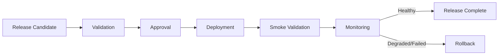
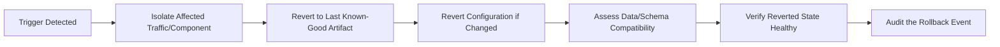

# Release and Rollback

## 1. Purpose

This document defines release management and rollback procedures, elaborating [deployment-strategy.md](deployment-strategy.md) Section 14. **No numeric threshold (error rate, latency degradation) triggers rollback in this document** — trigger conditions are qualitative, consistent with the Ten Gates' qualitative discipline (AD-IMP-005).

## 2. Release Lifecycle

## 3. Release Candidate

A build that has passed Testing-environment automated validation ([test-architecture.md](../14_Testing_Security_Observability/test-architecture.md)) and is proposed for Staging/Production promotion — restated consistent with [deployment-strategy.md](deployment-strategy.md) Section 2's staged pipeline.

## 4. Validation

Restated unchanged from [deployment-strategy.md](deployment-strategy.md) Section 11 — a release candidate is validated at each environment stage before further promotion; Staging validation is the final gate before Production.

## 5. Approval

A release candidate's promotion to Production requires an explicit, recorded approval action — restated conceptually parallel to the human-review-gate discipline already established for Recommendations (FR-032) applied here to releases: **a release does not reach Production merely by having passed automated checks**, consistent with this program's general refusal to treat automation alone as sufficient for a consequential state transition.

## 6. Deployment

Restated unchanged from [deployment-strategy.md](deployment-strategy.md) Sections 2–4.

## 7. Smoke Validation

Restated unchanged from [deployment-strategy.md](deployment-strategy.md) Section 12 — executed immediately after deployment, before the release is considered complete.

## 8. Monitoring

Post-deployment monitoring (restated from [operational-monitoring.md](operational-monitoring.md)) continues beyond smoke validation for an observation period, during which a rollback trigger (Section 9) may still fire — no specific observation-period duration is invented.

## 9. Rollback Triggers

| Trigger Category | Condition (Qualitative) |
|---|---|
| Smoke test failure | A smoke test fails immediately after deployment |
| Health check failure | The deployed instance fails to report healthy ([operational-monitoring.md](operational-monitoring.md)) |
| Elevated error rate | Errors increase materially relative to the pre-deployment baseline (qualitative comparison, no invented percentage) |
| Authorization/security anomaly | Any indication the deployment introduced an authorization bypass or security regression — treated as an automatic, non-negotiable rollback trigger, restated consistent with [engineering-quality-gates.md](../08_Implementation_Foundation/engineering-quality-gates.md) Gate 6's rollback condition |
| Data-integrity anomaly | Any indication the release wrote data inconsistent with the six information categories (e.g., an AI Response path found writing to Source-of-Truth) — also an automatic, non-negotiable trigger |
| GIS/Simulation sandbox violation | Any indication a Simulation run mutated production Curated data (AD-DE-004) — automatic, non-negotiable |
| Manual operator judgment | An operator determines the release is unsafe for a reason not captured by the automated triggers above |

## 10. Rollback Procedure Concept

A rollback reverts to the last known-good, already-validated artifact and its associated configuration — restated consistent with [deployment-strategy.md](deployment-strategy.md) Section 14's rollback-readiness requirement (a rollback path must exist and be exercised in principle before a deployment begins, not improvised after a failure).

## 11. Data/Schema Compatibility During Rollback

Where a release included a schema change, rollback must account for whether the prior artifact version remains compatible with the new schema (restated from [deployment-strategy.md](deployment-strategy.md) Section 7) — a schema change that is not backward-compatible complicates rollback and is therefore a reason to prefer additive, backward-compatible migrations as the default pattern.

## 12. Model Compatibility During Rollback

If a release promoted a new model version alongside application changes, rollback may need to revert the model version independently of the application artifact (restated from [model-lifecycle-implementation.md](../13_AI_Intelligence_Implementation/model-lifecycle-implementation.md) Section 8's promotion/rollback discipline) — the two are never assumed to be coupled unless the release explicitly required a new model version for the application change to function.

## 13. AI Provider Dependency

Since the AI provider is Unresolved, this document cannot specify provider-specific rollback behavior — conceptually, a release that changes AI provider integration is treated with the same rollback discipline as any other external-dependency change (Section 9's trigger categories apply), and reverting a provider integration change reverts to the prior provider configuration.

## 14. GIS/Data Dependency

A release affecting GIS computation logic or data-pipeline transformation logic is rolled back the same way as any application change (Section 10); where the release also involved a Curated-data transformation, rollback additionally requires assessing whether already-transformed data needs to be corrected or re-processed (restated from [data-and-pipeline-testing.md](../14_Testing_Security_Observability/data-and-pipeline-testing.md) Section 10).

## 15. Recovery

After a rollback, the system is verified healthy (Section 10's Verify step) before the release is considered resolved — restated consistent with [incident-and-failure-management.md](../14_Testing_Security_Observability/incident-and-failure-management.md) Section 9.

## 16. Rollback Scenarios

| Scenario | Rollback Approach |
|---|---|
| Backend release failure | Revert to the prior backend artifact version; verify API health |
| Frontend release failure | Revert to the prior frontend artifact; frontend rollback is typically faster/lower-risk since the frontend holds no authoritative state |
| Database/schema issue | Assess backward compatibility (Section 11); revert application code first if the schema change is additive and the prior code can tolerate the new schema, otherwise coordinate a schema rollback per [backup-and-recovery.md](backup-and-recovery.md) |
| GIS computation issue | Revert the backend artifact containing the GIS computation change; verify the three canonical examples (coverage, bridge closure, rainfall chain) still compute correctly against known test geometry |
| AI integration issue | Revert the AI/Agent-related code change; if the issue stems from the external AI provider itself rather than DistrictMind's own code, this is a provider-availability incident ([disaster-recovery-and-business-continuity.md](disaster-recovery-and-business-continuity.md)), not a DistrictMind release rollback |
| Prediction model issue | Roll back the live model version pointer (Section 12) independently of any application code rollback, per [model-lifecycle-implementation.md](../13_AI_Intelligence_Implementation/model-lifecycle-implementation.md) Section 8 |
| RAG issue | Revert to the prior corpus/index version if a re-indexing release introduced a retrieval regression, restated consistent with [embedding-and-retrieval-implementation.md](../13_AI_Intelligence_Implementation/embedding-and-retrieval-implementation.md) Section 16 |

## 17. Security

Sections 9's authorization/security-anomaly and data-integrity-anomaly triggers are treated as automatic, non-negotiable rollback conditions — restated unchanged from [engineering-quality-gates.md](../08_Implementation_Foundation/engineering-quality-gates.md) Gates 6 and 8's rollback conditions.

## 18. Observability

Every release and rollback event is logged with its trigger (if any), affected component, and outcome — restated unchanged from [operational-monitoring.md](operational-monitoring.md).

## 19. Milestone Traceability

| Release/Rollback Concept | First Needed |
|---|---|
| Basic release/rollback (backend/frontend/database) | M1 |
| AI integration rollback | M3 |
| Prediction model rollback | M4 |
| Simulation sandbox-violation trigger | M5 |

## 20. Open Decisions

- No numeric threshold for any rollback trigger is defined — intentionally, per this milestone's instruction.
- Release/rollback automation tooling — not selected.
