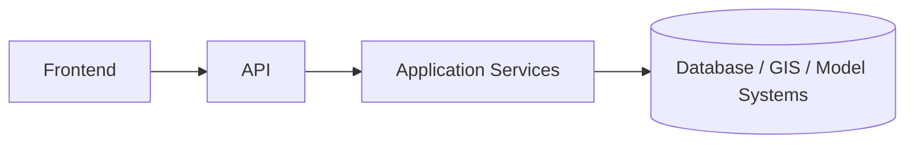
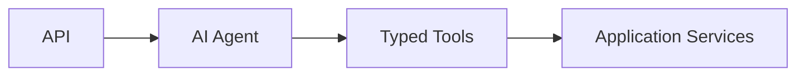

# Runtime Topology

## 1. Purpose

This document defines DistrictMind's runtime topology — where and how each request/workload executes — elaborating [deployment-architecture.md](deployment-architecture.md). No specific infrastructure technology is mandated.

## 2. Core Topology

## 3. AI Topology

Restated unchanged from [ai-implementation-architecture.md](../13_AI_Intelligence_Implementation/ai-implementation-architecture.md) Section 3 — the Agent never appears left of Typed Tool, and Typed Tools always route back through Application Services, never directly to Database/GIS/Model systems.

## 4. Synchronous Operations

| Operation | Topology |
|---|---|
| Simple data retrieval (`get_district`, `get_demographics`, etc.) | Frontend → API → Application Service → Repository → Response, within a single request/response cycle |
| Single-step AI query | Frontend → API → Agent → one Typed Tool → Response, within a single request/response cycle |
| Standard spatial query (containment, distance) | Frontend → API → Application Service → GIS computation → Response |

## 5. Asynchronous Operations

| Operation | Topology |
|---|---|
| Multi-step agentic query (Example C) | Frontend → API → Agent (multi-step plan) → several Typed Tools in sequence/parallel → aggregated Response — potentially long-running, a candidate for async/progressive delivery ([ai-runtime-architecture.md](../13_AI_Intelligence_Implementation/ai-runtime-architecture.md) Section 22) |
| Prediction request | May execute synchronously for a fast model or asynchronously for a longer-running one — classified per [background-job-architecture.md](../09_Backend_Implementation/background-job-architecture.md) Section 3's sync/async criteria |
| Scenario execution (`create_scenario`/`run_scenario`) | Runs in a sandboxed context (AD-DE-004); execution time depends on scenario complexity, making it a background-processing candidate for non-trivial scenarios |
| Large ingestion run | Always background — never blocks an API request |

## 6. Background Processing

Background jobs (ingestion, large predictions, large simulations, RAG re-indexing) execute outside the synchronous API request/response cycle, via a background-job mechanism (technology To Be Evaluated) — restated unchanged from [deployment-architecture.md](deployment-architecture.md) Section 12. A background job's completion is surfaced to the frontend via polling or a future notification mechanism (Proposed, not committed), never by holding a synchronous connection open indefinitely.

## 7. AI Processing Placement

AI processing (Agent planning, tool orchestration, response synthesis) executes entirely within the backend modular monolith — never client-side. The underlying LLM provider call is an outbound dependency to an external system (AI provider — Unresolved), issued from the backend, never from the frontend directly.

## 8. GIS Computation Placement

Restated unchanged from AD-FE-004: all authoritative spatial computation executes server-side, within the Application Service/GIS module. The frontend never performs a spatial computation — it only renders geometry/attribute data already computed and returned.

## 9. Prediction Execution Placement

Prediction execution occurs within the backend's Prediction Service module (or, if scaling evidence eventually justifies it, isolated background workers) — restated unchanged from [prediction-implementation.md](../13_AI_Intelligence_Implementation/prediction-implementation.md) Section 12's serving boundary. A prediction is never computed client-side or by the AI Agent's own reasoning.

## 10. Simulation Execution Placement

Simulation executes within the backend's Simulation Service module, against a cloned, sandboxed state — restated unchanged from AD-DE-004 and [simulation-and-scenario-implementation.md](../13_AI_Intelligence_Implementation/simulation-and-scenario-implementation.md) Section 11. Execution isolation (Section 16) applies specifically here to prevent any accidental interaction with production state.

## 11. Recommendation Execution Placement

Recommendation scoring executes within the backend's Recommendation Service module, consuming already-computed Evidence/Prediction/Simulation inputs — restated unchanged from [recommendation-and-decision-intelligence-implementation.md](../13_AI_Intelligence_Implementation/recommendation-and-decision-intelligence-implementation.md) Section 4.

## 12. Evidence Retrieval Placement

Evidence assembly (typed-tool results, RAG retrieval) occurs within the backend, as part of the Agent's plan execution — restated unchanged from [grounding-and-evidence-implementation.md](../13_AI_Intelligence_Implementation/grounding-and-evidence-implementation.md).

## 13. Keeping the Frontend Responsive — Where Expensive Workloads Must Execute

**This is the central design question this document answers.** Every workload classified as expensive (multi-step AI plans, GIS coverage/network-impact computation over large geometry, prediction/simulation execution, RAG retrieval over a large corpus) executes:

1. **Server-side, never client-side** — restated unchanged from AD-FE-004 and [ai-implementation-architecture.md](../13_AI_Intelligence_Implementation/ai-implementation-architecture.md) Section 6.
2. **Asynchronously where its duration would otherwise block a request thread** — restated unchanged from [background-job-architecture.md](../09_Backend_Implementation/background-job-architecture.md) Section 3.
3. **With the frontend using non-blocking loading states** while awaiting a result — restated unchanged from [performance-and-responsiveness-testing.md](../14_Testing_Security_Observability/performance-and-responsiveness-testing.md) Section 12's UI-must-not-freeze requirement.

The frontend's own runtime never performs, waits synchronously on, or is architecturally coupled to the completion time of any of these workloads beyond issuing the request and rendering whatever loading/result state is returned.

## 14. Workload Isolation Concept

Expensive workloads (GIS computation, AI/Prediction/Simulation execution) are conceptually isolated from the lightweight request-handling path — restated consistent with [caching-and-performance.md](../09_Backend_Implementation/caching-and-performance.md) — so that a spike in one workload type (e.g., many concurrent coverage queries) does not degrade an unrelated lightweight operation (e.g., a simple district metadata lookup). No specific isolation mechanism (separate process pool, separate compute tier) is mandated; this is a topology principle, elaborated further as a scaling concern in [scalability-and-capacity.md](scalability-and-capacity.md).

## 15. Security

Every arrow in Sections 2–3's diagrams passes through the same authentication/authorization enforcement regardless of sync/async classification — restated unchanged from [networking-and-access.md](networking-and-access.md).

## 16. Observability

Every synchronous and asynchronous operation above emits trace events under a shared correlation ID, restated unchanged from [ai-runtime-architecture.md](../13_AI_Intelligence_Implementation/ai-runtime-architecture.md) Section 18 and [operational-monitoring.md](operational-monitoring.md).

## 17. Milestone Traceability

| Topology Concept | First Needed |
|---|---|
| Core sync topology (Frontend→API→Services→DB) | M1 |
| GIS computation placement | M1–M2 |
| AI/Agent topology | M3 |
| Prediction/Simulation/Recommendation placement | M4, M5, M6 |

## 18. Open Decisions

- Background-job technology — To Be Evaluated.
- Workload-isolation mechanism (dedicated process pool, separate compute tier) — not selected; a future scaling decision.
