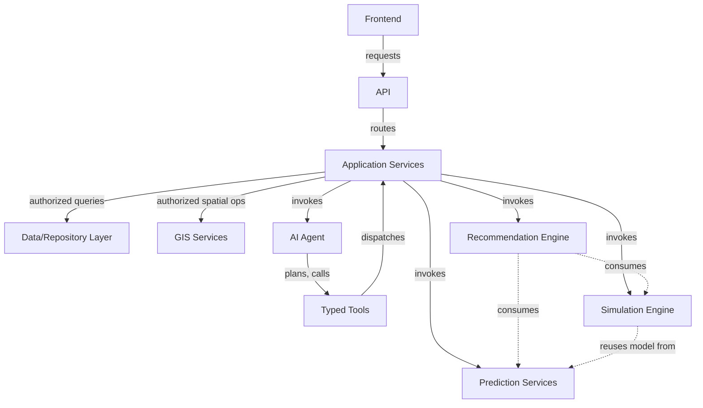

# AI GIS Data Boundary Matrix

## 1. Purpose

This document is the consolidated boundary matrix for DistrictMind's ten core components, synthesizing boundary rules established from [ai-implementation-architecture.md](../13_AI_Intelligence_Implementation/ai-implementation-architecture.md), [gis-implementation-architecture.md](../12_Data_GIS_Implementation/gis-implementation-architecture.md), and every prior boundary-defining document into a single reference.

## 2. The Boundary Matrix

| Component | Allowed Responsibilities | Prohibited Responsibilities | Inputs | Outputs | Authority Level | Evidence Responsibility | Security Boundary |
|---|---|---|---|---|---|---|---|
| **Frontend** | Render UI, render GIS geometry (already computed), issue API requests, display Evidence/provenance already attached | Direct database access; direct GIS-database access; authoritative spatial computation; direct AI provider calls; embedding secrets | User interaction, API responses | API requests, rendered UI | None — no authoritative computation authority | None — displays, never generates, Evidence | Public/Internal boundary ([networking-and-access.md](../15_Deployment_Infrastructure_Operations/networking-and-access.md) Section 2) |
| **API** | Authenticate, structurally validate requests, route to Application Services | Business logic; direct data access; spatial computation | HTTP requests | Routed, validated requests; structured responses | Gatekeeping authority — no data authority | Passes through, does not generate, Evidence | Internal/Trusted-service boundary |
| **Application Services** | Business logic, orchestrate Repository/GIS/AI/Model access, enforce authorization | Direct database driver calls (delegates to Repository); raw SQL | Validated requests | Domain results | Business-logic authority | Assembles Evidence from underlying calls | Trusted service boundary |
| **GIS Services** | Authoritative server-side spatial computation (buffer, containment, network impact, coverage, accessibility) | Rendering; client-side computation deferral | Geometry, spatial parameters | Computed spatial results with state-category label | **Sole spatial computation authority** | Attaches dataset version, computation timestamp | Trusted service boundary |
| **Data/Repository Layer** | Database access, query execution, transaction management | Business logic; authorization decisions | Domain queries | Records, Curated/Derived data | Sole data-access authority | Attaches source identifier, version, timestamp | Trusted service boundary |
| **AI Agent** | Interpret intent, plan, select/sequence Typed Tools, synthesize grounded responses | Direct DB/GIS-DB access; raw SQL; arbitrary shell/Python; unrestricted external API calls; inventing tool results | User request, conversation context | Typed Tool calls, synthesized AI Response | **No independent data-access or computation authority** — reasoning only | Validates every claim traces to Evidence before response | Trusted service boundary internally; outbound-only to AI provider (untrusted external) |
| **Typed Tools** | Validate input, enforce authorization, dispatch to Application Service, return structured result | Any capability beyond its fixed contract (no raw SQL/shell/filesystem/unrestricted-HTTP tool exists) | Agent-issued, schema-validated arguments | Structured, schema-bound results | Bounded, contract-defined authority only | Attaches full provenance to every result | Trusted service boundary |
| **Prediction Services** | Execute registered, versioned models against engineered features | Feature engineering ad hoc; overwriting Source-of-Truth | Features, model version | Predicted value, horizon, uncertainty (if produced) | Sole predictive-computation authority | Attaches model/feature version, timestamp | Trusted service boundary |
| **Simulation Engine** | Execute sandboxed, cloned-state scenario runs | Writing to production Curated data (AD-DE-004) | Baseline snapshot, scenario parameters | Before/after comparison, labeled Scenario-state | Sole simulation-computation authority, sandboxed only | Attaches baseline reference, execution timestamp | Trusted service boundary, sandbox-isolated |
| **Recommendation Engine** | Score candidate actions from Evidence/Prediction/Simulation inputs | Independent decision-making without human review (FR-032); AI-Agent-invented scoring | Evidence, Prediction, Simulation results | Ranked candidates, scoring breakdown | Sole recommendation-scoring authority; never final decision authority (human review required) | Attaches full input-to-score lineage | Trusted service boundary |

## 3. AI ≠ Database Access — Explicit Statement

**The AI Agent holds no database credential of any kind, in any environment, at any milestone.** Restated unchanged from AD-DE-005/AD-DB-006/AD-API-002 and re-verified consistent across every AI-touching document from ED-M2 Part 2B-2A ([ai-data-access-model.md](../05_Database_Design/ai-data-access-model.md)) through ED-M4 Part 4 ([networking-and-access.md](../15_Deployment_Infrastructure_Operations/networking-and-access.md) Section 15).

## 4. AI ≠ GIS Database Access — Explicit Statement

**The AI Agent has no direct path to the spatial database.** Any spatial information the Agent uses arrives exclusively via a Typed Tool's already-computed, already-authorized result — restated unchanged from AD-FE-004 and [ai-implementation-architecture.md](../13_AI_Intelligence_Implementation/ai-implementation-architecture.md) Section 10.

## 5. Frontend ≠ Database Access — Explicit Statement

**The Frontend holds no database credential and no direct database connection of any kind.** Every data need is served through the API — restated unchanged from [repository-layer-design.md](../09_Backend_Implementation/repository-layer-design.md) and [networking-and-access.md](../15_Deployment_Infrastructure_Operations/networking-and-access.md) Section 4.

## 6. Frontend GIS Rendering ≠ Authoritative GIS Computation — Explicit Statement

**The Frontend renders geometry and attribute data it receives; it never independently computes a spatial result.** Coverage, accessibility, network impact, buffer, and containment are exclusively GIS Service computations — restated unchanged from AD-FE-004 and re-verified in [gis-and-spatial-testing.md](../14_Testing_Security_Observability/gis-and-spatial-testing.md) Section 2's dedicated test-category separation.

## 7. Cross-Component Interaction Diagram

## 8. Security

Every prohibited responsibility in Section 2's matrix is a security boundary, not merely a stylistic preference — restated unchanged from [security-and-trust-boundary-matrix.md](security-and-trust-boundary-matrix.md), where this matrix's components are re-examined by trust level rather than responsibility.

## 9. Observability

Every cross-component call in Section 7's diagram is traceable via correlation ID, restated unchanged from [operational-monitoring.md](../15_Deployment_Infrastructure_Operations/operational-monitoring.md).

## 10. Milestone Traceability

| Component | First Fully Active |
|---|---|
| Frontend, API, Application Services, Data/Repository | M1 |
| GIS Services | M1–M2 |
| AI Agent, Typed Tools | M3 |
| Prediction Services | M4 |
| Simulation Engine | M5 |
| Recommendation Engine | M6 |

## 11. Open Decisions

None introduced by this document — it consolidates existing, already-decided boundaries; no new architecture decision is created.
