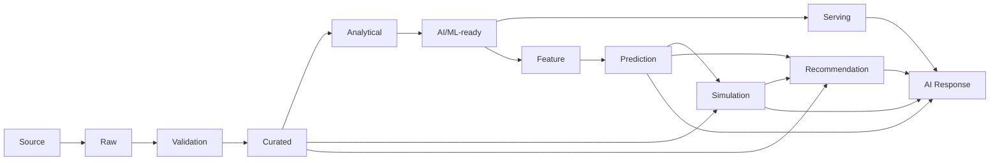

# Data to Intelligence Traceability

## 1. Purpose

This document traces the full chain from Source through AI Response, preserving provenance at every stage and distinguishing authoritative from derived, predictive, hypothetical, decision-support, and explanatory data.

## 2. The Full Chain

## 3. Stage Classification

| Stage | Classification | Authoritative? |
|---|---|---|
| Source | External system of record | Authoritative (external) |
| Raw | Unmodified ingested copy | Authoritative (DistrictMind's own copy) |
| Validation | Quality gate, not a data state itself | N/A — a process, not a stored category |
| Curated | Source-of-Truth | **Authoritative** |
| Analytical | Derived | Derived |
| AI/ML-ready | Derived (feature-engineered) | Derived |
| Serving | Derived (optimized for read) | Derived |
| Feature | Derived, prediction-input-specific | Derived |
| Prediction | Prediction | Predictive |
| Simulation | Simulation | Hypothetical |
| Recommendation | Recommendation | Decision-support |
| AI Response | AI Response | Explanatory |

**Six information categories preserved:** Source of Truth (Curated), Derived (Analytical/AI-ML-ready/Serving/Feature), Prediction, Simulation, Recommendation, AI Response — restated unchanged from [digital-twin-state-model.md](../05_Database_Design/digital-twin-state-model.md) throughout.

## 4. Provenance Propagation

Every stage transition carries forward: source identifier/version, timestamp, and transformation lineage — restated unchanged from [data-lineage-and-provenance-implementation.md](../12_Data_GIS_Implementation/data-lineage-and-provenance-implementation.md) and [grounding-and-evidence-implementation.md](../13_AI_Intelligence_Implementation/grounding-and-evidence-implementation.md). No stage is ever presented without a traceable path back to Section 3's authoritative base.

## 5. Example A — 10 km Healthcare Coverage

| Stage | Content | Classification |
|---|---|---|
| Source/Raw/Curated | Health Facility and Village records | Authoritative |
| Analytical | (Not required for this example — computed directly) | — |
| Serving-time computation | `coverage_analysis` (buffer + containment) | Derived |
| AI Response | "Villages X, Y, Z are outside 10 km coverage, based on facility data as of [timestamp]" | Explanatory, grounded in the Derived result |

Restated unchanged from [gis-computation-implementation.md](../12_Data_GIS_Implementation/gis-computation-implementation.md) Section 2.

## 6. Example B — Bridge Closure

| Stage | Content | Classification |
|---|---|---|
| Curated | Road Segment, Health Facility records (baseline) | Authoritative |
| Simulation | Cloned graph with target segment removed; recomputed accessibility | Hypothetical |
| Recommendation (optional extension) | A mitigation candidate scored against the Simulation result | Decision-support |
| AI Response | "If this bridge closes, accessibility for villages A, B would change as follows (hypothetical)" | Explanatory, explicitly framed as non-authoritative |

Restated unchanged from [gis-computation-implementation.md](../12_Data_GIS_Implementation/gis-computation-implementation.md) Section 3 and AD-DE-004.

## 7. Example C — Rainfall → Disaster → Transportation → Healthcare

| Stage | Content | Classification |
|---|---|---|
| Curated | Weather station observations, Road Segment, Health Facility records | Authoritative |
| Analytical | Spatially-aggregated rainfall | Derived |
| Feature/Prediction | Disaster risk assessment (if predictive) | Predictive |
| Derived (GIS) | Affected-area intersection with roads, network impact | Derived |
| Derived (GIS) | Re-evaluated healthcare accessibility | Derived |
| AI Response | The full aggregated, multi-domain explanation | Explanatory |

Restated unchanged from [ai-runtime-architecture.md](../13_AI_Intelligence_Implementation/ai-runtime-architecture.md) Section 20 — every stage's output retains its own state-category label through final aggregation, and the AI Response inherits and communicates any uncertainty from the Predictive stage rather than presenting a false certainty.

## 8. AI Response Is Never Source of Truth — Restated

**This is the single governing rule of this document.** An AI Response is always downstream of, and traceable to, one or more of Curated/Analytical/Prediction/Simulation/Recommendation data — it never becomes a new authoritative fact in its own right, and it is never written back into the Curated layer. Restated unchanged from every prior milestone's identical rule (most explicitly [ai-implementation-architecture.md](../13_AI_Intelligence_Implementation/ai-implementation-architecture.md) Section 9 and [disaster-recovery-and-business-continuity.md](../15_Deployment_Infrastructure_Operations/disaster-recovery-and-business-continuity.md) Section 15).

## 9. Known Chain Gaps

| Gap | Where the Chain Breaks |
|---|---|
| Healthcare Demand | The Feature → Prediction stage has no confirmed scope for this specific forecast target — restated unresolved from [prediction-implementation.md](../13_AI_Intelligence_Implementation/prediction-implementation.md) Section 14 |
| Recommendation scoring | The Prediction/Simulation → Recommendation stage's scoring technique lacks a technology-stack entry — restated unresolved from [recommendation-and-decision-intelligence-implementation.md](../13_AI_Intelligence_Implementation/recommendation-and-decision-intelligence-implementation.md) Section 6 |

Neither gap is resolved by this document; both are restated as-is.

## 10. Security

Every stage transition is subject to the same authorization scoping as any other data access — restated unchanged from [ai-gis-data-boundary-matrix.md](ai-gis-data-boundary-matrix.md).

## 11. Observability

Every stage transition is traceable via correlation ID/dataset version/model version, restated unchanged from [observability-and-monitoring.md](../14_Testing_Security_Observability/observability-and-monitoring.md).

## 12. Milestone Traceability

| Chain Segment | First Needed |
|---|---|
| Source→Raw→Validation→Curated | M1–M2 |
| Curated→Analytical→AI/ML-ready→Serving | M2 |
| Feature→Prediction | M4 |
| Curated/Prediction→Simulation | M5 |
| →Recommendation | M6 |
| →AI Response (any stage) | M3 onward, per which stages are available |

## 13. Open Decisions

Restated unchanged from Section 9 — Healthcare Demand scope and Recommendation weighted-scoring technique remain unresolved; no other new gap is introduced by this document.
