# Implementation Blockers

## 1. Purpose

This is the prioritized blocker register for DistrictMind implementation, classifying each blocker by documented dependency impact rather than arbitrary judgment.

## 2. Severity Classification Method

| Severity | Criterion |
|---|---|
| CRITICAL | Blocks the earliest possible M1 vertical slice; no preparatory implementation work is possible without it |
| HIGH | Blocks a specific milestone (M2–M6) but does not prevent earlier milestones' work from proceeding once its own prerequisites are met |
| MEDIUM | Constrains scope or quality but does not prevent implementation from beginning in its area |
| LOW | A documentation-completeness or calibration gap with no direct implementation-blocking effect |

Severity is assigned by tracing each blocker's dependency chain in [unresolved-items-baseline.md](unresolved-items-baseline.md) against [milestone-readiness-matrix.md](milestone-readiness-matrix.md) — not by subjective urgency.

## 3. CRITICAL Blockers

| Blocker | Why It Blocks Implementation | What Cannot Safely Proceed | What Preparatory Work Can Still Proceed | Unblocking Evidence/Decision |
|---|---|---|---|---|
| No confirmed real data source | Every ingestion, validation, curation, and downstream layer requires real data to be meaningfully implemented and tested (Item 1) | Any ingestion pipeline code; any GIS/dashboard feature relying on real district data | Pipeline *design* validation against synthetic fixtures; ingestion adapter interfaces | Confirmed access to at least one domain's real data source |
| No confirmed 33-district boundary dataset | The very first renderable map — the entry point to every other DistrictMind feature — has nothing to render (Item 2) | Any GIS rendering, coverage, or accessibility feature implementation against real geometry | Frontend map-shell scaffolding against synthetic/illustrative geometry; GIS Service interface design | A confirmed, licensable Telangana boundary dataset |
| Unresolved core technology stack (frontend, backend, database) | No code can be written without a language/framework/database to write it in (Items 13–15) | Any application code whatsoever | Technology evaluation, proof-of-concept spikes explicitly scoped as throwaway | Frontend/backend/database confirmation |

## 4. HIGH Blockers

| Blocker | Why It Blocks Implementation | What Cannot Safely Proceed | What Preparatory Work Can Still Proceed | Unblocking Evidence/Decision |
|---|---|---|---|---|
| Unresolved AI provider | No AI implementation can meaningfully begin without knowing which provider's integration pattern to build against (Item 3) — this is arguably the single largest open item after the CRITICAL tier | Agent runtime implementation, Typed Tool dispatch implementation | Typed Tool *contract* design (already complete, [ai-tool-contracts.md](../06_API_and_Integration/ai-tool-contracts.md)); Agent architecture design (already complete) | A data-sensitivity/governance decision, then provider selection |
| Healthcare Demand contradiction | M4 Prediction scope cannot be finalized while a source contradiction about whether this domain is in scope remains unadjudicated (Item 26) | Any Healthcare Demand-specific feature/pipeline/model work | The other five confirmed Prediction domains' design and eventual implementation | A scope-clarification decision, analogous to AD-RES-001 |
| Recommendation Engine scoring gap | M6 Recommendation cannot be implemented without a resolved scoring technique and calibrated weights (Item 27) | Any Recommendation Engine implementation | Recommendation Engine *interface*/contract design (already complete); Evidence-to-Recommendation data-flow design | A technique decision plus real-data-driven weight calibration |
| Unresolved RPO/RTO | No backup/disaster-recovery strategy can be finalized or committed to (Items 22–23) | Production deployment sign-off; any SLA commitment | Backup/recovery *architecture* design (already complete, [backup-and-recovery.md](../15_Deployment_Infrastructure_Operations/backup-and-recovery.md)) | An architecture-design-phase decision, informed by real operational requirements |

## 5. MEDIUM Blockers

| Blocker | Why It Blocks Implementation | What Cannot Safely Proceed | What Preparatory Work Can Still Proceed | Unblocking Evidence/Decision |
|---|---|---|---|---|
| Unresolved GIS technology (library/spatial extension) | Downstream of the database confirmation (Item 15/16); does not block *design* work | Spatial computation implementation specifics | GIS Service contract/interface design (already complete) | Selection once database technology is confirmed |
| Unresolved RAG/embedding/vector technology | Blocks RAG implementation specifically, not the rest of AI (Items 6–8) | RAG/retrieval implementation | RAG contract/interface design (already complete, [rag-implementation.md](../13_AI_Intelligence_Implementation/rag-implementation.md)) | Technology evaluation, partly downstream of the AI provider decision |
| Unresolved model-serving/background-job technology | Blocks Prediction/Simulation execution specifics, not their design (Items 11–12) | Model serving/async execution implementation | Prediction/Simulation Service contract design (already complete) | Selection once backend stack and (for model serving) real training data exist |
| Unresolved authentication/authorization provider | Blocks login/session and role-scoped implementation specifics (Items 17–18) | Auth implementation | Auth flow/contract design (already complete) | Provider selection |
| Unresolved observability/deployment technology | Blocks instrumentation and real deployment, not architecture (Items 19–21) | Real monitoring, real deployment | Observability/deployment architecture design (already complete) | Platform/provider selection |

## 6. LOW Blockers

| Blocker | Why It Blocks Implementation | What Cannot Safely Proceed | What Preparatory Work Can Still Proceed | Unblocking Evidence/Decision |
|---|---|---|---|---|
| Dataset-deprecation process gap | A documentation-completeness gap with no direct code-level blocking effect (Item 24) | Nothing directly | Everything | A future governance-process document |
| Source-precedence calibration | Cannot be calibrated without real conflicting data, but the mechanism itself is fully designed and does not block other work (Item 25) | Only the calibration itself | Fragmentation-resolution mechanism implementation against its designed (if uncalibrated) rules | Real data with genuine conflicts |

## 7. Blocker Dependency Chain

```mermaid
flowchart TD
    DataSrc[No Real Data Source] --> Ingestion[Blocks Ingestion Implementation]
    BoundaryData[No Boundary Dataset] --> Map[Blocks Map/GIS Implementation]
    TechStack[Unresolved Frontend/Backend/DB] --> AnyCode[Blocks Any Application Code]
    AIProvider[Unresolved AI Provider] --> AIImpl[Blocks AI Implementation]
    TechStack --> GISTech[Unresolved GIS Technology]
    TechStack --> AuthTech[Unresolved Auth Provider]
    AIProvider --> RAGTech[Unresolved RAG/Embedding/Vector]
    DataSrc --> ModelServing[Blocks Model Training/Serving]
    HealthDemand[Healthcare Demand Contradiction] --> PredScope[Blocks That Domain's Prediction Work Only]
    RecScoring[Recommendation Scoring Gap] --> RecImpl[Blocks Recommendation Implementation]
    RPORTO[Unresolved RPO/RTO] --> ProdDeploy[Blocks Production Deployment Sign-off]
```

## 8. Security

No blocker in this register is ever treated as a justification to bypass a security boundary — restated unchanged from [security-and-trust-boundary-matrix.md](security-and-trust-boundary-matrix.md); "we don't have a database yet" is never a reason to skip authorization design, for example.

## 9. Observability

Each blocker's resolution should be tracked and, once resolved, reflected as a status change in [milestone-readiness-matrix.md](milestone-readiness-matrix.md) — not silently absorbed into implementation without a corresponding documentation update.

## 10. Milestone Traceability

| Severity Tier | Primary Milestone Impact |
|---|---|
| CRITICAL | M1 (blocks the earliest vertical slice entirely) |
| HIGH | M3, M4, M6, and pre-production readiness respectively |
| MEDIUM | M1–M4 (technology-specific, staggered) |
| LOW | Non-blocking |

## 11. Open Decisions

None introduced — this document classifies existing unresolved items; it resolves none of them.
