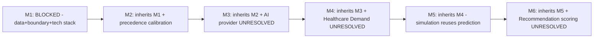

# Milestone Readiness Matrix

## 1. Purpose

This is the formal M1–M6 readiness matrix, synthesizing [implementation-readiness.md](../11_Architecture_Resolution/implementation-readiness.md) and every subsequent milestone's own readiness findings into one authoritative statement. **No milestone is claimed fully implementation-ready unless existing evidence genuinely supports it — none does.**

## 2. Rating Legend

| Rating | Meaning |
|---|---|
| READY | Both documented and free of any known blocker |
| PARTIALLY READY | Documented, but a specific named blocker prevents full readiness |
| NOT READY | A structural blocker exists independent of documentation quality |
| BLOCKED | Cannot even be attempted until an upstream dependency resolves |
| UNRESOLVED | An open question/contradiction has not been decided; no rating is meaningful until it is |

## 3. M1 — Digital Twin Foundation

| Dimension | Rating | Evidence |
|---|---|---|
| Requirements | READY | FR-001–FR-012, FR-018, FR-023, FR-034, FR-036 (M1-scoped) fully specified |
| Architecture | PARTIALLY READY | Fully specified; **blocker:** no technology confirmed |
| Data | NOT READY | No confirmed real data source (Item 1) |
| GIS | BLOCKED | No confirmed boundary dataset (Item 2) — the single hardest M1 blocker |
| Backend | PARTIALLY READY | Fully designed; blocked by unresolved backend technology (Item 14) |
| Frontend | PARTIALLY READY | Fully designed; blocked by unresolved frontend technology (Item 13) |
| AI | Not applicable to M1 | — |
| Testing | NOT READY | Zero test exists; correctly expected at this stage |
| Security | PARTIALLY READY | Boundaries fully designed; blocked by unresolved auth provider (Items 17–18) |
| Deployment | NOT READY | No infrastructure/hosting confirmed (Item 21) |
| Operational | NOT READY | Nothing instrumented |
| **Blockers** | | No data source, no boundary dataset, no frontend/backend/database technology, no auth provider |

## 4. M2 — District Intelligence

| Dimension | Rating | Evidence |
|---|---|---|
| Requirements | READY | FR-013–FR-017, FR-019, FR-024–FR-026, FR-035 fully specified |
| Architecture | PARTIALLY READY | Fully specified; inherits M1's technology blocker |
| Data | NOT READY | Inherits Item 1; additionally requires source-precedence calibration (Item 25), itself dependent on real data |
| GIS | BLOCKED | Inherits Item 2 |
| Backend | PARTIALLY READY | Inherits M1's blocker |
| Frontend | PARTIALLY READY | Inherits M1's blocker |
| AI | Not applicable to M2 | — |
| Testing | NOT READY | Inherits M1 |
| Security | PARTIALLY READY | Inherits M1 |
| Deployment | NOT READY | Inherits M1 |
| Operational | NOT READY | Inherits M1 |
| **Blockers** | | Inherits every M1 blocker plus source-precedence calibration |

## 5. M3 — Grounded Agentic AI

| Dimension | Rating | Evidence |
|---|---|---|
| Requirements | READY | FR-020–FR-022 fully specified |
| Architecture | PARTIALLY READY | AI boundary fully specified (AD-DE-005, AD-DB-006, AD-API-002); blocked by AI provider |
| Data | NOT READY | Inherits M1–M2 |
| GIS | BLOCKED | Inherits M1–M2 |
| Backend | PARTIALLY READY | Inherits M1–M2 |
| Frontend | PARTIALLY READY | Inherits M1–M2 |
| AI | **UNRESOLVED** | AI provider/framework divergence (Item 3) is an active, unreconciled two-way conflict — not merely undecided but genuinely contested between sources |
| Testing | NOT READY | Inherits prior; AI-specific tests additionally blocked |
| Security | PARTIALLY READY | AI-specific security controls fully designed ([ai-safety-implementation.md](../13_AI_Intelligence_Implementation/ai-safety-implementation.md)); untestable without a provider |
| Deployment | NOT READY | Inherits prior |
| Operational | NOT READY | Inherits prior |
| **Blockers** | | All M1–M2 blockers plus the AI provider divergence — the single largest open item in the entire program |

## 6. M4 — Predictive Intelligence

| Dimension | Rating | Evidence |
|---|---|---|
| Requirements | READY | FR-027, FR-028, FR-033 (partially — notification mechanism undesigned) |
| Architecture | PARTIALLY READY | Prediction pipeline fully specified for five confirmed domains |
| Data | NOT READY | Inherits M1–M3; additionally requires sufficient historical data for model training |
| GIS | BLOCKED | Inherits M1–M3 |
| Backend | PARTIALLY READY | Inherits M1–M3 |
| Frontend | PARTIALLY READY | Inherits M1–M3 |
| AI | BLOCKED | Inherits M3's AI provider blocker; additionally blocked by unresolved ML framework/model-serving technology (Items 10–11) |
| Testing | NOT READY | Inherits prior |
| Security | PARTIALLY READY | Inherits M3 |
| Deployment | NOT READY | Inherits prior |
| Operational | NOT READY | Inherits prior |
| **Blockers** | | All prior blockers plus ML framework, model-serving technology, and the **Healthcare Demand scope contradiction (UNRESOLVED, Item 26)** |

## 7. M5 — Scenario Simulation & Recommendations (Simulation Portion)

| Dimension | Rating | Evidence |
|---|---|---|
| Requirements | READY | FR-029, FR-030 fully specified |
| Architecture | PARTIALLY READY | Sandboxing (AD-DE-004), scenario lifecycle fully specified |
| Data | NOT READY | Inherits M1–M4 |
| GIS | BLOCKED | Inherits M1–M4 |
| Backend | PARTIALLY READY | Inherits M1–M4 |
| Frontend | PARTIALLY READY | Inherits M1–M4 |
| AI | BLOCKED | Inherits M3–M4 (Simulation reuses trained Prediction models per AD-AI-002, so it inherits every Prediction blocker) |
| Testing | NOT READY | Inherits prior |
| Security | PARTIALLY READY | Sandbox-integrity testing fully designed; untestable without infrastructure |
| Deployment | NOT READY | Inherits prior |
| Operational | NOT READY | Inherits prior |
| **Blockers** | | All prior blockers; Simulation specifically cannot proceed until Prediction (M4) is unblocked, per AD-AI-002's model-reuse dependency |

## 8. M6 — Advanced Agentic District Intelligence (Recommendation Portion)

| Dimension | Rating | Evidence |
|---|---|---|
| Requirements | READY | FR-031, FR-032, FR-037 fully specified |
| Architecture | PARTIALLY READY | Recommendation Engine/LLM-explanation boundary fully specified |
| Data | NOT READY | Inherits M1–M5 |
| GIS | BLOCKED | Inherits M1–M5 |
| Backend | PARTIALLY READY | Inherits M1–M5 |
| Frontend | PARTIALLY READY | Inherits M1–M5 |
| AI | BLOCKED | Inherits M3–M5 |
| Testing | NOT READY | Inherits prior |
| Security | PARTIALLY READY | Inherits prior |
| Deployment | NOT READY | Inherits prior |
| Operational | NOT READY | Inherits prior |
| **Blockers** | | All prior blockers plus the **Recommendation Engine weighted-scoring gap (UNRESOLVED, Item 27)** — M6 has the deepest, longest blocker chain of any milestone, since it depends on every preceding milestone's own unresolved items |

## 9. Consolidated M1–M6 View

Every milestone's readiness is strictly bounded above by the least-ready milestone it depends on — M6 cannot be more ready than M1, since it inherits every one of M1's unresolved foundational blockers.

## 10. Summary

**No milestone is fully implementation-ready.** M1 is the closest to being unblockable through pure technology decisions (frontend/backend/database/auth selection) but remains hard-blocked on data and boundary datasets that require external sourcing, not engineering decisions. M3, M4, and M6 each carry an additional genuine UNRESOLVED contradiction (AI provider, Healthcare Demand, Recommendation scoring respectively) that cannot be closed by implementation effort alone — each requires an explicit resolution decision first, following the same evidence-based resolution discipline already exercised for the routing conflict (AD-RES-001) and visual-direction classification (AD-RES-002).

## 11. Security

No milestone's readiness rating is inflated to accommodate schedule pressure — every PARTIALLY READY/NOT READY/BLOCKED/UNRESOLVED rating above is evidenced against a real, named blocker in [implementation-blockers.md](implementation-blockers.md) or [unresolved-items-baseline.md](unresolved-items-baseline.md), never assigned by default optimism.

## 12. Observability

This matrix should be re-evaluated and its ratings updated whenever a blocker in [implementation-blockers.md](implementation-blockers.md) is genuinely resolved — never advanced preemptively.

## 13. Milestone Traceability

This document *is* the milestone traceability artifact for the entire program.

## 14. Open Decisions

None introduced — this document rates existing readiness; it resolves nothing.
