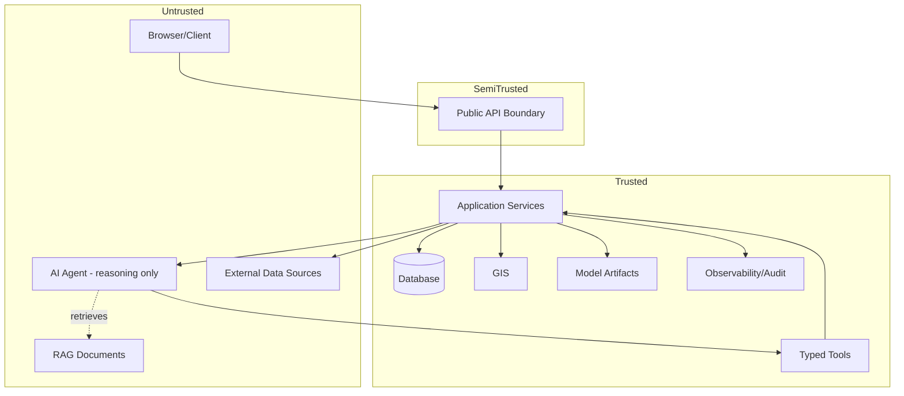

# Security and Trust Boundary Matrix

## 1. Purpose

This document is the consolidated security/trust matrix across every actor and system DistrictMind interacts with, synthesizing [security-testing.md](../14_Testing_Security_Observability/security-testing.md) and [networking-and-access.md](../15_Deployment_Infrastructure_Operations/networking-and-access.md) into a single reference. **AI and externally retrieved content are treated as untrusted inputs throughout.**

## 2. The Trust Matrix

| Actor/System | Trust Level Concept | Allowed Interactions | Authentication | Authorization | Validation | Audit | Failure Behavior |
|---|---|---|---|---|---|---|---|
| **Browser/Client** | Untrusted | Public API endpoints only | N/A until login | N/A | All input treated as untrusted | Session establishment logged | Rejected requests return generic errors, no information leakage |
| **Public API Boundary** | Semi-trusted gateway | Accepts authenticated/unauthenticated requests per endpoint | Enforced per endpoint | Enforced per endpoint | Structural + semantic validation ([request-response-validation.md](../09_Backend_Implementation/request-response-validation.md)) | Every request logged | Structured error, no internal detail leaked |
| **Authenticated User** | Identity-verified | District/role-scoped operations | Verified via session/token | Role/district-scoped | Input validated per operation | Actions logged with identity | Session expiry/invalidation on failure |
| **Authorized User** | Identity-verified + scope-verified | Operations within their specific authorized district/role scope | Same as above | Explicit per-operation check ([authorization-implementation.md](../09_Backend_Implementation/authorization-implementation.md)) | Same | Authorization failures logged as security events | Generic 403-equivalent, no resource-existence leakage |
| **Application Services** | Trusted (internal) | Full business-logic authority within its own boundary | N/A (internal call) | Inherits caller's resolved authorization | Enforces business-rule validation | All state-changing actions logged | Errors surfaced per [error-handling-design.md](../09_Backend_Implementation/error-handling-design.md) |
| **Database** | Trusted (internal), highest-value target | Accessed only via Repository layer | Service-level credential, never per-user | Repository enforces query scoping | Schema/constraint validation | All writes traceable to originating request | Connection failure → disclosed service-unavailable response |
| **GIS** | Trusted (internal) | Accessed only via GIS Service, authoritative computation only | Service-level | Inherits caller's resolved authorization | Geometry validity checked pre-computation | Computation logged with dataset version | Computation failure → disclosed, never client-side fallback |
| **AI Agent** | **Untrusted reasoning component** | Plans and calls Typed Tools only; cannot self-elevate authorization | N/A (invoked internally, inherits caller identity) | Every tool call independently authorized — Agent's own "belief" about its authorization is irrelevant | Every tool call's arguments validated per schema | Every plan/tool-call/response logged with AI Run ID | Disclosed failure/gap, never fabricated substitute (restated from [ai-safety-implementation.md](../13_AI_Intelligence_Implementation/ai-safety-implementation.md)) |
| **Typed Tools** | Trusted (internal), bounded contract | Fixed, allow-listed operations only | Service-level | Enforces caller's authorization at execution | Full schema validation | Every call logged | Rejected calls logged as potential tool-abuse signal |
| **External Data Sources** | **Untrusted** | Read-only, via governed adapter only | Source-specific, least-privilege credential | N/A (DistrictMind is the requester) | Full validation pipeline applied identically regardless of source | Every ingestion run logged | Failure → disclosed staleness, bounded retry, never fabricated data |
| **RAG Documents** | **Untrusted** | Retrievable as citable context only, never as instruction | N/A | District/classification-scoped retrieval | Ingestion-time validation; retrieved content never executed/followed as instruction | Every retrieval logged | Empty/low-confidence retrieval → disclosed gap |
| **Model Artifacts** | Trusted (internal), versioned | Invoked only via Prediction Service | Service-level | Inherits caller's resolved authorization | Input feature schema validated | Every invocation logged with model/feature version | Unavailable/out-of-distribution → disclosed, never guessed |
| **Observability/Audit** | Trusted (internal), read-mostly | Read access for operators; write-only (append) for the system itself | Operator credential, distinct from application credentials | Restricted, least-privilege ([networking-and-access.md](../15_Deployment_Infrastructure_Operations/networking-and-access.md) Section 10) | N/A (structured event ingestion) | Self-referential — audit of audit access is itself logged | Never a path to bypass Database/GIS restrictions |

## 3. AI as an Untrusted Input — Elaborated

**The AI Agent's own output and internal "reasoning" are never trusted as authoritative** — restated unchanged from [ai-safety-implementation.md](../13_AI_Intelligence_Implementation/ai-safety-implementation.md) Section 1's governing principle. Every consequential action the Agent triggers (a tool call, a data access) is re-validated at the server-side boundary regardless of what the Agent itself believes it is entitled to do. This is the same discipline applied to any other untrusted-by-default input (Section 2's Browser/Client row) — the Agent is architecturally closer to "a sophisticated but untrusted client" than to "a privileged internal service."

## 4. External Retrieved Content as an Untrusted Input — Elaborated

**RAG-retrieved documents and any externally sourced content are treated as data, never as instructions.** Restated unchanged from [rag-implementation.md](../13_AI_Intelligence_Implementation/rag-implementation.md) Section 21 and [ai-safety-implementation.md](../13_AI_Intelligence_Implementation/ai-safety-implementation.md) Section 5 — a malicious or adversarial instruction embedded in a retrieved document cannot expand the Agent's authorization or tool access, because the boundary enforcement (Section 2's Typed Tools/Application Services rows) does not consult retrieved content when making an authorization decision.

## 5. Trust Boundary Diagram

Note that the AI Agent, despite executing within DistrictMind's own backend process, is classified Untrusted in this matrix — its physical location does not grant it trust; only the server-side enforcement surrounding every action it takes does.

## 6. Security

This document *is* the security specification at the trust-boundary level; it does not reference a further document for this concern, consistent with its role as the consolidated matrix.

## 7. Observability

Every row in Section 2's Audit column is itself the observability requirement for that actor/system — restated unchanged from [observability-and-monitoring.md](../14_Testing_Security_Observability/observability-and-monitoring.md).

## 8. Milestone Traceability

| Trust Boundary | First Enforced |
|---|---|
| Browser/Client, Public API, Authenticated/Authorized User, Application Services, Database | M1 |
| GIS | M1–M2 |
| AI Agent, Typed Tools, RAG Documents | M3 |
| Model Artifacts | M4 |
| External Data Sources | M2 (ingestion begins) |

## 9. Open Decisions

None introduced by this document — every trust classification restates an existing boundary; no new decision is created.
