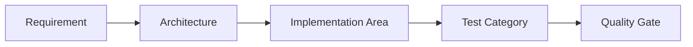

# Testing and Quality Traceability

## 1. Purpose

This document maps Requirement → Architecture → Implementation Area → Test Category → Quality Gate, using the existing testing architecture from `14_Testing_Security_Observability/`. **No test code and no numeric threshold is invented.**

## 2. The Traceability Chain

## 3. Unit

| Requirement | Architecture | Implementation Area | Test Category | Quality Gate |
|---|---|---|---|---|
| FR-015/NFR-029 (validation) | [request-response-validation.md](../09_Backend_Implementation/request-response-validation.md) | Domain logic, validation functions | [unit-testing.md](../14_Testing_Security_Observability/unit-testing.md) | Gate 3 (Backend Foundation) |
| Weighted-scoring arithmetic (AD-AI-005) | [recommendation-and-decision-intelligence-implementation.md](../13_AI_Intelligence_Implementation/recommendation-and-decision-intelligence-implementation.md) | Scoring function | [unit-testing.md](../14_Testing_Security_Observability/unit-testing.md) Section 11 | Gate 9 (Recommendation) |

## 4. Integration

| Requirement | Architecture | Implementation Area | Test Category | Quality Gate |
|---|---|---|---|---|
| FR-013–FR-015 | [repository-layer-design.md](../09_Backend_Implementation/repository-layer-design.md) | Service↔Repository↔Database | [integration-testing.md](../14_Testing_Security_Observability/integration-testing.md) | Gate 2–3 |
| FR-021 (Evidence propagation) | [grounding-and-evidence-implementation.md](../13_AI_Intelligence_Implementation/grounding-and-evidence-implementation.md) | Evidence assembly across layers | [integration-testing.md](../14_Testing_Security_Observability/integration-testing.md) Section 7 | Gate 6 (AI Foundation) |

## 5. API

| Requirement | Architecture | Implementation Area | Test Category | Quality Gate |
|---|---|---|---|---|
| Operations 1–18 ([api-contracts.md](../06_API_and_Integration/api-contracts.md)) | [api-route-implementation.md](../09_Backend_Implementation/api-route-implementation.md) | API routes | [api-testing.md](../14_Testing_Security_Observability/api-testing.md) | Gate 3 |
| FR-020–FR-022 (AI operations) | [ai-agent-integration.md](../06_API_and_Integration/ai-agent-integration.md) | Operations 16–18 | [api-testing.md](../14_Testing_Security_Observability/api-testing.md) Section 14 | Gate 6 |

## 6. GIS

| Requirement | Architecture | Implementation Area | Test Category | Quality Gate |
|---|---|---|---|---|
| FR-010–FR-012, NFR-035–036 | [gis-computation-engine.md](../07_AI_GIS_and_Intelligence/gis-computation-engine.md) | GIS Service | [gis-and-spatial-testing.md](../14_Testing_Security_Observability/gis-and-spatial-testing.md) | Gate 4 (GIS Foundation) |
| Canonical Example A (10 km coverage) | [gis-computation-implementation.md](../12_Data_GIS_Implementation/gis-computation-implementation.md) Section 2 | `coverage_analysis` | [gis-and-spatial-testing.md](../14_Testing_Security_Observability/gis-and-spatial-testing.md) Section 8 | Gate 4 |
| Canonical Example B (bridge closure) | Same, Section 3 | `create_scenario`/`run_scenario` | [gis-and-spatial-testing.md](../14_Testing_Security_Observability/gis-and-spatial-testing.md) Section 11 | Gate 8 (Simulation) |
| Canonical Example C (rainfall chain) | Same, Section 4 | Multi-domain GIS composition | [gis-and-spatial-testing.md](../14_Testing_Security_Observability/gis-and-spatial-testing.md) Section 12 | Gate 4, 7, 10 |

## 7. AI

| Requirement | Architecture | Implementation Area | Test Category | Quality Gate |
|---|---|---|---|---|
| FR-020–FR-022, NFR-031, NFR-033 | [ai-safety-and-grounding.md](../07_AI_GIS_and_Intelligence/ai-safety-and-grounding.md) | Agent, Typed Tools, Grounding | [ai-and-agent-testing.md](../14_Testing_Security_Observability/ai-and-agent-testing.md) | Gate 6 (AI Foundation) |
| Canonical Example C multi-step workflow | [ai-runtime-architecture.md](../13_AI_Intelligence_Implementation/ai-runtime-architecture.md) Section 20 | Multi-step Agent plan | [ai-and-agent-testing.md](../14_Testing_Security_Observability/ai-and-agent-testing.md) Section 20.3 | Gate 6, 10 |

## 8. Data Pipeline

| Requirement | Architecture | Implementation Area | Test Category | Quality Gate |
|---|---|---|---|---|
| FR-013–FR-015, NFR-029–030 | [data-implementation-architecture.md](../12_Data_GIS_Implementation/data-implementation-architecture.md) | Seven-layer pipeline | [data-and-pipeline-testing.md](../14_Testing_Security_Observability/data-and-pipeline-testing.md) | Gate 2 |
| Fragmentation-resolution strategy (AD-DATA-001) | [data-gis-integration.md](../12_Data_GIS_Implementation/data-gis-integration.md) Section 7 | Conflict detection/precedence/freshness | [data-and-pipeline-testing.md](../14_Testing_Security_Observability/data-and-pipeline-testing.md) Section 19 | Gate 2 |

## 9. E2E

| Requirement | Architecture | Implementation Area | Test Category | Quality Gate |
|---|---|---|---|---|
| FR-018 (login/district selection) | [frontend-routing-design.md](../10_Frontend_Implementation/frontend-routing-design.md), AD-RES-001 | Journey 1 | [end-to-end-testing.md](../14_Testing_Security_Observability/end-to-end-testing.md) Section 3 | Gate 5, 10 |
| Canonical Examples A/B/C | Multiple | Journeys 2–4 | [end-to-end-testing.md](../14_Testing_Security_Observability/end-to-end-testing.md) Sections 4–6 | Gate 10 |
| FR-027, FR-029–032 | Prediction/Simulation/Recommendation architecture | Journeys 5–6 | [end-to-end-testing.md](../14_Testing_Security_Observability/end-to-end-testing.md) Sections 7–8 | Gate 7–9 |

## 10. Performance

| Requirement | Architecture | Implementation Area | Test Category | Quality Gate |
|---|---|---|---|---|
| NFR-001–003, NFR-035–036 | [caching-and-performance.md](../09_Backend_Implementation/caching-and-performance.md) | Frontend/Backend/GIS/AI responsiveness | [performance-and-responsiveness-testing.md](../14_Testing_Security_Observability/performance-and-responsiveness-testing.md) | Gate 4, 5, 6 |
| UI-must-not-freeze requirement | [runtime-topology.md](../15_Deployment_Infrastructure_Operations/runtime-topology.md) Section 13 | Async execution, loading states | [performance-and-responsiveness-testing.md](../14_Testing_Security_Observability/performance-and-responsiveness-testing.md) Section 12 | Gate 5, 6 |

## 11. Security

| Requirement | Architecture | Implementation Area | Test Category | Quality Gate |
|---|---|---|---|---|
| FR-034, FR-036 | [authorization-implementation.md](../09_Backend_Implementation/authorization-implementation.md) | AuthN/AuthZ | [security-testing.md](../14_Testing_Security_Observability/security-testing.md) | Gate 3 |
| AI cannot bypass authorization | [ai-safety-implementation.md](../13_AI_Intelligence_Implementation/ai-safety-implementation.md) Section 6 | Typed Tool authorization enforcement | [security-testing.md](../14_Testing_Security_Observability/security-testing.md) Section 23 | Gate 6 |

## 12. Observability

| Requirement | Architecture | Implementation Area | Test Category | Quality Gate |
|---|---|---|---|---|
| NFR-025–026 | [backend-observability.md](../09_Backend_Implementation/backend-observability.md) | Logs, correlation IDs | [observability-and-monitoring.md](../14_Testing_Security_Observability/observability-and-monitoring.md) | Gate 1–3 |

## 13. Failure/Recovery

| Requirement | Architecture | Implementation Area | Test Category | Quality Gate |
|---|---|---|---|---|
| Error-handling foundation | [error-handling-design.md](../09_Backend_Implementation/error-handling-design.md) | Every layer's disclosed-failure behavior | [incident-and-failure-management.md](../14_Testing_Security_Observability/incident-and-failure-management.md) | Gate 1–10 |
| Simulation sandbox integrity (AD-DE-004) | [simulation-and-scenario-implementation.md](../13_AI_Intelligence_Implementation/simulation-and-scenario-implementation.md) Section 11 | Sandbox violation detection | [incident-and-failure-management.md](../14_Testing_Security_Observability/incident-and-failure-management.md), Gate 8 rollback condition | Gate 8 |

## 14. Security

This document's own traceability is itself a quality-assurance artifact — it does not introduce new security requirements beyond what Section 11 already cites.

## 15. Observability

Every mapping in this document is itself traceable back to its source document's own Milestone Traceability section — no new observability requirement is introduced.

## 16. Milestone Traceability

Restated unchanged from every cited document — Gates 1–5 = M1, Gate 6 = M3, Gate 7 = M4, Gate 8 = M5, Gate 9 = M6, Gate 10 = ongoing/M6 close (AD-IMP-005).

## 17. Open Decisions

None introduced — every quality gate and test category cited is already established in `14_Testing_Security_Observability/` and [engineering-quality-gates.md](../08_Implementation_Foundation/engineering-quality-gates.md).
