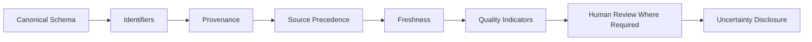

# Data Fragmentation Resolution

## 1. Purpose

This document formalizes DistrictMind's fragmented-data handling, elaborating AD-DATA-001 and [data-gis-integration.md](../12_Data_GIS_Implementation/data-gis-integration.md) Section 7. **No precedence rule for any actual agency or provider is invented** — every precedence example remains illustrative and hypothetical.

## 2. The Existing Pattern — Restated Unchanged

This is AD-DATA-001's pattern, restated without modification — this document formalizes evidence requirements for each stage, it does not redesign the pattern.

## 3. Canonical Schema

Every domain's Curated representation is a single, stable schema that multiple fragmented sources map onto — restated unchanged from [data-source-implementation.md](../12_Data_GIS_Implementation/data-source-implementation.md) Section 4. **Formalized here:** a candidate source is not eligible for ingestion (per [data-source-evaluation-framework.md](data-source-evaluation-framework.md) Section 3.2) until a mapping from its native schema to the canonical schema has been documented and reviewed.

## 4. Identifiers

Every canonical entity carries a stable identifier independent of any single source's own identifier scheme — restated unchanged from [entity-catalog.md](../05_Database_Design/entity-catalog.md) Section 4. **Formalized here:** where two sources use incompatible identifier schemes for what should be the same real-world entity (e.g., a health facility referenced by a government code in one source and a free-text name in another), an identifier-resolution/matching step is a mandatory prerequisite for treating them as the same entity — a fuzzy or unverified match is treated as a **potential** conflict requiring review (Section 8), not silently assumed correct.

## 5. Source Precedence — No Actual Rule Invented

**This document does not invent a precedence rule for any real agency, department, or provider**, since no real source has yet been evaluated (restated from [data-source-requirements.md](data-source-requirements.md)). What is formalized instead is the **evidence required before a precedence rule can be finalized**:

| Evidence Required | Why |
|---|---|
| At least two qualified (per [data-source-evaluation-framework.md](data-source-evaluation-framework.md)) sources for the same domain, with a documented history of actual disagreement | A precedence rule with no observed conflict to resolve is speculative, not evidence-based |
| A documented rationale for why one source is more authoritative for the specific field in conflict (not the domain generally — one source may be authoritative for facility location while another is more current for facility capacity) | Precedence is field-specific, not source-wide, restated unchanged from [data-gis-integration.md](../12_Data_GIS_Implementation/data-gis-integration.md) Section 7.1 |
| Sign-off consistent with the Data Steward review process ([data-governance-implementation.md](../12_Data_GIS_Implementation/data-governance-implementation.md)) | Precedence is a governance decision, not an engineering default |

**Until this evidence exists for a given domain, no precedence rule is finalized for it, and any conflict in that domain routes to human review (Section 8) by default.**

## 6. Freshness

Restated unchanged from [data-gis-integration.md](../12_Data_GIS_Implementation/data-gis-integration.md) Section 7.1: where precedence is not established, the more recently updated value is preferred, with its age disclosed regardless of which value is ultimately shown.

## 7. Quality Indicators

Restated unchanged: the presence of an unresolved or recently-resolved conflict is itself a data-quality signal, surfaced per [data-quality-implementation.md](../12_Data_GIS_Implementation/data-quality-implementation.md) — not hidden from downstream consumers.

## 8. Human Review Where Required

Restated unchanged: a conflict that precedence/freshness rules cannot confidently resolve (including every conflict in a domain with no finalized precedence rule per Section 5) is queued for Data Steward review rather than resolved automatically by a guess.

## 9. Uncertainty

Restated unchanged: where a conflict remains unresolved, downstream consumers (dashboard, AI Response) disclose that the value is contested, rather than presenting one side as settled fact — this directly feeds the Claim→Evidence→Source→Timestamp→Transformation→Confidence chain ([grounding-and-evidence-implementation.md](../13_AI_Intelligence_Implementation/grounding-and-evidence-implementation.md)).

## 10. Detecting Conflicting Sources

| Mechanism | Detail |
|---|---|
| Identifier matching (Section 4) | Establishes that two records genuinely refer to the same entity before comparison is meaningful |
| Field-level comparison | For matched entities, each field is compared independently — a match on facility name with a mismatch on facility type is a partial, field-specific conflict, not a wholesale record conflict |
| Threshold-free flagging | Any detected disagreement is flagged; no similarity threshold is invented to suppress "minor" disagreements, consistent with this program's refusal to invent numeric thresholds |
| Temporal-aware comparison | A disagreement between an old record and a new one may reflect legitimate change over time, not a genuine conflict — restated consistent with [temporal-data-implementation.md](../12_Data_GIS_Implementation/temporal-data-implementation.md) |

## 11. DistrictMind Cannot Guarantee Perfect Data — Restated Explicitly

**DistrictMind cannot guarantee that all external data is complete or perfectly accurate.** Restated unchanged from [data-gis-integration.md](../12_Data_GIS_Implementation/data-gis-integration.md) Section 7.2 and the Blueprint's own acknowledgment (§17) that government datasets are often incomplete or inconsistent. The mechanisms in Sections 2–10 make fragmentation *visible and manageable*, not eliminated.

## 12. Security

Precedence decisions and human-review outcomes are audit-logged — restated unchanged from [data-gis-integration.md](../12_Data_GIS_Implementation/data-gis-integration.md) Section 9.

## 13. Observability

Every detected conflict, its resolution path (precedence, freshness, or human review), and its outcome are traceable — restated unchanged from [data-lineage-and-provenance-implementation.md](../12_Data_GIS_Implementation/data-lineage-and-provenance-implementation.md).

## 14. Milestone Traceability

| Fragmentation-Resolution Capability | First Needed |
|---|---|
| Canonical schema, identifiers, provenance | M1–M2 |
| Precedence, freshness, quality indicators | M2 |
| Human review workflow | M2 |

## 15. Open Decisions

- **Source-precedence calibration remains unresolved** — restated unchanged from [unresolved-items-baseline.md](../16_Engineering_Readiness_and_Baseline/unresolved-items-baseline.md) Item 25; Section 5 above defines only the evidence bar for resolving it, not the resolution itself.
- No actual precedence rule for any real provider exists anywhere in this document.
