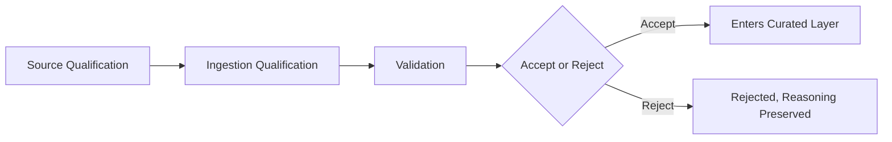

# Data Source Evaluation Framework

## 1. Purpose

This document defines the framework for evaluating a candidate dataset once one is identified, elaborating [data-quality-implementation.md](../12_Data_GIS_Implementation/data-quality-implementation.md). **No numeric scoring weight is invented** unless already established by prior documentation (none is) — any scoring model proposed here is explicitly labeled PROPOSED and not adopted as a final method.

## 2. Evaluation Dimensions

| Dimension | What It Assesses |
|---|---|
| Authority | Is the source an official/recognized body for this domain, or a secondary aggregation? |
| Provenance | Can the data's origin and chain of custody be established? |
| Coverage | Does it cover all 33 districts, or a subset requiring supplementation? |
| Completeness | Are required fields (per [data-source-requirements.md](data-source-requirements.md)) actually populated, or sparsely available? |
| Spatial accuracy | Does geometry meet the domain's spatial requirements (Section 3–10 of that document)? |
| Temporal relevance | Is the data current enough for its intended use? |
| Update frequency | How often is the source refreshed, and is that cadence disclosed? |
| Consistency | Are values internally consistent (no contradictory records for the same entity)? |
| Accessibility | Can DistrictMind actually obtain the data (API, bulk download, request process)? |
| Licensing | Does the license permit DistrictMind's intended ingestion, storage, computation, and display? |
| Machine readability | Is the data in a structured, parseable format, or does it require manual extraction? |
| Schema stability | Does the source's schema change unpredictably, breaking ingestion? |
| Identifier quality | Does the source use stable, unique identifiers, or only free-text names? |
| Interoperability | Does the source's identifier/schema map cleanly onto DistrictMind's canonical schema, or require significant reconciliation? |
| Documentation quality | Is the source's own methodology/schema documented well enough to evaluate the other dimensions? |
| Historical availability | Does the source retain historical versions, supporting temporal analysis? |
| Reproducibility | Can the same query/extract be repeated and yield a consistent result? |

## 3. Evaluation Process

### 3.1 Source Qualification

A candidate source is assessed against Section 2's dimensions *before* any ingestion effort begins — this is a paper/evidence review, not a technical integration attempt.

### 3.2 Ingestion Qualification

A source that qualifies (3.1) is assessed for whether DistrictMind's existing ingestion architecture ([data-ingestion-implementation.md](../12_Data_GIS_Implementation/data-ingestion-implementation.md)) can actually consume it — format compatibility, access mechanism, credential requirements.

### 3.3 Validation

The source's actual data, once ingested into Raw, passes through the existing Validation stage ([data-validation-implementation.md](../12_Data_GIS_Implementation/data-validation-implementation.md)) — schema, completeness, uniqueness, consistency checks restated unchanged.

### 3.4 Acceptance/Rejection

| Outcome | Meaning |
|---|---|
| Accept | The source's records advance to Curated, becoming Source-of-Truth data |
| Reject | The source fails one or more dimensions materially — the rejection and its reasoning are preserved (restated from [decision-register-baseline.md](../16_Engineering_Readiness_and_Baseline/decision-register-baseline.md) Section 13's "never delete history" discipline), not silently discarded |
| Quarantine | A source's individual records may be partially accepted with specific records held for review, per [data-validation-implementation.md](../12_Data_GIS_Implementation/data-validation-implementation.md) Section 13 |

## 4. PROPOSED Scoring Model — Explicitly Not Adopted

**The following is a PROPOSED illustrative scoring approach, not an adopted methodology, and carries no numeric weight from any prior source document:**

A future evaluation *could* score each dimension in Section 2 qualitatively (Strong / Adequate / Weak / Absent) rather than numerically, and require every "Required" dimension (Authority, Provenance, Spatial accuracy for spatial domains, Licensing) to reach at least "Adequate" before a source is eligible for Acceptance — restated consistent with the qualitative-over-invented-numeric discipline established in [engineering-quality-gates.md](../08_Implementation_Foundation/engineering-quality-gates.md) (AD-IMP-005). **This is a suggestion for a future decision-gate design, not a rule this document enforces.**

## 5. Domain-Specific Dimension Weighting — Not Defined

Some domains may reasonably weight dimensions differently (e.g., Temporal relevance matters more for Weather than for District Boundaries) — this document does not define such weightings, since doing so would require the kind of invented numeric precision this program has consistently avoided.

## 6. Relationship to Data Fragmentation

Where multiple candidate sources exist for the same domain, Section 2's dimensions inform which source is preferred under the precedence mechanism defined in [data-fragmentation-resolution.md](data-fragmentation-resolution.md) — this document evaluates a single source's fitness; that document handles what happens when multiple qualified sources disagree.

## 7. Security

Licensing and accessibility (Section 2) explicitly include a check for whether ingestion credentials can be obtained and scoped per the least-privilege principle already established in [data-gis-integration.md](../12_Data_GIS_Implementation/data-gis-integration.md) Section 9.

## 8. Observability

Every evaluation outcome (Section 3.4) is recorded, including rejections, consistent with the audit discipline established throughout this program.

## 9. Milestone Traceability

| Evaluation Capability | First Needed |
|---|---|
| Source qualification framework | M1 (Geographic), M2 (all other domains) |

## 10. Open Decisions

- The PROPOSED scoring model (Section 4) is not adopted; a future milestone may formalize or reject it.
- No specific dimension weighting is defined for any domain.
