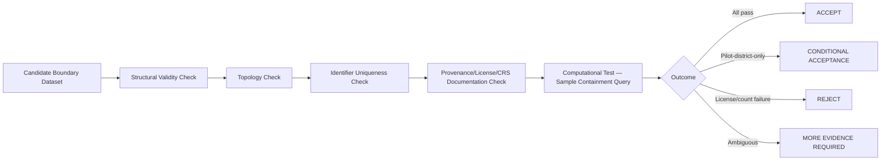

# Boundary Dataset Validation Plan

## 1. Purpose

This document defines the validation plan for the 33-district Telangana boundary dataset — **DistrictMind's single most critical unresolved dependency**, elaborating [district-boundary-dataset-requirements.md](../17_Data_and_Technology_Resolution/district-boundary-dataset-requirements.md) with a concrete evidence and accept/reject plan. **No specific dataset is named or selected. No dataset has been tested.**

## 2. Validation Checklist

| # | Check | Requirement Source | Evidence Required |
|---|---|---|---|
| 1 | Exactly 33 districts present | [district-boundary-dataset-requirements.md](../17_Data_and_Technology_Resolution/district-boundary-dataset-requirements.md) Section 3 | A feature count against the candidate dataset equals 33; any deviation (fewer, or more due to duplicate/split records) is investigated before proceeding |
| 2 | Unique stable IDs | Same, Section 5 | Every district feature carries an identifier verified unique across the full dataset (no duplicates) |
| 3 | District names present | Same | Every feature carries a human-readable name, distinct from its identifier |
| 4 | Valid polygons | Same, Section 4 | Every feature passes structural geometry validity checks (no self-intersection, no degenerate shapes) |
| 5 | Topology | Same, Section 7 | Adjacent districts share boundaries without gaps or overlaps, verified by an adjacency/containment check |
| 6 | Coordinate reference system disclosed | Same, Section 6 | The dataset's documentation or metadata explicitly states its CRS |
| 7 | Geometry validity (computational) | Same, Section 8 | Geometry is usable by the eventually-confirmed GIS technology for buffer/containment/network operations, not merely visually plausible |
| 8 | Spatial coverage | Same, Section 3 | Coverage spans the full Telangana extent with no unexplained gaps |
| 9 | Provenance | Same, Section 9 | Publishing authority and known limitations are documented and traceable |
| 10 | Version | Same, Section 10 | The dataset carries or can be assigned a version identifier, and updates are detectable |
| 11 | Licensing | Same, Section 11 | License permits ingestion, storage, server-side computation, and re-serving simplified/derived geometry to the frontend |
| 12 | Frontend compatibility | Same, Section 14 | Geometry can be simplified into the level-of-detail tiers already architected (AD-GIS-001) without losing administrative accuracy |
| 13 | Server-side GIS compatibility | Same, Section 13 | Geometry supports meaningful, correct spatial analysis (buffer, containment, network-impact) once loaded into whichever GIS technology is confirmed |
| 14 | `/districts/:id` routing compatibility | Same, Section 15; AD-RES-001 | The dataset's stable identifier scheme (Check 2) can serve directly as the `:id` path parameter without requiring a fragile name-based lookup |

## 3. Evidence Required Before ACCEPT

| Evidence Type | Detail |
|---|---|
| Structural | An automated geometry-validity pass against every one of the 33 district features, with zero unresolved validity failures |
| Topological | An automated adjacency check confirming no gap/overlap between neighboring districts |
| Count | A confirmed count of exactly 33 top-level district features |
| Identifier | A confirmed uniqueness check across all identifiers |
| Documentation | A retrievable, citable statement of the dataset's CRS, provenance, and license |
| Computational | A successful test computation (e.g., a containment query against a known reference point) demonstrating the geometry supports real spatial analysis, not merely rendering |

**Until all six evidence types exist for a specific candidate dataset, the dataset does not reach ACCEPT.**

## 4. Validation Outcomes

Restated unchanged from [data-source-validation-plan.md](data-source-validation-plan.md) Section 2 — ACCEPT, REJECT, CONDITIONAL ACCEPTANCE, MORE EVIDENCE REQUIRED — applied specifically here:

| Outcome | Example Condition for the Boundary Dataset |
|---|---|
| ACCEPT | All 14 checks (Section 2) pass with the evidence in Section 3 |
| REJECT | Licensing does not permit redistribution via the frontend (Check 11), or the district count is materially wrong (Check 1) |
| CONDITIONAL ACCEPTANCE | All structural/computational checks pass, but coverage is limited to the Warangal pilot district only — acceptable as an interim M1 vertical-slice input per AD-IMP-001, with the gap to the full 33-district set explicitly tracked |
| MORE EVIDENCE REQUIRED | Geometry validity is unclear without a direct computational test not yet performed |

## 5. Interim Pilot-District Path

Consistent with AD-IMP-001's risk-first, vertical-slice strategy, a dataset covering only the Warangal pilot district may receive CONDITIONAL ACCEPTANCE sufficient to begin M1 work, while the full 33-district requirement remains tracked as a distinct, still-open item for M2. **This is not a lowering of the standard** — every check in Section 2 still applies to the pilot district's own geometry; only the *coverage* requirement (all 33) is deferred.

## 6. `/districts/:id` and Stable Identifiers — Preserved

**This validation plan does not revert to `/district/:districtName`.** Check 14 exists specifically to verify the candidate dataset supports the already-resolved canonical routing convention (AD-RES-001) — a dataset lacking stable, unique identifiers would force a name-based fallback and fails this check regardless of its geometric quality.

## 7. Validation Sequence

## 8. No Specific Dataset Named

**This document does not identify, name, or select any specific boundary dataset or provider.** This remains SOURCE UNRESOLVED, restated unchanged from [district-boundary-dataset-requirements.md](../17_Data_and_Technology_Resolution/district-boundary-dataset-requirements.md) Section 19 and [unresolved-items-baseline.md](../16_Engineering_Readiness_and_Baseline/unresolved-items-baseline.md) Item 2.

## 9. Security

The boundary dataset, once ACCEPTed, is subject to the same authorization-scoped access as any other Curated data — restated unchanged from [networking-and-access.md](../15_Deployment_Infrastructure_Operations/networking-and-access.md) Section 4.

## 10. Observability

Every validation check outcome (Section 2) is logged and traceable to the specific candidate dataset version tested — restated unchanged from [data-lineage-and-provenance-implementation.md](../12_Data_GIS_Implementation/data-lineage-and-provenance-implementation.md).

## 11. Milestone Traceability

| Validation Milestone | First Needed |
|---|---|
| Pilot-district geometry validation (CONDITIONAL ACCEPTANCE path) | M1 |
| Full 33-district validation (ACCEPT path) | M2 |

## 12. Open Decisions

**No boundary dataset has been evaluated, tested, or selected.** This item remains the highest-priority CRITICAL blocker in [implementation-blockers.md](../16_Engineering_Readiness_and_Baseline/implementation-blockers.md); this document defines only the plan by which it would eventually be resolved.
