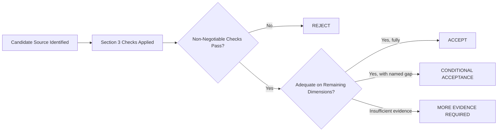

# Data Source Validation Plan

## 1. Purpose

This document defines how candidate datasets will be validated once identified, elaborating [data-source-evaluation-framework.md](../17_Data_and_Technology_Resolution/data-source-evaluation-framework.md) with a concrete accept/reject decision plan. **No actual provider is named or selected. No dataset has been tested.**

## 2. Validation Outcome Categories

| Outcome | Meaning |
|---|---|
| **ACCEPT** | The candidate satisfies every non-negotiable check (Section 4) and meets an adequate bar on every other dimension — proceeds to Curated ingestion |
| **REJECT** | The candidate fails a non-negotiable check, or fails multiple dimensions materially — preserved in the record ([decision-evidence-record.md](decision-evidence-record.md)) with reasoning, never silently discarded |
| **CONDITIONAL ACCEPTANCE** | The candidate is usable with a named, tracked limitation (e.g., partial spatial coverage, disclosed staleness) — the limitation is carried into the data's own provenance/quality metadata, not hidden from downstream consumers |
| **MORE EVIDENCE REQUIRED** | The available evidence is insufficient to reach any of the above three outcomes — the evaluation returns to Stage 3 (Evidence Collection) of [technology-decision-gates.md](../17_Data_and_Technology_Resolution/technology-decision-gates.md) |

## 3. Validation Checks — Applied Per Domain

| Check | What It Verifies |
|---|---|
| Authority | Is the source an official/recognized body, or a secondary aggregation requiring further scrutiny? |
| Provenance | Can origin and chain of custody be established and documented? |
| Completeness | Are the fields required by [data-source-requirements.md](../17_Data_and_Technology_Resolution/data-source-requirements.md) actually populated? |
| Spatial coverage | Does the dataset cover the geographic scope DistrictMind needs (at minimum the pilot district, ultimately all 33)? |
| Temporal coverage | Does the dataset span the time range needed for its intended use (current state, and historical depth if required for trend analysis)? |
| Freshness | Is the dataset's own update cadence disclosed and adequate for its domain's use? |
| Schema stability | Does the source's schema remain stable across its own updates, or does it change unpredictably? |
| Identifiers | Does the source provide stable, unique identifiers, or only free-text names requiring reconciliation? |
| Quality | Are values internally consistent, with duplicates and outliers detectable? |
| Licensing | Does the license permit DistrictMind's intended ingestion, storage, computation, and display? |
| Accessibility | Can DistrictMind actually obtain the data through a documented, repeatable process? |
| Reproducibility | Does querying/extracting the same data twice yield a consistent result? |

## 4. Non-Negotiable Checks

The following checks, if failed, result in an automatic **REJECT** regardless of strength elsewhere:

- Licensing does not permit DistrictMind's intended use.
- No provenance can be established at all (a genuinely anonymous or unattributable source).
- The data cannot be ingested by any means DistrictMind's architecture supports (e.g., requires a workflow that would bypass the ingestion/validation pipeline).

## 5. Per-Domain Validation Plans

### 5.1 Geographic

| Check | Plan |
|---|---|
| Priority | Highest — blocks M1 entirely; elaborated separately in [boundary-dataset-validation-plan.md](boundary-dataset-validation-plan.md) |
| Additional domain-specific check | Topological consistency across administrative levels (District/Mandal/Village nesting) |

### 5.2 Demographic

| Check | Plan |
|---|---|
| Additional domain-specific check | Classification per [data-governance.md](../04_Data_Engineering/data-governance.md) Section 3 (Potentially Sensitive) verified before ACCEPT is possible |
| Methodology disclosure | The census/estimate methodology itself must be disclosed as part of Provenance |

### 5.3 Healthcare

| Check | Plan |
|---|---|
| Additional domain-specific check | Facility-type taxonomy consistency, verified against [entity-catalog.md](../05_Database_Design/entity-catalog.md) Section 4's Healthcare entity definitions |

### 5.4 Transportation

| Check | Plan |
|---|---|
| Additional domain-specific check | Network connectivity validation — a road dataset with unexplained disconnected segments fails Quality regardless of other strengths, since it would corrupt accessibility computation (Example B) |

### 5.5 Agriculture

| Check | Plan |
|---|---|
| Additional domain-specific check | Crop/season taxonomy consistency across regions |

### 5.6 Weather/Environment

| Check | Plan |
|---|---|
| Additional domain-specific check | Station coverage density sufficient for meaningful spatial aggregation feeding the rainfall canonical example (Example C) |

### 5.7 Disaster

| Check | Plan |
|---|---|
| Additional domain-specific check | Severity/risk classification consistency across events, since inconsistent classification would corrupt FR-028's risk score |

### 5.8 Infrastructure

| Check | Plan |
|---|---|
| Additional domain-specific check | Asset-type taxonomy consistency; deduplication verification |

## 6. Validation Sequence

## 7. What "Adequate" Means — Explicitly Not Numerically Defined

**This document does not define a numeric adequacy threshold for any dimension.** Consistent with [data-source-evaluation-framework.md](../17_Data_and_Technology_Resolution/data-source-evaluation-framework.md) Section 4's PROPOSED-only scoring illustration, adequacy is a qualitative judgment made against the specific requirement each dimension serves (e.g., "Completeness is adequate" means every field [data-source-requirements.md](../17_Data_and_Technology_Resolution/data-source-requirements.md) marks Required for that domain is actually populated) — not an invented percentage.

## 8. Recording Outcomes

Every validation outcome (ACCEPT/REJECT/CONDITIONAL ACCEPTANCE/MORE EVIDENCE REQUIRED), including its reasoning, is recorded via [decision-evidence-record.md](decision-evidence-record.md) — a REJECT is preserved for audit, never silently deleted, consistent with [decision-register-baseline.md](../16_Engineering_Readiness_and_Baseline/decision-register-baseline.md) Section 13.

## 9. Security

Licensing and accessibility checks (Section 3) explicitly verify that any required ingestion credential can be scoped per least-privilege, restated unchanged from [data-gis-integration.md](../12_Data_GIS_Implementation/data-gis-integration.md) Section 9.

## 10. Observability

Every validation run's inputs, checks applied, and outcome are logged and traceable — restated unchanged from [data-lineage-and-provenance-implementation.md](../12_Data_GIS_Implementation/data-lineage-and-provenance-implementation.md).

## 11. Milestone Traceability

| Domain Validation | First Needed |
|---|---|
| Geographic | M1 |
| Healthcare, Transportation, Weather, Disaster, Agriculture, Infrastructure, Demographic | M2 |

## 12. Open Decisions

**No provider is named, evaluated, or selected by this document for any domain.** All eight domains remain SOURCE UNRESOLVED, restated unchanged from [data-source-requirements.md](../17_Data_and_Technology_Resolution/data-source-requirements.md).
