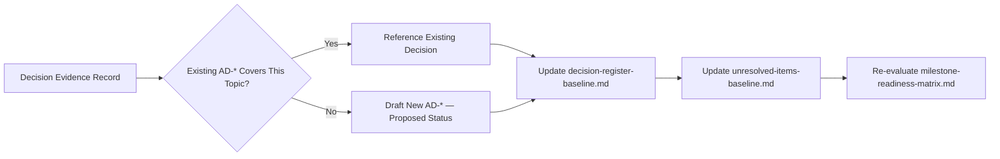

# Decision Evidence Record

## 1. Purpose

This document defines the formal record template used whenever a candidate technology or data source is evaluated, and explains how that record feeds [decision-register-baseline.md](../16_Engineering_Readiness_and_Baseline/decision-register-baseline.md). **This is a template — no actual record has been completed for any candidate, since no PoC has been executed.**

## 2. The Record Template

| Field | Detail |
|---|---|
| Candidate | The exact technology/dataset and version under evaluation |
| Category | Which evaluation domain (frontend, backend, database, GIS, AI, RAG, infrastructure, data source, boundary dataset) |
| Requirements | Which existing FR/NFR/architecture decision/evaluation-document dimension this record addresses — never invented |
| Source evidence | Evidence gathered from documentation/source review, prior to any PoC (per [evidence-strategy.md](evidence-strategy.md) Section 6) |
| PoC evidence | Observations from an actually executed PoC, per the structure in [proof-of-concept-framework.md](proof-of-concept-framework.md) |
| Observations | Factual, uninterpreted findings (restated distinct from Result, per [proof-of-concept-framework.md](proof-of-concept-framework.md) Section 10) |
| Limitations | What was not tested, and why |
| Risks | Known risks the evidence surfaced or failed to rule out |
| Dependencies | Other unresolved items this candidate's evaluation depends on (e.g., a GIS technology's evaluation depending on the database decision) |
| Result | Pass / Fail / Conditional, per [proof-of-concept-framework.md](proof-of-concept-framework.md) Section 13 |
| Recommendation | The proposed next action (proceed to Validation, run an additional PoC, reject) |
| Status | Candidate / Under Evaluation / Selected / Confirmed / Rejected / Deprecated, per [resolution-strategy.md](../17_Data_and_Technology_Resolution/resolution-strategy.md) Section 8 |
| Decision ID (if applicable) | The AD-* identifier once a formal Architecture Decision is drafted (Stage 7, [technology-decision-gates.md](../17_Data_and_Technology_Resolution/technology-decision-gates.md)) — left blank until that stage is reached |
| Affected milestones | Which M1–M6 milestone(s) this decision unblocks or constrains |
| Affected documents | Which existing documents must be updated once this record's outcome is baselined |
| Reviewer concept | The conceptual role responsible for independent review (e.g., "Architecture Reviewer") — **never a named individual** |
| Date/version concept | When this record was created/last updated, and which version of the candidate it evaluated |

## 3. Example Record — Illustrative Structure Only, Not a Real Evaluation

**The following is an illustrative, blank-value example showing the template's shape. It does not represent an actual evaluation of any real candidate.**

| Field | Example Value |
|---|---|
| Candidate | [Illustrative placeholder — not an actual candidate under test] |
| Category | Frontend |
| Requirements | AD-FE-001–004, [frontend-technology-evaluation.md](../17_Data_and_Technology_Resolution/frontend-technology-evaluation.md) |
| Source evidence | Not collected |
| PoC evidence | Not collected — no PoC executed |
| Observations | N/A |
| Limitations | N/A — no evaluation performed |
| Risks | N/A |
| Dependencies | N/A |
| Result | N/A |
| Recommendation | N/A |
| Status | Candidate (unchanged from prior documentation) |
| Decision ID | None |
| Affected milestones | M1 |
| Affected documents | [frontend-technology-evaluation.md](../17_Data_and_Technology_Resolution/frontend-technology-evaluation.md), [technology-stack.md](../00_Engineering_Overview/technology-stack.md) |
| Reviewer concept | Architecture Reviewer |
| Date/version concept | Not applicable — template illustration only |

## 4. How This Record Feeds the Decision Register

| Step | Detail |
|---|---|
| 1. Search existing decisions | Before any new AD-* is drafted, [decision-register-baseline.md](../16_Engineering_Readiness_and_Baseline/decision-register-baseline.md)'s 42-decision baseline is searched for a topic match — restated unchanged from [technology-decision-gates.md](../17_Data_and_Technology_Resolution/technology-decision-gates.md) Section 9 |
| 2. Draft or reuse | If an existing decision covers the topic, this record references it rather than duplicating it; if genuinely new, a collision-free ID is assigned |
| 3. Status assignment | The new/updated decision is marked **Proposed** (or the PROPOSED **Selected** intermediate label, [resolution-strategy.md](../17_Data_and_Technology_Resolution/resolution-strategy.md) Section 8) — **never Confirmed on the strength of a single PoC alone** |
| 4. Baseline update | [decision-register-baseline.md](../16_Engineering_Readiness_and_Baseline/decision-register-baseline.md) is updated with the new/referenced decision |
| 5. Unresolved-item update | If this record resolves (or partially resolves) an item in [unresolved-items-baseline.md](../16_Engineering_Readiness_and_Baseline/unresolved-items-baseline.md), that register is updated to reflect the new state — never silently, always with the record as evidence |
| 6. Readiness re-evaluation | [milestone-readiness-matrix.md](../16_Engineering_Readiness_and_Baseline/milestone-readiness-matrix.md) ratings are re-assessed for any milestone this record's outcome affects |

## 5. Confirmed Requires More Than One Passing PoC

**A single Pass result on a single PoC does not, by itself, justify a Confirmed status.** Restated unchanged from [technology-decision-gates.md](../17_Data_and_Technology_Resolution/technology-decision-gates.md) Section 11's "technically possible" vs. "validated for DistrictMind" vs. "Confirmed decision" distinction — Confirmed additionally requires the independent review at Stage 6 (Validation) and a formally ratified Decision Review at Stage 7, both beyond what a single Decision Evidence Record alone establishes.

## 6. No Real People Assigned

**The Reviewer concept field (Section 2) is always a role description, never a named individual** — restated unchanged from every prior milestone's identical rule (e.g., [pre-implementation-checklist.md](../16_Engineering_Readiness_and_Baseline/pre-implementation-checklist.md)'s "owner concept" fields).

## 7. Records Are Never Deleted

A Rejected or superseded record is preserved in the baseline, restated unchanged from [decision-register-baseline.md](../16_Engineering_Readiness_and_Baseline/decision-register-baseline.md) Section 13's "never delete history" discipline — a future re-evaluation of a previously Rejected candidate creates a new record referencing the old one, rather than overwriting it.

## 8. Security

Every record's Risks field explicitly includes any security-relevant finding — restated unchanged from [evidence-strategy.md](evidence-strategy.md) Section 4's Security evidence category.

## 9. Observability

Every record is itself an audit artifact, dated and versioned per Section 2's Date/version concept field.

## 10. Milestone Traceability

This record template applies to every candidate evaluation across all M1–M6 milestones, restated unchanged from [evidence-strategy.md](evidence-strategy.md) Section 12.

## 11. Open Decisions

None introduced — this is a template. No actual record has been completed for any real candidate as part of this milestone.
