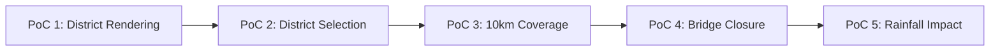

# Geographic Data PoC

## 1. Purpose

This document designs five conceptual GIS/data PoCs, applying the structure defined in [proof-of-concept-framework.md](proof-of-concept-framework.md). **No PoC has been executed. No GIS code is written here.**

## 2. PoC 1 — District Rendering

| Field | Detail |
|---|---|
| Input | A validated boundary dataset (per [boundary-dataset-validation-plan.md](boundary-dataset-validation-plan.md)), at minimum the Warangal pilot district's geometry |
| Computation | Server-side geometry simplification per level-of-detail tier (AD-GIS-001); frontend renders the returned geometry |
| Expected output | The pilot district's boundary renders correctly at each documented level-of-detail tier, with pan/zoom remaining responsive |
| Evidence | Functional (renders correctly), Performance (NFR-035's Initial Target — 30 fps, To Be Validated), Spatial (geometry fidelity across simplification tiers) |
| Failure condition | Geometry fails to render, renders with visible distortion beyond acceptable simplification loss, or pan/zoom becomes unresponsive |
| Dependency | Boundary dataset ACCEPTed or CONDITIONALLY ACCEPTed; frontend and GIS rendering technology candidates identified |

## 3. PoC 2 — District Selection

| Field | Detail |
|---|---|
| Input | The rendered map from PoC 1, plus the district's stable identifier |
| Computation | User interaction (click/tap) resolves to the district's identifier; navigation occurs via `/districts/:id` (AD-RES-001) |
| Expected output | Selecting the pilot district navigates correctly and loads its dashboard shell |
| Evidence | Functional (correct routing), Technical (identifier resolution, not name-based lookup) |
| Failure condition | Selection resolves to the wrong district, or routing falls back to a name-based path |
| Dependency | PoC 1; frontend routing implementation of AD-RES-001 |

## 4. PoC 3 — 10 km Healthcare Coverage (Canonical Example A)

| Field | Detail |
|---|---|
| Input | The pilot district's boundary, a small fixture set of test Health Facility points, a fixture set of test Village boundaries |
| Computation | Server-side `coverage_analysis` (buffer + containment), restated unchanged from [gis-computation-implementation.md](../12_Data_GIS_Implementation/gis-computation-implementation.md) Section 2 |
| Expected output | The correct set of villages outside 10 km of any test facility, matching an independently, manually computed expected result for the fixture |
| Evidence | Functional (correct computation), Spatial (buffer/containment accuracy), Performance (computation completes without blocking the UI) |
| Failure condition | The computed gap set does not match the independently verified expected result for the fixture, or the computation requires client-side fallback |
| Dependency | GIS technology candidate; fixture Health Facility and Village data (synthetic, not real, per [test-architecture.md](../14_Testing_Security_Observability/test-architecture.md) Section 5) |

## 5. PoC 4 — Bridge Closure (Canonical Example B)

| Field | Detail |
|---|---|
| Input | A fixture routable road graph, a fixture Health Facility set, a target Road Segment to close |
| Computation | `create_scenario`/`run_scenario` against a cloned graph (AD-DE-004); recomputed accessibility to nearest facility |
| Expected output | A correct before/after accessibility comparison for affected fixture villages, with the production fixture graph verified unmutated after the run |
| Evidence | Functional (correct recomputation), Technical (sandbox isolation verified), Spatial (network-impact accuracy) |
| Failure condition | The scenario mutates the baseline graph, or the recomputed accessibility does not match the independently verified expected result |
| Dependency | GIS technology candidate; Simulation Service design ([simulation-and-scenario-implementation.md](../13_AI_Intelligence_Implementation/simulation-and-scenario-implementation.md)) |

## 6. PoC 5 — Rainfall Spatial Impact (Canonical Example C)

| Field | Detail |
|---|---|
| Input | A fixture set of Weather station observations, Road Segments, and Health Facilities |
| Computation | Spatial aggregation (rainfall) → affected-area intersection with roads → network impact → healthcare accessibility re-evaluation, per [gis-computation-implementation.md](../12_Data_GIS_Implementation/gis-computation-implementation.md) Section 4 |
| Expected output | A correctly composed, multi-stage spatial result with each stage's output correctly labeled by state category (Derived/Predicted as applicable) |
| Evidence | Functional (correct multi-stage composition), Spatial (aggregation and intersection accuracy), Provenance (state-category labels correctly propagated) |
| Failure condition | Any stage's output is mislabeled (e.g., a Derived result presented as Observed), or the chain fails to compose correctly across all four domains |
| Dependency | GIS technology candidate; fixture Weather/Transportation/Healthcare data |

## 7. Authoritative Server-Side GIS Computation — Preserved

**Every PoC above executes its computation server-side.** No PoC in this document tests or validates a client-side spatial computation path, since none exists in the architecture — restated unchanged from AD-FE-004. PoC 1 and 2 test rendering only; PoCs 3–5 test authoritative computation only; the two are never conflated within a single PoC's evidence.

## 8. Cross-PoC Dependency Chain

PoC 5 is the most demanding, since it exercises the full multi-domain composition — a strong candidate is expected to remain viable through PoC 5 without contradicting evidence gathered in PoCs 1–4.

## 9. No PoC Executed — Restated

**None of the five PoCs above has been run.** No dataset, no fixture geometry, and no GIS technology candidate has actually been tested. This document is a design specification for future PoC execution only.

## 10. Security

Every PoC's fixture data is synthetic, per [test-architecture.md](../14_Testing_Security_Observability/test-architecture.md) Section 5 — no PoC uses real production or Curated data.

## 11. Observability

Every future PoC execution should be logged and its results retained per [decision-evidence-record.md](decision-evidence-record.md), regardless of outcome.

## 12. Milestone Traceability

| PoC | First Needed |
|---|---|
| PoC 1–2 | M1 |
| PoC 3 | M1–M2 |
| PoC 4 | M5 |
| PoC 5 | M2 (data), M4 (prediction), M5 (scenario) |

## 13. Open Decisions

No GIS technology, boundary dataset, or fixture data source is selected by this document — every dependency named above remains unresolved.
