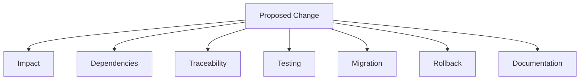

# Architecture Baseline Management

## 1. Purpose

This document defines how the architecture baseline changes over time, elaborating [decision-management-framework.md](decision-management-framework.md) and [change-impact-assessment.md](change-impact-assessment.md) specifically for architectural (not merely technology-selection) change. **No existing architecture decision is modified by this document.**

## 2. What Counts as an Architecture Change

| Change Type | Example |
|---|---|
| Requirements changes | A new FR/NFR is added, or an existing one's scope is clarified |
| Technology changes | A category in [technology-baseline-management.md](technology-baseline-management.md) reaches a new Decision |
| Data changes | A new domain's data model is introduced, or the seven-layer flow is extended |
| API changes | A new operation is added to [api-contracts.md](../06_API_and_Integration/api-contracts.md), or an existing one's contract changes |
| GIS changes | A new spatial operation is added to the bounded operation set ([typed-tool-implementation.md](../13_AI_Intelligence_Implementation/typed-tool-implementation.md) Section 8.2) |
| AI changes | A new Typed Tool is added, or the Agent's planning behavior changes |
| Security changes | An authorization rule or trust boundary is modified |
| Deployment changes | A new environment or deployment pattern is adopted |

## 3. Every Change Considers Seven Dimensions

| Dimension | Question |
|---|---|
| Impact | What breaks or must change elsewhere, per [change-impact-assessment.md](change-impact-assessment.md) |
| Dependencies | Which other decisions/components depend on the thing being changed |
| Traceability | Does the change preserve or require updating the requirement-to-architecture trace ([requirements-to-architecture-traceability.md](../16_Engineering_Readiness_and_Baseline/requirements-to-architecture-traceability.md)) |
| Testing | What new or updated test coverage does the change require, per `14_Testing_Security_Observability/` |
| Migration | If the change affects already-baselined or already-implemented state, what migration path exists |
| Rollback | Can the change be reverted if it proves unsound, and what would that require |
| Documentation | Which existing documents must be updated to reflect the change accurately |

## 4. Requirements Changes

A new or clarified FR/NFR is added to [functional-requirements.md](../01_Requirements/functional-requirements.md) or [non-functional-requirements.md](../01_Requirements/non-functional-requirements.md) only through the same evidence-based process as any other decision — restated consistent with this program's refusal to invent requirement IDs anywhere outside those two source documents.

## 5. Technology Changes

Restated unchanged from [technology-baseline-management.md](technology-baseline-management.md) Section 4 — every technology-category change follows Change Control before being accepted into the architecture baseline.

## 6. Data Changes

A new data domain or a change to the seven-layer flow's own structure is a Requirements-level change (Section 4) before it is a Data-level change, since the seven-layer flow itself is architecturally invariant (restated unchanged throughout every milestone since ED-M2 Part 2A) — a proposal to *collapse* or *reorder* the seven layers would require an extraordinarily strong justification and is not casually entertained.

## 7. API Changes

Restated unchanged from [api-design-principles.md](../06_API_and_Integration/api-design-principles.md) and [deployment-strategy.md](../15_Deployment_Infrastructure_Operations/deployment-strategy.md) Section 10 — a breaking API change is deployed only alongside a coordinated consumer update, never silently; an additive, backward-compatible change is preferred by default.

## 8. GIS Changes

A new spatial operation added to the Typed Tool bounded set requires its own Decision Review (per [decision-review-process.md](decision-review-process.md)), since expanding this set is exactly the kind of change [ai-implementation-architecture.md](../13_AI_Intelligence_Implementation/ai-implementation-architecture.md) Section 3 and [typed-tool-implementation.md](../13_AI_Intelligence_Implementation/typed-tool-implementation.md) Section 9 treat as requiring deliberate justification, not casual addition.

## 9. AI Changes

Any change to the Typed Tool contract, the Agent's authorization enforcement, or the grounding/evidence chain is treated as a CRITICAL-impact change by default (per [change-impact-assessment.md](change-impact-assessment.md) Section 3), given how many downstream documents and safety guarantees depend on these boundaries remaining stable.

## 10. Security Changes

Any change to an authorization rule or trust boundary ([security-and-trust-boundary-matrix.md](../16_Engineering_Readiness_and_Baseline/security-and-trust-boundary-matrix.md)) requires explicit re-verification that AI≠database access, Frontend≠database access, and GIS server-side authority all remain intact after the change — these three invariants are never weakened as a side effect of an unrelated security change.

## 11. Deployment Changes

Restated unchanged from [deployment-strategy.md](../15_Deployment_Infrastructure_Operations/deployment-strategy.md) — a deployment-pattern change follows the same staged validation discipline as any application change, never bypassing Testing/Staging.

## 12. No Existing Architecture Decision Modified

**This document does not modify, reinterpret, or silently update any of the 42 existing decisions in [decision-register-baseline.md](../16_Engineering_Readiness_and_Baseline/decision-register-baseline.md).** It defines the process a future genuine architectural change would follow — restated consistent with [decision-supersession-and-history.md](decision-supersession-and-history.md) Section 4's never-silently-delete rule, extended here to never-silently-modify.

## 13. Security

Section 10 makes explicit that architecture baseline management itself is a security-relevant process — a change is never accepted purely on functional merit while silently degrading a trust boundary.

## 14. Observability

Every architecture baseline change, once it occurs, is recorded in [decision-register-baseline.md](../16_Engineering_Readiness_and_Baseline/decision-register-baseline.md) and cross-referenced in every affected document, per Section 3's Documentation dimension.

## 15. Milestone Traceability

This architecture-change-management structure applies across all M1–M6 milestones, since architectural stability is a precondition for every one of them.

## 16. Open Decisions

None introduced — this document defines change-management process; it makes no actual architectural change.
