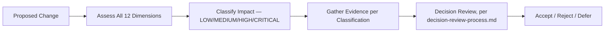

# Change Impact Assessment

## 1. Purpose

This document defines a formal framework for assessing the impact of a proposed change, referenced throughout [architecture-baseline-management.md](architecture-baseline-management.md) and [technology-baseline-management.md](technology-baseline-management.md) Section 4. **No arbitrary impact level is assigned to any existing unresolved decision by this document.**

## 2. Impact Dimensions

| Dimension | What Is Assessed |
|---|---|
| Requirements | Does the change affect any FR/NFR's scope or satisfaction? |
| Frontend | Does the change require frontend code/component changes? |
| Backend | Does the change require backend service/module changes? |
| Database | Does the change require schema or data-model changes? |
| Data | Does the change affect the seven-layer pipeline or a specific domain's data handling? |
| GIS | Does the change affect spatial computation, rendering, or the bounded operation set? |
| AI | Does the change affect the Agent, Typed Tools, grounding, or safety controls? |
| API | Does the change affect any existing contract in [api-contracts.md](../06_API_and_Integration/api-contracts.md)? |
| Security | Does the change affect any trust boundary or authorization rule? |
| Testing | Does the change require new or updated test coverage? |
| Deployment | Does the change affect packaging, environments, or release process? |
| Operations | Does the change affect monitoring, backup, or disaster-recovery behavior? |
| M1–M6 milestones | Which milestone(s) does the change advance, constrain, or block? |

## 3. Qualitative Impact Classes

| Class | Definition |
|---|---|
| **LOW** | The change is isolated to a single component, has no dependency ripple, requires no architectural invariant re-verification, and its rollback is trivial (e.g., a documentation clarification, a non-breaking additive field) |
| **MEDIUM** | The change affects a bounded set of related components (e.g., one domain's data pipeline) but does not touch a non-negotiable architectural invariant, and its rollback requires some but not extensive effort |
| **HIGH** | The change affects multiple components across layers (e.g., a new Typed Tool, a schema change affecting multiple domains) or touches a boundary that, while not itself invariant, is widely depended upon (e.g., an API contract change) |
| **CRITICAL** | The change touches a non-negotiable architectural invariant (modular monolith, AI≠database access, GIS server-side authority, six-category state model) or a canonical example's correctness, or its rollback is difficult or impossible without data loss |

**No numeric threshold defines these boundaries — classification is a qualitative judgment applied against the criteria stated above, consistent with [engineering-quality-gates.md](../08_Implementation_Foundation/engineering-quality-gates.md) AD-IMP-005's qualitative-gate discipline.**

## 4. Impact Assessment Process

## 5. Evidence Needed to Determine Impact

| Impact Class | Evidence Required |
|---|---|
| LOW | A statement of the isolated scope, confirming no dependency exists elsewhere |
| MEDIUM | A dependency map showing the bounded set of affected components ([decision-management-framework.md](decision-management-framework.md) Section 7) |
| HIGH | A full dependency map plus a compatibility assessment against every affected component's current baseline state ([technology-baseline-management.md](technology-baseline-management.md) Section 5) |
| CRITICAL | All of the above, plus explicit re-verification that every non-negotiable architectural invariant remains intact post-change, and a documented rollback plan |

## 6. Worked Examples — Illustrative Classification Reasoning

**These are illustrative examples of how the framework would apply, not actual assessments of real pending changes:**

| Example Change | Illustrative Class | Reasoning |
|---|---|---|
| Adding a new optional field to an existing Curated entity | LOW | Isolated, additive, no invariant touched, trivially reversible |
| Adding a new domain's data pipeline (e.g., a new indicator category) | MEDIUM | Affects the data pipeline and possibly the dashboard, but does not touch a non-negotiable invariant |
| Adding a new Typed Tool to the AI contract | HIGH | Affects the AI layer, API surface, and testing across multiple documents; widely depended upon once adopted |
| Changing the database technology after implementation has begun | CRITICAL | Touches the AI-exclusion credential model, the six-category schema separation, and every already-implemented Repository-layer integration; rollback would require data migration |

## 7. No Impact Level Assigned to Existing Unresolved Decisions

**This document does not assign LOW/MEDIUM/HIGH/CRITICAL to any of DistrictMind's currently unresolved decisions** (frontend/backend/database/GIS/AI technology, data sources, boundary dataset) — those are *initial* decisions, not *changes* to an existing baseline, and this framework governs change to an already-baselined state, not the first-time resolution of an open item ([implementation-blockers.md](../16_Engineering_Readiness_and_Baseline/implementation-blockers.md)'s CRITICAL/HIGH/MEDIUM/LOW severity classification is a related but distinct concept, governing blocking-ness rather than change-impact).

## 8. Relationship to Blocker Severity

| Concept | Governs |
|---|---|
| Blocker severity ([implementation-blockers.md](../16_Engineering_Readiness_and_Baseline/implementation-blockers.md)) | How much an *unresolved* item blocks progress |
| Change impact (this document) | How much a *proposed change to an already-baselined state* would ripple through the system |

These are related but answer different questions — a CRITICAL blocker (e.g., no confirmed data source) is not itself a "change" being assessed by this framework; it is an unresolved initial decision, addressed via [decision-management-framework.md](decision-management-framework.md), not this document.

## 9. Security

Security is one of the twelve dimensions (Section 2) and is always assessed — a change touching a trust boundary is never classified LOW regardless of how isolated it appears elsewhere.

## 10. Observability

Every completed impact assessment is recorded alongside the change proposal it evaluates, feeding the same Decision Review process ([decision-review-process.md](decision-review-process.md)) as any other decision.

## 11. Milestone Traceability

This framework applies to any proposed change across all M1–M6 milestones, once a baseline exists to change.

## 12. Open Decisions

None introduced — this document defines an assessment framework; it assesses no actual pending change.
