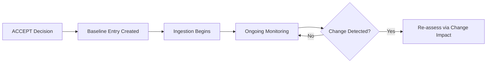

# Data Baseline Management

## 1. Purpose

This document defines how an accepted dataset becomes part of DistrictMind's data baseline and how that baseline is subsequently maintained, elaborating [data-source-decision-record-standard.md](data-source-decision-record-standard.md) and [storage-and-persistence-operations.md](../15_Deployment_Infrastructure_Operations/storage-and-persistence-operations.md). **No dataset is accepted by this document.**

## 2. From Decision to Baseline Entry

## 3. Baseline Entry Fields

| Field | Detail |
|---|---|
| Source | The accepted provider/dataset, per the Decision Evidence Record's Source identity field ([data-source-decision-record-standard.md](data-source-decision-record-standard.md)) |
| Version | The specific dataset version accepted — restated consistent with that document's Version field |
| Provenance | Carried forward unchanged from the acceptance record |
| Schema | The canonical-schema mapping this source uses, per [data-fragmentation-resolution.md](../17_Data_and_Technology_Resolution/data-fragmentation-resolution.md) Section 3 |
| Spatial reference | The dataset's CRS and coverage, where applicable |
| Temporal coverage | The dataset's time range and update cadence |
| Quality state | The most recent validation outcome (per [data-source-validation-plan.md](../18_Evidence_and_PoC_Resolution/data-source-validation-plan.md)) |
| Validation state | Whether the current baseline entry reflects a full ACCEPT or a CONDITIONAL ACCEPTANCE, with the specific condition named |
| Freshness | Time since last update, tracked against the source's disclosed cadence |
| Lineage | The full ingestion/transformation trail from Raw through Curated, per [data-lineage-and-provenance-implementation.md](../12_Data_GIS_Implementation/data-lineage-and-provenance-implementation.md) |

## 4. Change Detection

A baselined dataset is monitored for upstream changes — a new version, a schema change, or a licensing change — restated consistent with [district-boundary-dataset-requirements.md](../17_Data_and_Technology_Resolution/district-boundary-dataset-requirements.md) Section 12's update-handling requirement, generalized here to every domain. Change detection triggers re-validation against [data-source-validation-plan.md](../18_Evidence_and_PoC_Resolution/data-source-validation-plan.md)'s checklist, not an automatic silent update to the baseline.

## 5. Deprecation — A Framework This Document Establishes, Not an Existing Process

**This document defines the deprecation framework a future dataset lifecycle would follow — it does not claim a dataset-deprecation process already exists or has been exercised.** Restated explicitly consistent with [unresolved-items-baseline.md](../16_Engineering_Readiness_and_Baseline/unresolved-items-baseline.md) Item 24, first identified as a gap in [data-governance-implementation.md](../12_Data_GIS_Implementation/data-governance-implementation.md) Section 10:

| Deprecation Step | Detail |
|---|---|
| Trigger | A source becomes unavailable, is superseded by a materially better-evidenced alternative, or its license changes to prohibit continued use |
| Marking | The baseline entry is marked Deprecated (per [decision-approval-and-status.md](decision-approval-and-status.md) Section 3), never silently removed |
| Downstream handling | Every Analytical/AI-ML-ready/Serving derivative of the deprecated source is flagged for re-evaluation — since those layers are recomputable from Curated data (restated from [storage-and-persistence-operations.md](../15_Deployment_Infrastructure_Operations/storage-and-persistence-operations.md) Section 17), a deprecation does not corrupt them, but their continued validity depends on whether a replacement source has been accepted |
| Retention | The deprecated source's already-ingested Curated data is retained for historical/audit purposes per [storage-and-persistence-operations.md](../15_Deployment_Infrastructure_Operations/storage-and-persistence-operations.md) Section 14 (Archival), not deleted outright |

**This framework itself does not resolve Item 24 — it is the design that a future, actually-adopted deprecation process would follow, closing the gap only once genuinely exercised.**

## 6. Replacement

Where a deprecated source is replaced, the replacement source undergoes the full Decision process ([data-source-decision-record-standard.md](data-source-decision-record-standard.md)) independently — a replacement is never assumed equivalent to its predecessor merely because it serves the same domain; its own Authority, Provenance, and Quality must be independently established.

## 7. Rollback/Reprocessing Concept

| Concept | Detail |
|---|---|
| Rollback | If a newly ingested dataset version is found to have introduced a quality regression, the prior Curated state is restored per [backup-and-recovery.md](../15_Deployment_Infrastructure_Operations/backup-and-recovery.md)'s recovery sequencing, and the new version's baseline entry is marked Rejected pending correction |
| Reprocessing | Because Raw storage persists an unmodified copy (restated unchanged from AD-DE-002), a validation-rule fix or source correction can trigger reprocessing of already-landed Raw data without re-fetching from the external source — restated unchanged from [data-ingestion.md](../04_Data_Engineering/data-ingestion.md) |

## 8. Cross-Reference to Source Precedence

Where multiple baselined sources exist for the same domain and conflict (restated from [data-fragmentation-resolution.md](../17_Data_and_Technology_Resolution/data-fragmentation-resolution.md)), the baseline entry for each source retains its own independent Quality/Validation state — the precedence question is a separate, field-specific determination layered on top of the baseline, not a property of any single source's own entry.

## 9. No Dataset Accepted

**This document does not accept, name, or select any real dataset.** It defines the baseline-management structure a future, actually-executed data-source decision would populate.

## 10. Security

Every baseline entry's Provenance and Licensing fields (Section 3, inherited from [data-source-decision-record-standard.md](data-source-decision-record-standard.md)) remain the basis for access-control classification per [data-governance.md](../04_Data_Engineering/data-governance.md) Section 3.

## 11. Observability

Every change detected (Section 4) and every deprecation/replacement event (Sections 5–6) is logged and traceable, restated unchanged from [data-lineage-and-provenance-implementation.md](../12_Data_GIS_Implementation/data-lineage-and-provenance-implementation.md).

## 12. Milestone Traceability

| Data Baseline Activity | First Needed |
|---|---|
| Geographic baseline entry | M1 |
| All other domain baseline entries | M2 |
| Deprecation/replacement framework exercised for real | Whenever the first real source requires it — not tied to a specific milestone |

## 13. Open Decisions

None introduced — no dataset has an actual baseline entry as a result of this milestone. The dataset-deprecation process gap ([unresolved-items-baseline.md](../16_Engineering_Readiness_and_Baseline/unresolved-items-baseline.md) Item 24) remains open; this document defines its future framework, not its resolution.
