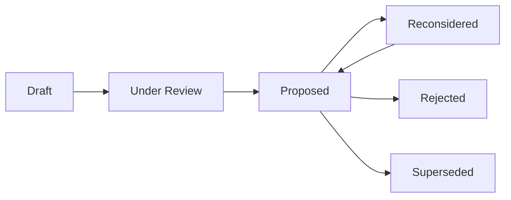

# Decision Management Framework

## 1. Purpose

This document defines DistrictMind's decision-management lifecycle, unifying [resolution-strategy.md](../17_Data_and_Technology_Resolution/resolution-strategy.md) Section 6, [technology-decision-gates.md](../17_Data_and_Technology_Resolution/technology-decision-gates.md), and [decision-evidence-record.md](../18_Evidence_and_PoC_Resolution/decision-evidence-record.md) into a single governing framework. **No decision is made, and no technology or dataset is confirmed, by this document.**

## 2. The Nine-Stage Lifecycle

This extends the five-stage process in [resolution-strategy.md](../17_Data_and_Technology_Resolution/resolution-strategy.md) Section 6 and the eight-stage gate process in [technology-decision-gates.md](../17_Data_and_Technology_Resolution/technology-decision-gates.md) by making Evaluation and Recommendation explicit, separate stages — this is a synthesis of prior work, not a competing process.

## 3. Stage Definitions

| Stage | Input | Activity | Output |
|---|---|---|---|
| Candidate | A named possibility (technology or data source), already Candidate/Proposed/To Be Evaluated per existing documentation, or newly proposed | Recorded in the relevant register | A named entry with current status |
| Evaluation | A candidate | Applied against the relevant per-domain evaluation document (`17_Data_and_Technology_Resolution/`) | A structured evaluation matrix (initially "To Be Evaluated" per cell) |
| Evidence | An evaluation | Gathered per [evidence-strategy.md](../18_Evidence_and_PoC_Resolution/evidence-strategy.md) Section 4's twelve categories | Documented, attributable evidence — never assumption |
| PoC | Sufficient evidence | Executed per [proof-of-concept-framework.md](../18_Evidence_and_PoC_Resolution/proof-of-concept-framework.md)'s 15-section structure | A completed PoC document with Observed Behavior and a Result |
| Validation | A completed PoC | Independent review of the PoC's Result | A pass/fail/conditional verdict, distinct from the PoC author's own Result |
| Recommendation | A validated PoC | A proposed next action, drafted per [decision-evidence-record.md](../18_Evidence_and_PoC_Resolution/decision-evidence-record.md) | A recommendation record — not yet a Decision |
| Decision | A recommendation | A formal Architecture Decision drafted and reviewed, per [architecture-decision-record-standard.md](architecture-decision-record-standard.md) | An AD-* entry, marked Proposed (never Confirmed on this basis alone) |
| Baseline | A decision | [decision-register-baseline.md](../16_Engineering_Readiness_and_Baseline/decision-register-baseline.md), [unresolved-items-baseline.md](../16_Engineering_Readiness_and_Baseline/unresolved-items-baseline.md), and [milestone-readiness-matrix.md](../16_Engineering_Readiness_and_Baseline/milestone-readiness-matrix.md) updated | An accurate, current baseline reflecting the new decision |
| Implementation | A baselined decision | Real engineering work begins | Working code — explicitly outside this document's own scope |

## 4. Why Decisions Need Evidence

**A decision made without evidence is indistinguishable from a guess, and a guess dressed as a decision is more dangerous than an openly acknowledged unresolved item** — because it forecloses further scrutiny while carrying no more actual justification. Restated consistent with [technology-decision-gates.md](../17_Data_and_Technology_Resolution/technology-decision-gates.md) Section 13's rejection of popularity/familiarity as sufficient grounds, and [evidence-strategy.md](../18_Evidence_and_PoC_Resolution/evidence-strategy.md) Section 3's Assumption-vs-Evidence distinction: every Decision stage entry in this framework must trace back through Evidence and PoC/Validation, not skip directly from Candidate to Decision.

## 5. Decision Ownership Concept

| Concept | Detail |
|---|---|
| Decision Author | The conceptual role that drafts a Decision record — **never a named individual in this documentation** |
| Decision Reviewer | The conceptual role that performs independent Validation, distinct from the Author, restated unchanged from [decision-evidence-record.md](../18_Evidence_and_PoC_Resolution/decision-evidence-record.md) Section 2 |
| Decision Approver | The conceptual role that formally moves a Decision from Proposed to whatever status a future governance process defines as sufficient for adoption — elaborated in [decision-approval-and-status.md](decision-approval-and-status.md) |
| Baseline Maintainer | The conceptual role responsible for keeping [decision-register-baseline.md](../16_Engineering_Readiness_and_Baseline/decision-register-baseline.md) accurate as decisions are made |

**No role above is ever assigned to a real, named person in this documentation set.**

## 6. Decision Scope

Every decision has an explicit scope statement — what it does and does not govern. A scope that is too broad (e.g., "this decision selects the entire technology stack") is a process anti-pattern; restated consistent with [decision-register-baseline.md](../16_Engineering_Readiness_and_Baseline/decision-register-baseline.md), where every existing decision has a narrow, specific scope (e.g., AD-DB-005 governs only the six-category schema separation, not the database product itself).

## 7. Decision Dependencies

A decision may depend on another decision already having reached a certain stage — e.g., a vector database decision (Item 7, [unresolved-items-baseline.md](../16_Engineering_Readiness_and_Baseline/unresolved-items-baseline.md)) is naturally sequenced after the primary database decision, since pgvector's fitness depends on PostgreSQL's own status. Dependencies are recorded explicitly in the Decision Evidence Record's Dependencies field ([decision-evidence-record.md](../18_Evidence_and_PoC_Resolution/decision-evidence-record.md) Section 2).

## 8. Affected Components

Every decision names the components it affects (frontend, backend, database, GIS, AI, data pipeline, infrastructure) — restated consistent with [decision-register-baseline.md](../16_Engineering_Readiness_and_Baseline/decision-register-baseline.md)'s per-decision "Affected architecture" field.

## 9. Affected Milestones

Every decision names the M1–M6 milestone(s) it unblocks or constrains — restated consistent with [milestone-readiness-matrix.md](../16_Engineering_Readiness_and_Baseline/milestone-readiness-matrix.md)'s existing structure.

## 10. Decision Lifecycle — State Transitions

Elaborated fully in [decision-approval-and-status.md](decision-approval-and-status.md) and [decision-supersession-and-history.md](decision-supersession-and-history.md) — no decision in this program has ever reached a state beyond Proposed except Git's own Confirmed status.

## 11. Decision History

**No decision is ever deleted.** A superseded, rejected, or deprecated decision remains in the register with its relationship to any newer decision explicitly recorded — restated unchanged from [decision-register-baseline.md](../16_Engineering_Readiness_and_Baseline/decision-register-baseline.md) Section 13's example (AD-FE-005/AD-RES-001).

## 12. Preventing Failure Modes — Restated as This Framework's Governing Purpose

| Failure Mode | Prevention Mechanism |
|---|---|
| Unsupported technology selection | The Evidence/PoC/Validation stages (Sections 2–3) must complete before a Decision can be drafted |
| Undocumented decisions | Every decision follows the standard record structure ([architecture-decision-record-standard.md](architecture-decision-record-standard.md)) |
| Duplicate decisions | The decision-ID search-before-create discipline, restated unchanged from [technology-decision-gates.md](../17_Data_and_Technology_Resolution/technology-decision-gates.md) Section 9 |
| Decisions without evidence | Section 4 |
| Silent architectural changes | [change-impact-assessment.md](change-impact-assessment.md) requires explicit impact evaluation before any change is baselined |
| Accidental Proposed → Confirmed promotion | [decision-approval-and-status.md](decision-approval-and-status.md) Section 4's explicit statement that no automatic promotion exists |

## 13. Security

Every decision's evidence explicitly includes security evidence ([evidence-strategy.md](../18_Evidence_and_PoC_Resolution/evidence-strategy.md) Section 4) — a decision cannot reach Proposed status while carrying an unresolved security-boundary violation.

## 14. Observability

Every lifecycle transition (Section 10) is recorded and auditable, consistent with the audit discipline established throughout this program.

## 15. Milestone Traceability

This framework applies to every decision across all M1–M6 milestones, restated unchanged from [technology-decision-gates.md](../17_Data_and_Technology_Resolution/technology-decision-gates.md) Section 16.

## 16. Open Decisions

None introduced — this document defines process only. No candidate has moved through this lifecycle as a result of this milestone.
