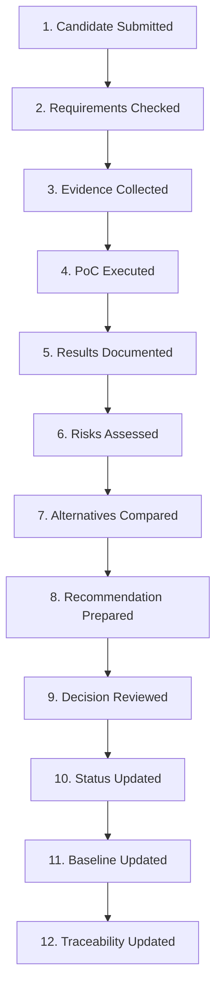

# Decision Review Process

## 1. Purpose

This document defines the review workflow every decision passes through, elaborating [decision-management-framework.md](decision-management-framework.md) Section 3 with concrete process steps. **No real reviewer name is used anywhere in this document.**

## 2. The Twelve-Step Review Workflow

## 3. Step Definitions

| Step | Detail |
|---|---|
| 1. Candidate submitted | A candidate is formally proposed for evaluation, referencing its existing entry in a per-domain evaluation document (`17_Data_and_Technology_Resolution/`) or a newly identified possibility |
| 2. Requirements checked | The candidate is checked against non-negotiable architectural invariants (modular monolith, AI≠database access, GIS server-side authority, six-category state model) — a failure here halts the process before further investment, restated unchanged from [technology-decision-gates.md](../17_Data_and_Technology_Resolution/technology-decision-gates.md) Stage 2 |
| 3. Evidence collected | Evidence is gathered per [decision-evidence-requirements.md](decision-evidence-requirements.md) |
| 4. PoC executed | A scoped PoC runs per [proof-of-concept-framework.md](../18_Evidence_and_PoC_Resolution/proof-of-concept-framework.md) |
| 5. Results documented | The PoC's Observed Behavior, Evidence Collected, and Result are recorded factually |
| 6. Risks assessed | Known risks and limitations are explicitly enumerated — a PoC reporting none is treated with suspicion, restated unchanged from [proof-of-concept-framework.md](../18_Evidence_and_PoC_Resolution/proof-of-concept-framework.md) Section 12 |
| 7. Alternatives compared | Every genuinely considered Option is compared against the same evidence categories, not merely the leading candidate |
| 8. Recommendation prepared | A proposed next action is drafted — not itself a Decision |
| 9. Decision reviewed | Independent review of the Recommendation against the underlying Evidence and PoC Results, by a role distinct from whoever prepared the Recommendation |
| 10. Status updated | The decision's Status field is set per [decision-approval-and-status.md](decision-approval-and-status.md) — almost always Proposed, never Confirmed at this step |
| 11. Baseline updated | [decision-register-baseline.md](../16_Engineering_Readiness_and_Baseline/decision-register-baseline.md) and, where applicable, [unresolved-items-baseline.md](../16_Engineering_Readiness_and_Baseline/unresolved-items-baseline.md) are updated |
| 12. Traceability updated | [milestone-readiness-matrix.md](../16_Engineering_Readiness_and_Baseline/milestone-readiness-matrix.md) and any affected domain document are updated to reflect the new state |

## 4. Roles — Conceptual Only

| Role | Responsibility | Named Individual? |
|---|---|---|
| Submitter | Proposes the candidate (Step 1) | Never |
| Evidence Collector | Performs Steps 2–5 | Never |
| Risk Assessor | Performs Step 6, ideally distinct from the Evidence Collector | Never |
| Decision Reviewer | Performs Step 9, always distinct from whoever prepared the Recommendation (Step 8) | Never |
| Baseline Maintainer | Performs Steps 10–12 | Never |

**No step in this process is ever attributed to a named, real person in this documentation.**

## 5. Handling Conflicts

| Conflict Type | Resolution Approach |
|---|---|
| Two reviewers disagree on a Result (Step 5/9) | The disagreement is recorded explicitly in the decision record's Risks field, not silently resolved by one reviewer overriding the other — escalated to a broader review if the evidence itself is ambiguous |
| A candidate passes evidence collection but fails PoC execution | The PoC's factual Observed Behavior takes precedence over prior Evidence expectations — Evidence informs what to test, not what the outcome must be |
| Two candidates in the same category both show strong evidence | Both proceed through Alternatives Comparison (Step 7); the Recommendation (Step 8) explicitly states the trade-off rather than silently favoring one |
| A stakeholder disputes an already-Proposed decision | Handled via Reconsideration, per [decision-approval-and-status.md](decision-approval-and-status.md) Section 6 and [decision-supersession-and-history.md](decision-supersession-and-history.md) — the existing decision is never silently edited in place |

## 6. Independence Between Steps 8 and 9

**The Decision Reviewer (Step 9) is never the same role as whoever prepared the Recommendation (Step 8).** Restated unchanged from [technology-decision-gates.md](../17_Data_and_Technology_Resolution/technology-decision-gates.md) Stage 6's "independent review, not by the same person/process that built the PoC, where practical" — this is the single structural safeguard against a decision becoming a self-confirming exercise.

## 7. What Happens on Rejection

A Reject outcome at any step (Step 2's requirements check, Step 9's decision review) does not end the process silently — it produces a record with the rejection reasoning preserved, per [decision-supersession-and-history.md](decision-supersession-and-history.md), available for a future reconsideration if new evidence emerges.

## 8. Security

Step 2's requirements check explicitly includes every non-negotiable security boundary — a candidate cannot advance past Step 2 while carrying an unresolved violation.

## 9. Observability

Every step's completion is recorded, making the full review process auditable end-to-end — restated consistent with the audit discipline established throughout this program.

## 10. Milestone Traceability

This review process applies to every decision across all M1–M6 milestones.

## 11. Open Decisions

None introduced — this document defines process only; no candidate has moved through this workflow as a result of this milestone.
