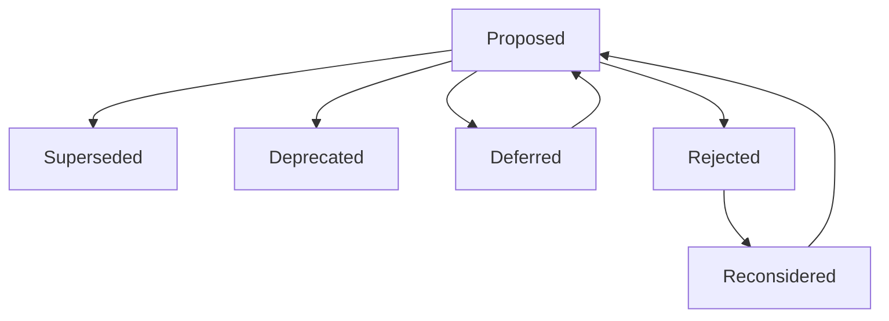

# Decision Supersession and History

## 1. Purpose

This document defines how decisions evolve over time, formalizing the pattern already established in [decision-register-baseline.md](../16_Engineering_Readiness_and_Baseline/decision-register-baseline.md) Section 13. **No decision is ever silently deleted. No new supersession relationship beyond the one already documented (AD-FE-005/AD-RES-001) is invented by this document.**

## 2. The Evolution States

## 3. State Definitions

| State | Meaning | Original Decision Status |
|---|---|---|
| Superseded | A newer decision formally replaces this one's conclusion (though not necessarily its full content — e.g., AD-RES-001 resolves AD-FE-005's conflict without rewriting AD-FE-005 itself) | Preserved in place, unmodified, with a cross-reference added |
| Replaced | A near-synonym for Superseded, used when the newer decision is a direct, like-for-like substitution rather than a conflict resolution | Preserved in place |
| Deprecated | A decision that is no longer the team's active direction, without a specific successor decision yet existing | Preserved in place, status field updated to note deprecation |
| Deferred | A decision intentionally paused pending a dependency (Section 8, [decision-approval-and-status.md](decision-approval-and-status.md)) | Preserved unchanged; not yet evaluated further |
| Rejected | A candidate failed evidence or PoC review | Preserved in place with rejection reasoning intact |
| Reconsidered | A previously Rejected or Deferred decision re-enters the Evidence stage due to new evidence | A new record is created referencing the old one; the old one is never overwritten |

## 4. The Core Rule — Never Silently Delete

**No decision record is ever removed from [decision-register-baseline.md](../16_Engineering_Readiness_and_Baseline/decision-register-baseline.md).** Every state transition in Section 2 is expressed as an addition (a new record, a cross-reference, a status-field update) — never as a deletion or silent overwrite of prior text. This restates and formalizes the discipline already exercised throughout this program (e.g., [decision-register-baseline.md](../16_Engineering_Readiness_and_Baseline/decision-register-baseline.md) Section 13's explicit statement that AD-FE-005's own document was never modified even after AD-RES-001 resolved its conflict).

## 5. Worked Example — AD-FE-005 / AD-RES-001

**This is the only completed supersession-class relationship that currently exists in DistrictMind's decision history, and it is used here exactly as documented, with no invented elaboration:**

| Aspect | Detail |
|---|---|
| Original decision | AD-FE-005 — "District Detail Route Path Convention: Conflict Between `/districts/:id` and `/district/:districtName`," recorded in [frontend-routing-design.md](../10_Frontend_Implementation/frontend-routing-design.md) with Status "Conflict Identified, Not Resolved" |
| Superseding decision | AD-RES-001 — "District Detail Route Uses Identifier-Based Addressing (`/districts/:id`); Human-Readable Name May Be Supported as a Non-Canonical Alias," recorded in [routing-resolution.md](../11_Architecture_Resolution/routing-resolution.md) with Status "Proposed" |
| Relationship type | Resolution / effective supersession — AD-RES-001 answers the question AD-FE-005 left open |
| Original document modified? | **No.** [frontend-routing-design.md](../10_Frontend_Implementation/frontend-routing-design.md) still reads "Conflict Identified, Not Resolved" today, exactly as originally written |
| How the relationship is recorded | In [decision-register-baseline.md](../16_Engineering_Readiness_and_Baseline/decision-register-baseline.md) Section 13's explicit relationship table, and restated in every subsequent milestone that references routing (e.g., [district-boundary-dataset-requirements.md](../17_Data_and_Technology_Resolution/district-boundary-dataset-requirements.md) Section 15, [boundary-dataset-validation-plan.md](../18_Evidence_and_PoC_Resolution/boundary-dataset-validation-plan.md) Section 6) |

**This example demonstrates the pattern this entire document formalizes: both decisions remain fully readable in their original form; the relationship between them is recorded as a separate, explicit fact, not as an edit to either original.**

## 6. No Other Supersession Relationship Invented

**This document does not invent, imply, or fabricate any additional completed supersession relationship beyond AD-FE-005/AD-RES-001.** Every other decision in the 42-entry baseline remains at its original Proposed status with no supersession recorded, because none has actually occurred.

## 7. Recording a Future Supersession

When a future decision genuinely supersedes an existing one, the record follows this pattern:

1. The original decision's document is **not** edited.
2. The new decision's own record includes an explicit "Supersession relationship" field (per [architecture-decision-record-standard.md](architecture-decision-record-standard.md) Section 2) naming the original decision by ID.
3. [decision-register-baseline.md](../16_Engineering_Readiness_and_Baseline/decision-register-baseline.md)'s relationship table (Section 13 of that document) is updated to add the new pair.
4. Any document that previously cited the original decision as unresolved is updated to also cite the superseding decision, following the pattern already used for AD-FE-005 references throughout `17_Data_and_Technology_Resolution/` and `18_Evidence_and_PoC_Resolution/`.

## 8. Deprecation Without a Successor

Where a decision is Deprecated without yet having a specific successor (Section 3), its record's Status field is updated to state "Deprecated — no successor decision yet recorded," and the reason for deprecation is documented — this state should be treated as a signal that a new Candidate evaluation is needed, not left indefinitely ambiguous.

## 9. Reconsideration Creates a New Record

**A Reconsidered decision is never achieved by editing the original Rejected or Deferred record.** A new Decision Evidence Record is created, explicitly referencing the original by ID and explaining what new evidence justifies reconsideration — restated consistent with Section 4's core rule.

## 10. Security

Preserving full decision history (Section 4) is itself a security-relevant audit property — a record of what was rejected and why prevents a future evaluation from unknowingly re-proposing a candidate that already failed a security-relevant check.

## 11. Observability

Every state transition in Section 2 is dated and traceable within [decision-register-baseline.md](../16_Engineering_Readiness_and_Baseline/decision-register-baseline.md).

## 12. Milestone Traceability

This history-preservation discipline applies to every decision across all M1–M6 milestones.

## 13. Open Decisions

None introduced — this document formalizes existing history-preservation practice; it creates no new supersession relationship.
