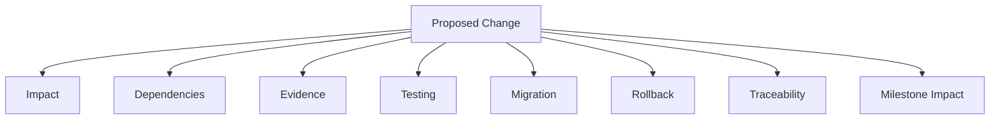

# Change Control Governance

## 1. Purpose

This document defines how changes are governed after baselining, applying [change-impact-assessment.md](../19_Decision_Records_and_Baseline/change-impact-assessment.md) and [architecture-baseline-management.md](../19_Decision_Records_and_Baseline/architecture-baseline-management.md) as an enforceable governance process for this milestone's readiness-gate context.

## 2. Change Categories Governed

| Category | Governed By |
|---|---|
| Requirement change | [requirements-readiness-gates.md](requirements-readiness-gates.md) |
| Technology change | [technology-baseline-management.md](../19_Decision_Records_and_Baseline/technology-baseline-management.md), [technology-readiness-gates.md](technology-readiness-gates.md) |
| Data-source change | [data-baseline-management.md](../19_Decision_Records_and_Baseline/data-baseline-management.md), [data-readiness-gates.md](data-readiness-gates.md) |
| Schema change | [architecture-baseline-management.md](../19_Decision_Records_and_Baseline/architecture-baseline-management.md) Section 6 |
| API change | [api-and-integration-readiness-gates.md](api-and-integration-readiness-gates.md) |
| GIS change | [ai-and-gis-readiness-gates.md](ai-and-gis-readiness-gates.md) Section 4 |
| AI change | Same, Section 3 |
| Security change | [security-and-quality-readiness-gates.md](security-and-quality-readiness-gates.md) |
| Deployment change | [deployment-and-operations-readiness-gates.md](deployment-and-operations-readiness-gates.md) |

## 3. Every Change Assesses Eight Dimensions

Restated and extended from [change-impact-assessment.md](../19_Decision_Records_and_Baseline/change-impact-assessment.md) Section 2, applied specifically to a post-baseline change:

| Dimension | What Is Assessed |
|---|---|
| Impact | Per [change-impact-assessment.md](../19_Decision_Records_and_Baseline/change-impact-assessment.md) Section 2's twelve dimensions |
| Dependencies | Which other baselined decisions/gates depend on the thing being changed |
| Evidence | Whether new Evidence justifies the change, per [decision-evidence-requirements.md](../19_Decision_Records_and_Baseline/decision-evidence-requirements.md) — a change proposed without evidence is treated identically to a first-time decision proposed without evidence: blocked |
| Testing | What new/updated test coverage the change requires |
| Migration | If the change affects already-baselined or already-implemented state, what migration path exists |
| Rollback | Whether the change can be reverted, and at what cost |
| Traceability | Whether [requirements-to-architecture-traceability.md](../16_Engineering_Readiness_and_Baseline/requirements-to-architecture-traceability.md) and related documents require updating |
| Milestone impact | Which M1–M6 milestone(s) the change affects |

## 4. Qualitative Impact Classes — Restated Unchanged

Restated unchanged from [change-impact-assessment.md](../19_Decision_Records_and_Baseline/change-impact-assessment.md) Section 3 — LOW / MEDIUM / HIGH / CRITICAL, with the same qualitative criteria (isolation, invariant contact, rollback difficulty). No numeric threshold is introduced here either.

## 5. Change Governance by Category

### 5.1 Requirement Change

A change to FR-001–FR-037/NFR-001–NFR-038 follows the same evidence-based process as their original authorship — restated unchanged from [architecture-baseline-management.md](../19_Decision_Records_and_Baseline/architecture-baseline-management.md) Section 4. Impact is at minimum MEDIUM, since every downstream architecture/implementation document traces to these IDs.

### 5.2 Technology Change

A change to a category in [technology-baseline-management.md](../19_Decision_Records_and_Baseline/technology-baseline-management.md) Section 2 before it reaches Selected is a normal part of the Evidence/PoC cycle (not a "change" requiring this governance, since nothing was baselined yet). A change *after* Selected/Baseline Entry follows the full 8-dimension assessment (Section 3) and is classified per Section 4 — typically HIGH given the number of dependent components a core technology decision carries.

### 5.3 Data-Source Change

A change to an ACCEPTed source (a new version, a licensing change) follows [data-baseline-management.md](../19_Decision_Records_and_Baseline/data-baseline-management.md) Section 4's change-detection and re-validation process — impact ranges MEDIUM (a minor version update) to CRITICAL (a licensing change prohibiting continued use, forcing REJECT and replacement).

### 5.4 Schema Change

A change to the logical or (once designed) physical data model is assessed against every entity/relationship it touches, and explicitly checked against RG-ARCH-005 (six-category state separation) — a schema change that would collapse or blur the six categories is automatically CRITICAL, restated unchanged from [architecture-baseline-management.md](../19_Decision_Records_and_Baseline/architecture-baseline-management.md) Section 6.

### 5.5 API Change

Restated unchanged from [deployment-strategy.md](../15_Deployment_Infrastructure_Operations/deployment-strategy.md) Section 10 and [architecture-baseline-management.md](../19_Decision_Records_and_Baseline/architecture-baseline-management.md) Section 7 — a breaking change to any of the 18 existing operations is HIGH by default; an additive, backward-compatible change is typically MEDIUM or LOW.

### 5.6 GIS Change

A change to the bounded spatial-operation set (adding or modifying an operation) is checked against RG-ARCH-004 (server-side authority) and RG-GIS-004 (spatial operations correctness) — restated unchanged from [architecture-baseline-management.md](../19_Decision_Records_and_Baseline/architecture-baseline-management.md) Section 8; typically HIGH given the operation's role in all three canonical examples.

### 5.7 AI Change

A change to the Typed Tool contract, Agent authorization enforcement, or grounding/evidence chain is CRITICAL by default, restated unchanged from [architecture-baseline-management.md](../19_Decision_Records_and_Baseline/architecture-baseline-management.md) Section 9 — no exception is made for a change that appears functionally minor, since the AI≠database-access boundary's integrity does not degrade gracefully.

### 5.8 Security Change

A change to any authorization rule or trust boundary requires explicit re-verification that all three core invariants (AI≠database, Frontend≠database, GIS server-side authority) remain intact — restated unchanged from [architecture-baseline-management.md](../19_Decision_Records_and_Baseline/architecture-baseline-management.md) Section 10; automatically CRITICAL.

### 5.9 Deployment Change

A change to deployment pattern or infrastructure technology follows the staged validation discipline in [deployment-strategy.md](../15_Deployment_Infrastructure_Operations/deployment-strategy.md) — impact is typically MEDIUM to HIGH depending on whether Production is already live.

## 6. Change Approval

A change assessed as LOW may proceed with a single Decision Review pass (Step 3, [decision-to-baseline-governance.md](decision-to-baseline-governance.md)); a change assessed MEDIUM or above requires the full seven-step governance path, including explicit Baseline Entry and Readiness Update — restated unchanged from that document Section 2.

## 7. No Arbitrary Impact Level Assigned

**This document does not assign LOW/MEDIUM/HIGH/CRITICAL to any specific pending or hypothetical real change** — Section 5's per-category guidance describes typical patterns, not predetermined verdicts for an actual proposal, restated consistent with [change-impact-assessment.md](../19_Decision_Records_and_Baseline/change-impact-assessment.md) Section 7's identical restriction.

## 8. Security

Sections 5.7–5.8 (AI and Security changes) are this document's highest-severity default categories — both CRITICAL by default, reflecting the disproportionate downstream dependency these boundaries carry.

## 9. Observability

Every governed change, once it occurs, is recorded per the seven-step path in [decision-to-baseline-governance.md](decision-to-baseline-governance.md).

## 10. Milestone Traceability

This change-control governance applies to every baselined element across all M1–M6 milestones, once a baseline exists to change.

## 11. Open Decisions

None introduced — this document governs future change; it assesses no actual pending change.
